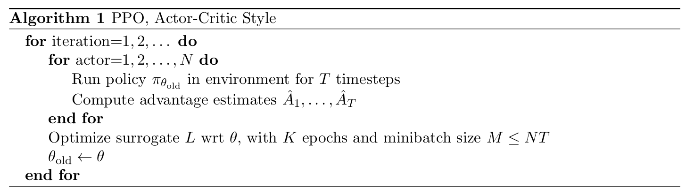
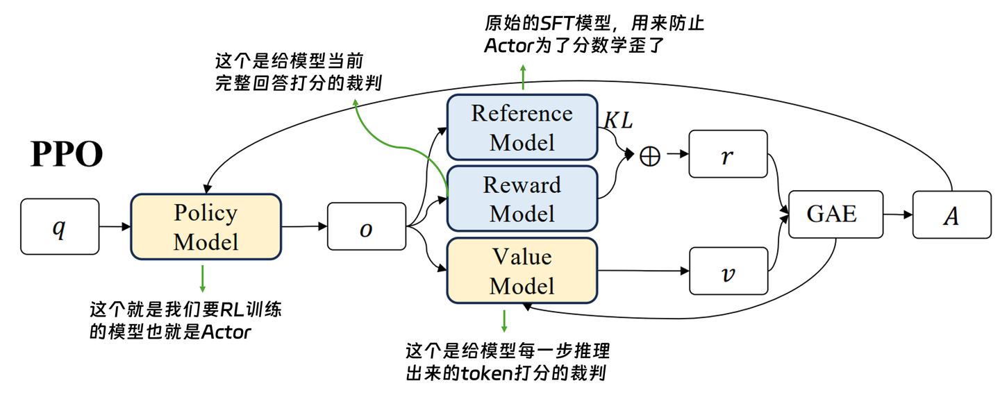
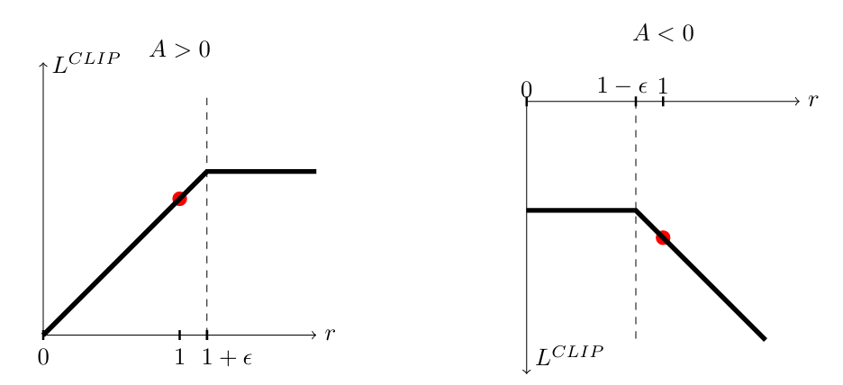
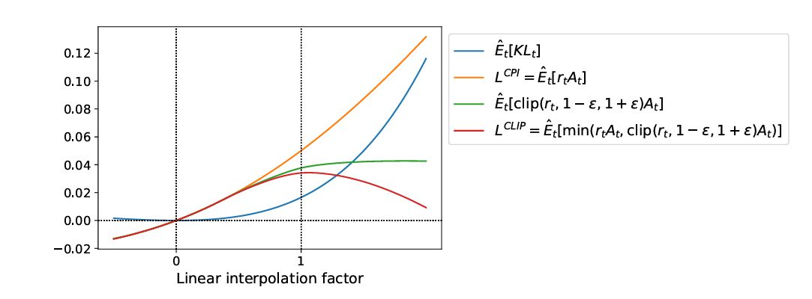

# [ICML 2017] Proximal Policy Optimization Algorithms

> * 论文地址：[Arxiv: 1707.06347](https://arxiv.org/abs/1707.06347)
> * 参考讲解：[看完能和外婆解释的PPO, DPO, GRPO强化学习 - Ryann的文章 - 知乎](https://zhuanlan.zhihu.com/p/1984387073625593089)
> * **更简洁的摘要：** PPO 通过限制新旧策略的概率比 $\epsilon$，使同一批交互数据能够进行小批量多轮更新，以较简单的一阶优化实现稳定、有效的策略学习. **用最简单的数学技巧（Clip），解决了强化学习中最难的稳定性问题**。

原先工作的 Problem：

1. **Vanilla policy gradient 的数据利用率低. ** 通常每批采样数据只做一次更新；若反复用同一批轨迹优化原始目标，策略可能发生破坏性的大幅变化. 
2. **TRPO 的实现较复杂. ** 它通过 KL 约束控制策略更新，但需要近似求解带约束的优化问题，也不便于使用 policy/value 参数共享等架构. 
3. **固定 KL 惩罚系数难以通用. ** 合适的系数会随任务和训练阶段变化，直接使用固定系数不足以稳定控制更新幅度. 

---

PPO 采用「用旧策略采样 → 估计 advantage → 在固定数据上进行多轮更新 → 用新策略重新采样」的循环. 其核心是 **clipped surrogate objective**：当某个动作的概率变化已经使目标朝有利方向超出指定范围时，目标函数不再继续奖励这部分变化；若变化使目标变差，则仍计入损失. 这样便可以使用常规 minibatch 优化方法重复利用一批数据. 

<center></center>

<center></center>

<center>图源：<a href="https://zhuanlan.zhihu.com/p/1984387073625593089" target="_blank" rel="noopener noreferrer">看完能和外婆解释的PPO, DPO, GRPO强化学习 - Ryann的文章 - 知乎</a></center>

---

构建方法论（Methodology）

1. Clipped surrogate objective：限制策略更新的收益

    令：
    
    * $\pi_{\theta_{\mathrm{old}}}$: 更新这一步之前的 Actor 模型. 注意这里不是 Ref Model 的输出，还是 Actor 模型，只不过是上一轮没更新梯度前的 Actor （旧策略）
    * $\pi_\theta$: 当前策略，即当前正在更新的Actor 模型（新策略）
    
    定义同一状态和动作下的概率比：
    $$
    r_t(\theta)=
    \frac{\pi_\theta(a_t\mid s_t)}
    {\pi_{\theta_{\mathrm{old}}}(a_t\mid s_t)}.
    $$
    用来衡量参数更新后，产生当前动作的概率变成了原来的多少. 
    
    设 $\hat A_t$ 是时刻 $t$ 的 advantage 估计：
    $$
    \hat{A}_t = \underbrace{(R_{\text{score}} - \beta \cdot \text{KL}(\pi, \pi_{\text{ref}}) + \gamma V(s_{t+1}))}_{\text{现实：RM打分 - Ref约束罚分 + 未来潜力}} - \underbrace{V(s_t)}_{\text{预期：Critic 之前的预判}}
    $$
    正数（+）表示是好动作，负数（-）表示是坏动作，代表梯度更新方向. 
    
    如果直接反复最大化 $\hat{\mathbb E}_t[r_t(\theta)\hat A_t]$，策略可能偏离采样时的旧策略过远. 所以 PPO 改为最大化以下函数：
    $$
    L^{\mathrm{CLIP}}(\theta)=
    \hat{\mathbb E}_t\!\left[
    \min\left(
    r_t(\theta)\hat A_t,\;
    \operatorname{clip}(r_t(\theta),1-\epsilon,1+\epsilon)\hat A_t
    \right)
    \right].
    $$
    $\epsilon$ 决定概率比的裁剪区间，论文以 $0.2$ 为示例. `min` 使该目标不高于未裁剪的 surrogate objective：
    
    * **$\hat A_t>0$：** 增加该动作的概率有利，但当 $r_t>1+\epsilon$ 时，目标不再因继续增加概率而提高. 
    * **$\hat A_t<0$：** 降低该动作的概率有利，但当 $r_t<1-\epsilon$ 时，目标不再因继续降低概率而提高. 
    * **朝不利方向变化时：** 目标仍会下降，因此 clipping 不是把所有超出区间的更新都直接截断. 
    
    代码里直接一行：
    
    ```python
    epsilon = 0.2
    r_clipped = torch.clamp(r, 1-epsilon, 1+epsilon)
    ```
    
    <center></center>
    
    <center></center>

2. 多轮更新与 advantage 估计

    PPO 的一次迭代中，$N$ 个并行 actor 各采集 $T$ 步，得到 $NT$ 个时间步的数据；随后在这批数据上进行 $K$ 轮、minibatch 大小为 $M\leq NT$ 的优化，最后将更新后的策略设为下一轮采样策略. 论文给出的截断 GAE 形式为：
    $$
    \hat A_t=\sum_{l=0}^{T-t-1}(\gamma\lambda)^l\delta_{t+l},
    \qquad
    \delta_t=r_t^{\mathrm{env}}+\gamma V(s_{t+1})-V(s_t).
    $$

    其中 $r_t^{\mathrm{env}}$ 是环境奖励，区别于上文的策略概率比 $r_t(\theta)$；$\gamma$ 为折扣因子，$\lambda$ 为 GAE 参数. 

    若 policy 与 value function 共享参数，论文还给出组合目标：

    $$
    \hat{\mathbb E}_t\!\left[
    L_t^{\mathrm{CLIP}}(\theta)
    -c_1L_t^{\mathrm{VF}}(\theta)
    +c_2S[\pi_\theta](s_t)
    \right].
    $$

    其中 $L_t^{\mathrm{VF}}$ 是 value function 的平方误差，$S$ 是 entropy bonus.

3. Adaptive KL penalty：论文比较的另一种 PPO 目标

    论文还研究通过 KL 惩罚控制更新幅度的版本：

    $$
    L^{\mathrm{KLPEN}}(\theta)=
    \hat{\mathbb E}_t\!\left[
    r_t(\theta)\hat A_t
    -\beta\,\mathrm{KL}\!\left(
    \pi_{\theta_{\mathrm{old}}}(\cdot\mid s_t),
    \pi_\theta(\cdot\mid s_t)
    \right)
    \right].
    $$

    每轮更新后，根据实际平均 KL 与目标值 $d_{\mathrm{targ}}$ 的关系调整 $\beta$：KL 过小则减半，过大则加倍. 它同样允许多轮 minibatch 更新，但论文的目标函数对比实验显示，**clipped 版本优于所测试的固定和自适应 KL 惩罚设置**. 

---

**Limitations & Future Work**

显然，所需的显存资源太缺乏了.