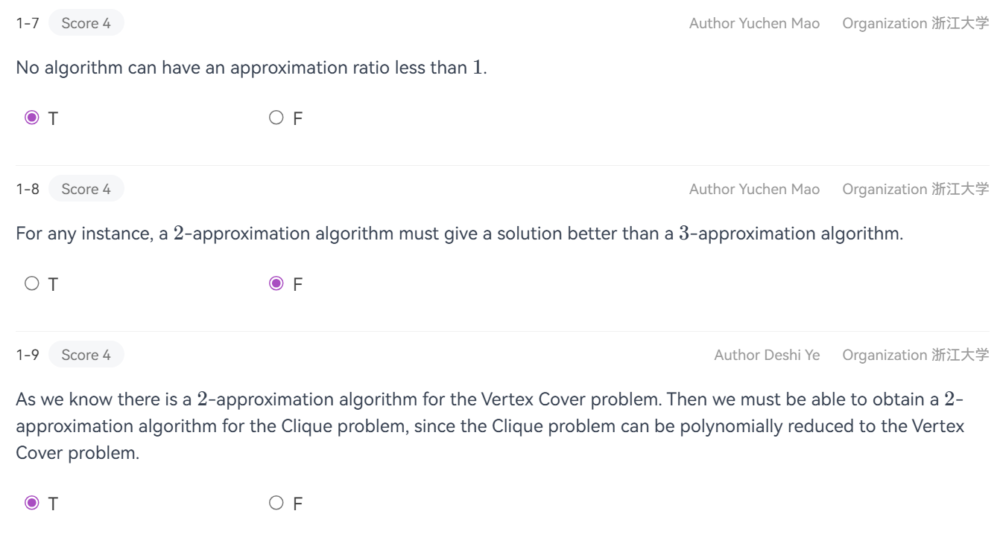
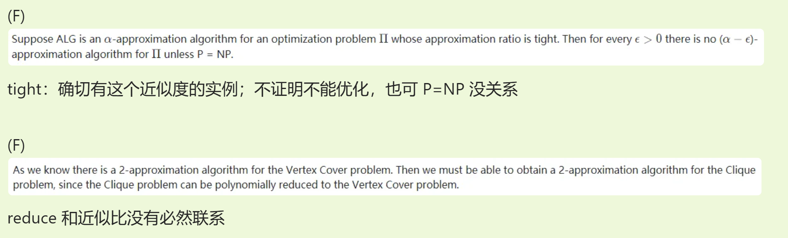
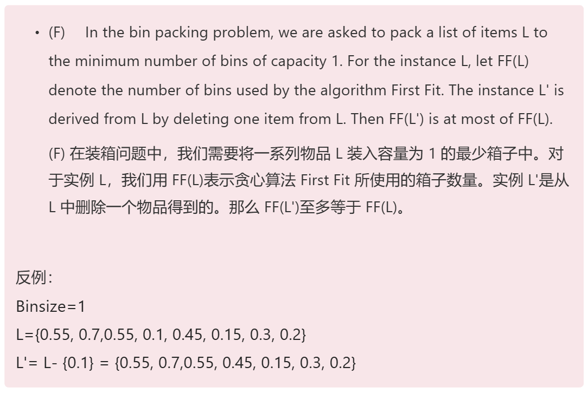
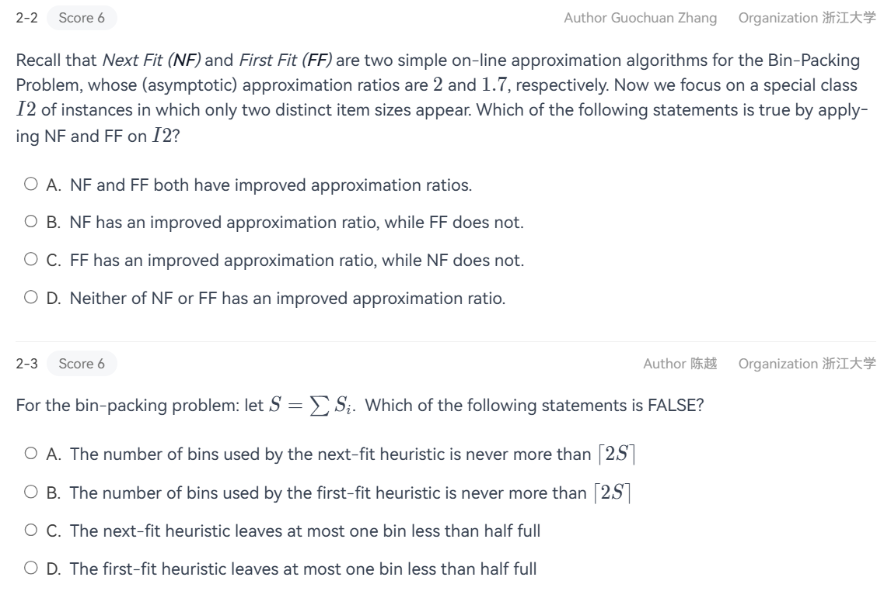
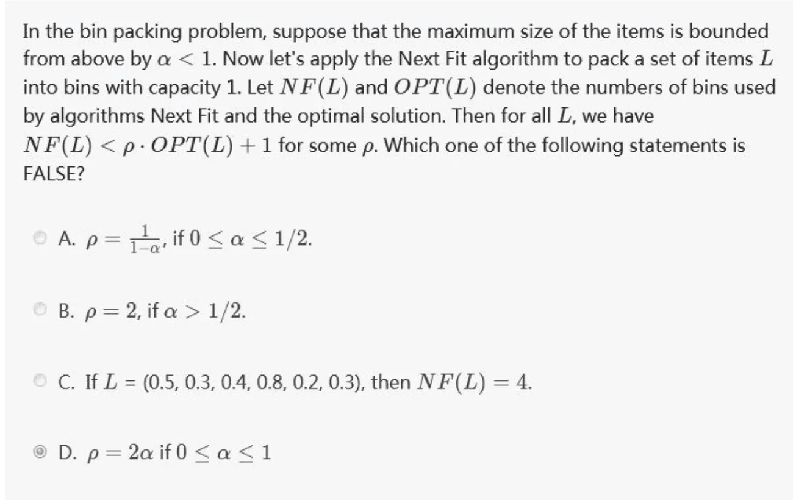
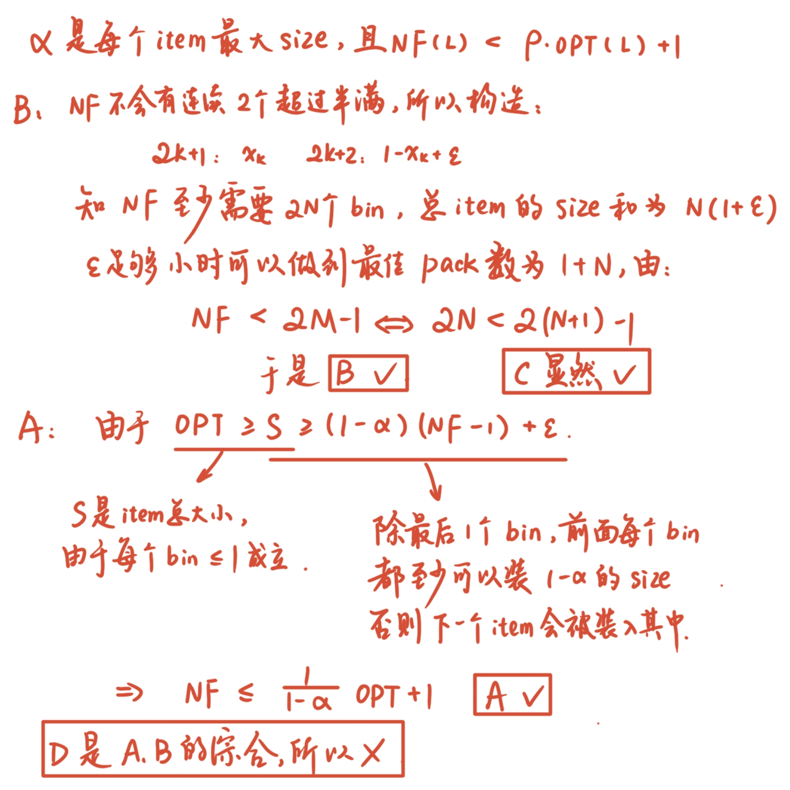
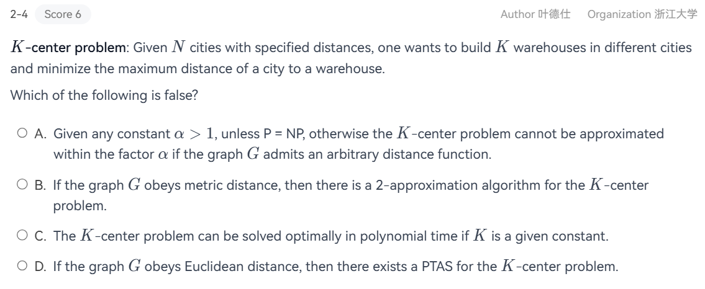
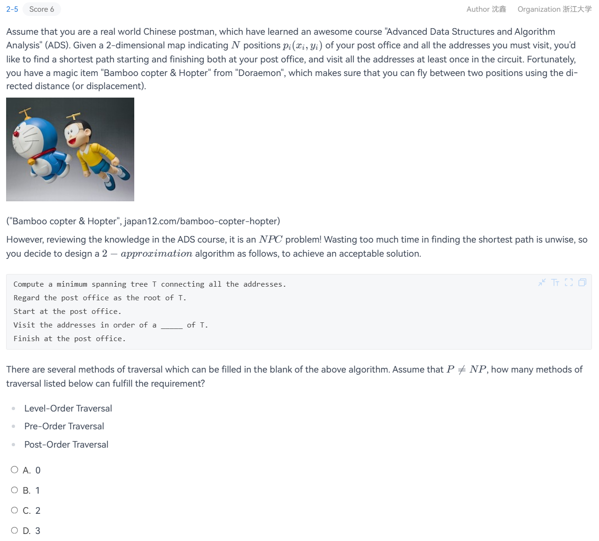
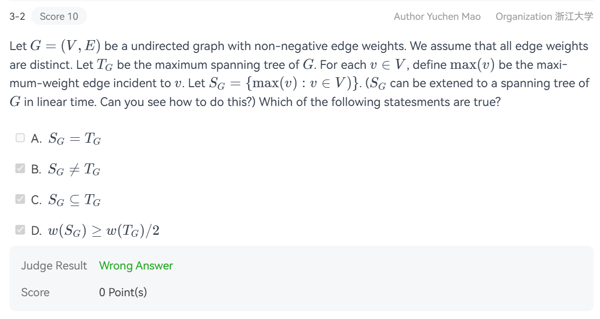

???+ info "参考资源"

    <a href="reference/lec17.pdf" download="np.pdf">MIT6.046J(2015 Spring)-Lec17</a>
    $\quad$
    [HobbitQia助教哥哥的笔记](https://note.hobbitqia.cc/ADS/)
    $\quad$
    [Starstone的笔记本](https://starstone3.github.io/incourse/ADS/Approximation/)
    
    [wikipedia](https://zh.wikipedia.org/wiki/%E8%BF%91%E4%BC%BC%E7%AE%97%E6%B3%95)

???+ warning "期末补天须知"

    Binpacking Problem: 假设最优是$M$个pack，则

    * NextFit (如果前一个bin能放下就放，放不下新开一个): $\text{worst} = 2M-1$<br>
    * BestFit (放进去以后剩余空间最少的bin): $\text{worst} = 1.7M-1.7$<br>
    * FirstFit (第一个能放下的bin): $\text{worst} = 1.7M$<br>
    * Online: $\geq \dfrac{5M}{3}$<br>
    * Offline: $\dfrac{11M}{9} + \dfrac{2}{3}$

## 近似算法基本定义

近似算法是基于$\textbf{P} \neq \textbf{NP}$假设的，为最优化问题寻找近似解的算法. 该类算法找到的近似解与最优解之间的差值需能证明不超过某个值（后面会记作近似比）.

已经证明是$\textbf{NP-completeness}$的时间复杂度极高的优化问题，学界广泛认为不具备多项式时间算法，所以很难获得精确解. 于是转而使用近似算法来获得局部区间的近似最优.

**近似比(Approximation Ratio):**An algorithm has an approximation ratio of $\rho(n)$ if, for any input of size $n$, the cost $C$ of the solution produced by the algorithm is within a factor of $\rho(n)$ of the cost $C^*$ of an optimal solution:

$$\max(\dfrac{C}{C^*},\dfrac{C^*}{C}) \leq \rho(n)$$

称对应的算法是$\rho(n)$-approximation algorithm.

**近似范数(Approximation Scheme)**: An approximation scheme for an optimization problem is an approximation algorithm that takes as input not only an instance of the problem, but also a value $\epsilon > 0$ such that for any fixed $\epsilon$, the scheme is a $(1+ \epsilon)$-approximation algorithm.

对于最小化问题，如果算法解$C$与最优解$C^{*}$满足$C \leq (1+\epsilon)C^*$，
则称为$(1+\epsilon)$-近似算法.

对于最大化问题，算法解$C$与最优解$C^{*}$满足$C \geq (1-\epsilon)C^*$，$\epsilon$称为误差参数，越小则解越接近最优.

**PTAS(polynomial-time approximation scheme,多项式时间近似方案)**: an approximation scheme which for any fixed $\epsilon > 0$, the scheme runs in time polynomial in the size $n$ of its input instance.

一个优化问题有PTAS，意味着对于任意给定的$\epsilon > 0$，存在算法$A_{\epsilon}$是一个$(1+\epsilon)$-近似算法，其中运行时间关于输入规模$n$是多项式.

形式化表示：运行时间$T(n, \epsilon) = O(n^{f(\epsilon)})$，其中$n$是输入规模，$f(\epsilon)$是关于$\epsilon$的任意函数（可以非常大，但对固定的$\epsilon$，$T(n, \epsilon)$关于$n$是多项式.

**FPTAS(Fully-polynomial-time approximation scheme, 完全多项式时间近似方案)**: ，定义更为严苛：在上面的基础上，要求运行时间关于$n$和$\dfrac1\epsilon$都是多项式.

???+ tips "PTAS/FPTAS举例"

    PTAS但不是FPTAS: $O(n^{\frac{2}{\epsilon}})$  
    
    FPTAS: $O(\dfrac{1}{\epsilon^2}n^3)$

### PTA习题

???+ tips "6.1-7/8/9"

    <center></center>

???+ tips "xyx-2"

    <center></center>

## 实际应用

### Approximate Bin Packing

这是一个很接近[Project 5 Three-Partition](../ads/proj/5.md)的$\textbf{NP-hard}$问题，描述如下：

> Given $N$ items of sizes  $S_1 , S_2 , \cdots , S_N$ , such that $0 < S_i \leq 1, \forall 1 \leq i \leq N$. Pack these items in the fewest number of bins, each of which has unit capacity.

#### Next Fit Algorithm

策略：只考虑上一个打开的箱子. 如果新物品能放入上一个箱子，就放入；否则，立即打开一个新箱子，并将新物品作为新的“上一”物品.

???+ tips "代码示例"

    ```cpp
    #include <iostream>
    #include <vector>
    using namespace std;

    #define max 100
    double bins[max];
    int cnt = 0;

    void nf(vector<double> item){
        int lastbin = -1;
        for (int j = 0; j < item.size(); j++){
            if (lastbin >= 0 && bins[lastbin] >= item[j]){
                bins[lastbin] -= item[j];
                cout << "item " << item[j] << " packed into " << lastbin << "-th bin" << endl;
            }
            else if(cnt < max){
                bins[cnt] = 1.0 - item[j];
                lastbin = cnt;
                cnt++;
                cout << "item " << item[j] << " packed into a new bin numbered " << (cnt-1) << endl;
            }
            else{
                cerr << "No free bins" << endl;
                return;
            }
        }
    }

    int main(){
        vector<double> item = {.42, .25, .27, .07, .72, .09, .86, .44, .50, .68, .73, .31, .78, .17, .79, .37, .73, .23, .30};
        nf(item);
        return 0;
    }
    ```

定理：Let $M$ be the optimal number of bins required to pack a list I of items. Then next fit never uses more than $2M – 1$ bins. There exist sequences such that next fit uses $2M – 1$ bins.

证明：反证，用不等式构造矛盾.

#### First Fit Algorithm

策略：扫描所有已打开的箱子，将新物品放入第1个足够大的箱子中. 如果所有已开箱子都不够大，则创建一个新箱子.

???+ tips "代码示例"

    ```cpp
    #include <iostream>
    #include <vector>
    using namespace std;

    #define max 100
    double bins[max];
    int cnt = 0;

    void ff(vector<double> item){
        for (int j = 0; j < item.size(); j++){
            int f = 0;
            for (int i = 0; i < cnt; i++){
                if (bins[i] >= item[j]){
                    bins[i] -= item[j];
                    cout << "item " << item[j] << " packed into " << i << "-th bin" << endl;
                    f = 1;
                    break;
                }
            }
            if (!f && cnt < max){
                bins[cnt] = 1.0 - item[j];
                cnt++;
                cout << "item " << item[j] << " packed into a new bin numbered " << (cnt-1) << endl;
            }else if (!f){
                cerr << "No free bins" << endl;
                return;
            }
        }
    }

    int main(){
        vector<double> item = {.42, .25, .27, .07, .72, .09, .86, .44, .50, .68, .73, .31, .78, .17, .79, .37, .73, .23, .30};
        ff(item);
        return 0;
    }
    ```

效率: 可以实现为 $O(N \log N)$ 的时间复杂度.

是不稳定的算法，如果在一个序列中所需的箱子数量是$M$，去掉一个箱子之后，所需的箱子数也可能$>M$.

举例：

???+ tips "xyx-2"
    <center></center>

    $\text{Bin Size} =1, L = \{0.55,0.7,0.55,0.1,0.45,0.15,0.3,0.2\}$, $L' = \{0.55,0.7,0.55,0.45,0.15,0.3,0.2\}$

    可以得出第一种需要3个pack，第二种需要4个pack，反而劣化了.

#### Best Fit Algorithm

策略：扫描所有已打开的箱子，将新物品放入其中放入后最接近capacity的箱子中. 如果所有已开箱子都不够大，则创建一个新箱子.

相比First Fit而言，是稳定的.

???+ tips "代码示例"

    ```cpp
    #include <iostream>
    #include <vector>
    using namespace std;

    #define max 100
    double bins[max];
    int cnt = 0;

    void bf(vector<double> item){
        for (int j = 0; j < item.size(); j++){
            int aim = -1;
            for (int i = 0; i < cnt; i++)
                if (bins[i] >= item[j] && (bins[i] <= bins[aim] || aim < 0))
                    aim = i;   
            if (aim != -1){
                bins[aim] -= item[j];
                cout << "item " << item[j] << " packed into " << aim << "-th bin" << endl;
            }
            else{
                if (cnt < max){
                    bins[cnt] = 1.0 - item[j];
                    cnt++;                
                    cout << "item " << item[j] << " packed into a new bin numbered " << (cnt-1) << endl;
                }else {
                    cerr << "No free bins" << endl;
                    return;
                }
            }
        }   
    }

    int main(){
        vector<double> item = {.42, .25, .27, .07, .72, .09, .86, .44, .50, .68, .73, .31, .78, .17, .79, .37, .73, .23, .30};
        bf(item);
        return 0;
    }
    ```

#### Online Algorithm

Place an item before processing the next one, and can NOT change decision.

也就是说获得一个输入之后必须马上决策，无法看到后面的输入.

No on-line algorithm can always give an optimal solution. **There are inputs that force any on-line bin-packing algorithm to use at least $\dfrac53$ the optimal number of bins.**

举例：

#### Offline Algorithm

View the entire item list before producing an answer.

#### PTA习题

???+ tips "6.2-2/3"
    <center></center>
    2-2选C，因为NF只与前一个有关，样例特殊时也不会提升比率;<br>

    2-3选C，考虑$\{0.9,0.2,0.9,0.2\}$.

???+ tips "xyx-2"
    <center></center>
    <center></center>

???+ tips "Final Practice 2 2-1"

    A. The expected number of balls in a box is calculated by dividing the total number of balls (\(m\)) by the total number of boxes (\(m\)), which is 1. So, this option is true .
    
    B. The probability that a particular box is empty after \(m\) independent and uniform random assignments is \((1 - \frac{1}{m})^m\). As \(m\) approaches infinity, \((1 - \frac{1}{m})^m\) approaches \(\frac{1}{e}\). Therefore, the expected number of empty boxes is \(m \times \frac{1}{e} = \frac{m}{e}\). This option is true .

    C. In the case where each box can only contain one ball, the number of rejected balls follows a Poisson distribution with mean \(\frac{m}{e}\). So, this option is true .
    
    D. For a box to contain exactly two balls, we need to consider the binomial distribution. The probability that a box contains exactly two balls is \(\binom{m}{2} (\frac{1}{m})^2 (1 - \frac{1}{m})^{m - 2}\). As \(m\) approaches infinity, this probability is not \(\frac{1}{e}\).

---

### The Knapsack Problem(背包问题)

#### fractional ver.

非常简单，只需要依照maximum profit density的原则去贪心就可以了.

假设profit序列$\{p_i\}$，weight序列$\{w_i\}$，率先装尽density序列$\{d_i = \dfrac{p_i}{w_i}\}$之中最大的，依次装包直至装满.

#### 0-1 ver.

**结论：是$\textbf{NP-hard}$，近似比是2.**

证明：

$$\begin{cases}
p_{\max} \leq P_{opt} \leq P_{frac} \\
p_{\max} \leq P_{greedy} \\
P_{opt} \leq P_{greedy} + p_{\max}
\end{cases} \Longrightarrow
\dfrac{P_{opt}}{P_{greedy}} \leq 1+\dfrac{p_{\max}}{P_{greedy}} \leq 2$$

动态规划下的时间复杂度是$O(n^2p_{\max})$，其中$p_{\max}$是最终规划出来的最大利润.

???+ tips "xyx-2"

    For the 0-1 version of the Knapsack problem, if we are greedy on taking the maximum profit or profit density, then the resulting profit must be bounded below by the optimal solution minus the maximum profit. (F)

    原因是，

---

### The K-center Problem(K中心问题)

给定平面上的一系列site（即点），在平面中找出$k$个不同的 center，记$\text{site}_i$到离它最近的 center的距离为$\text{dis}_i$，求$\max\{\text{dis}_i\}$的最小值.

一个(不可行的)贪心策略是，刚开始把第一个中心放在最可能的位置，之后不断地添加中心，使得covering radius不断被降低. 这个策略不能解决局部聚集成“团”而“团”之间距离极大的问题，因而是不可行的.

#### $2r$-Greedy

$K$-Center 问题的贪心算法（通常被称为 Gonzalez's Algorithm）.

* 初始化： 随便选一个点作为第一个中心加入集合 $C$.
* 循环： 在剩下的所有点中，找到距离当前中心集合 $C$ 最远的那个点 $s$（即 $s$ 到 $C$ 中最近点的距离最大）.
* 加入： 把这个“最远”的点 $s$ 加入中心集合 $C$.
* 终止： 重复直到选够了 $K$ 个中心.

结论：$2$-approximation.

> Theorem: Unless $\textbf{P} = \textbf{NP}$, there is no $\rho-$approximation algorithm for center-selection problem for any $\rho < 2$. 

```c
Centers  Greedy-2r ( Sites S[ ], int n, int K, double r )
{   Sites  S’[ ] = S[ ]; /* S’ is the set of the remaining sites */
    Centers  C[ ] = \infty;
    while ( S’[ ] != \infty ) {
        Select any s from S’ and add it to C;
        Delete all s’ from S’ that are at dist(s’, s) <= 2r;
    }
    if ( |C| <= K ) return C;
    else ERROR(No set of K centers with covering radius at most r);
}
```

#### Thresholding & Binary Search

另一种思路是，如果我们猜测一个半径 $r$，能不能判断是否存在 $K$ 个中心能覆盖所有点？

二分搜索优化:

* 我们不知道最优半径 $r(C^*)$ 是多少，于是使用二分搜索来猜 $r$. 首先设定搜索范围 $(0, r_{max})$，取中间值 $r = \dfrac{(0 + r_{max})}2$

* 运行上面的判定逻辑：如果能用 $K$ 个中心覆盖（覆盖半径 $2r$），说明 $r$ 可能偏大，往左半区搜（尝试更小的 $r$）；如果不能覆盖（需要 $>K$ 个中心），说明 $r$ 太小，往右半区搜.

这种方法同样能给出一个 2-Approximation 的解.

需要注意的是，无法给出更好的近似结果：

在 $\textbf{P} \neq \textbf{NP}$ 的假定下，利用支配集问题 (Dominating Set, $\textbf{NP-complete}$)进行归约.

构造方法是，给定一个图$G$，我们构造一个 $K$-Center 问题,如果两个点在原图中有边相连，距离设为 1; 如果没有边相连，距离设为 2.

这里产生了逻辑矛盾：如果原图存在大小为 $K$ 的支配集 $\Longrightarrow$ $K$-Center 问题的最优半径为 1；如果原图不存在大小为 $K$ 的支配集 $K$-Center 问题的最优半径至少为 2（必须跨越不相连的点）.

#### PTA习题

???+ tips "6.2-4"
    <center></center>

???+ tips "xyx-2"
    (T) The K-center problem can be solved optimally in polynomial time if K is a given constant. 

    分析：一个圆可以由 2 个点（直径）或者 3 个点（三角形）确定，不妨认为是 3. 那么，我们总共可以找到 $C_n^3 \simeq n^3$ 种 3 个点的组合方式，计算其构成的圆的半径. 
    最优解即为在上述组合方式中每次选出 $K$ 个，判定是否覆盖所有点，记录满足条件的最小结果（半径），因此组合方式是 $C_{C_n^3}^{K} \simeq C_{n^3}^{K} \simeq n^{3K}$ 个. 
    如果认为 $K$ 是常数，则这是一个多项式级别的算法. 但是 $K$ 最多可达 $n$ 的大小，因此在最大情况下为 $n^{3n}$，这不是多项式级别的. 

???+ tips "xyx-2评论区的题目"

    <center></center>

### TSP问题（Traveling Salesman Problem）

有1.5/2-approximation两种算法需要掌握.

#### 1.5-approximation

#### 2-approximation

### 图论与树PTA习题

???+ tips "6.2-5"
    <center></center>

???+ tips "6.3-2"
    <center></center>
