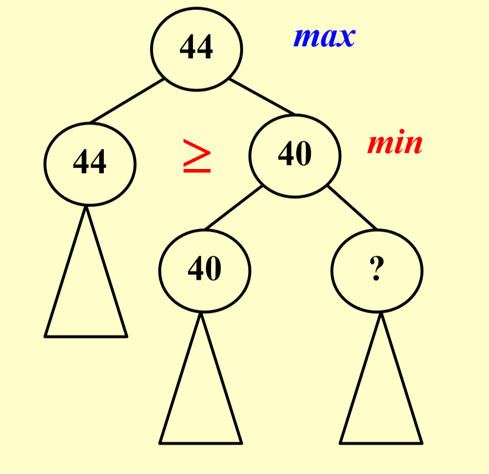
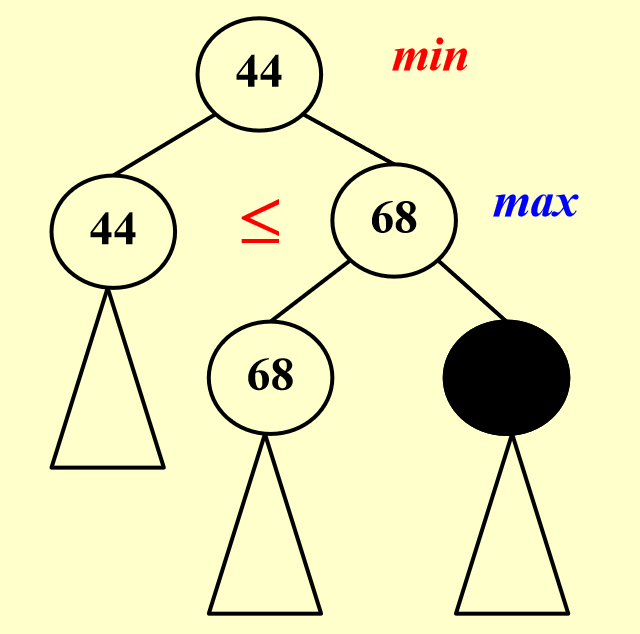
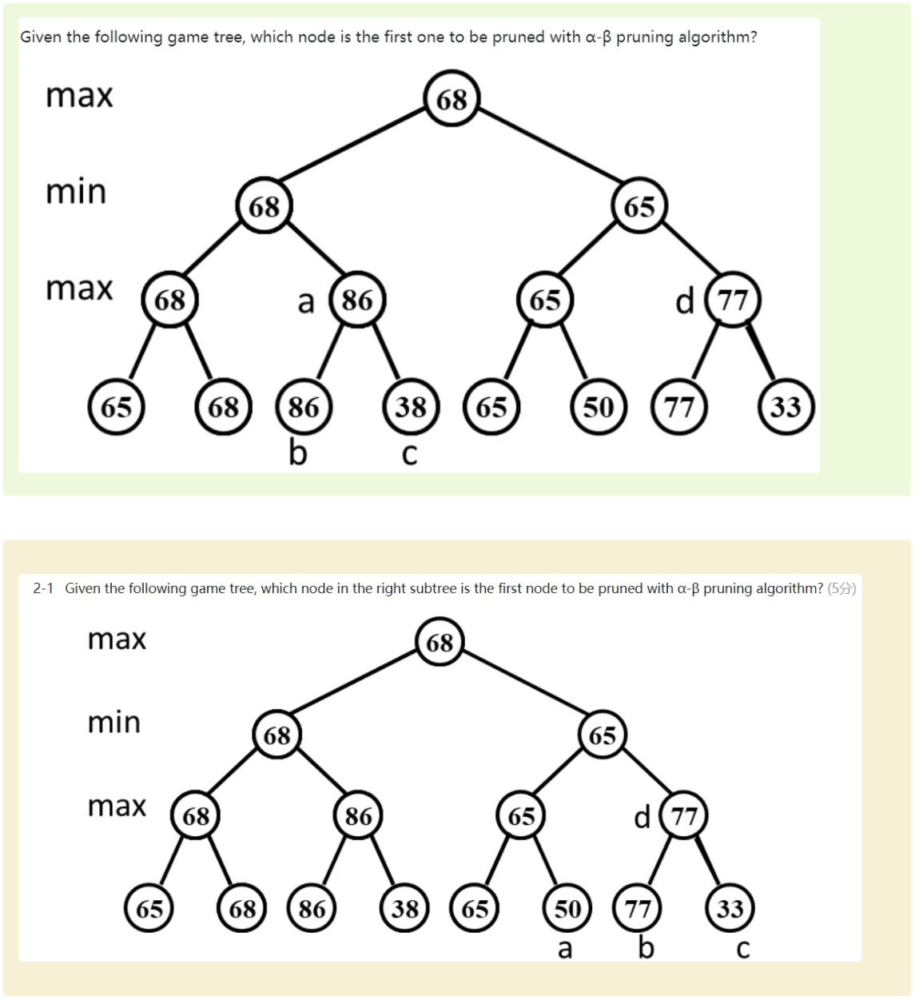
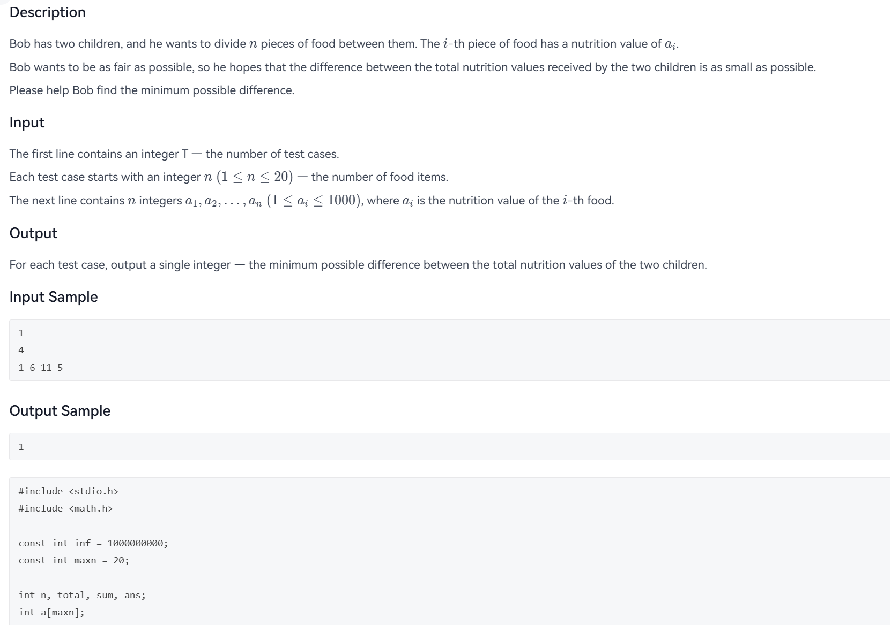
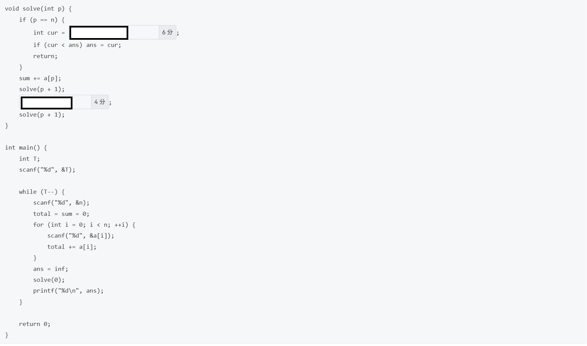
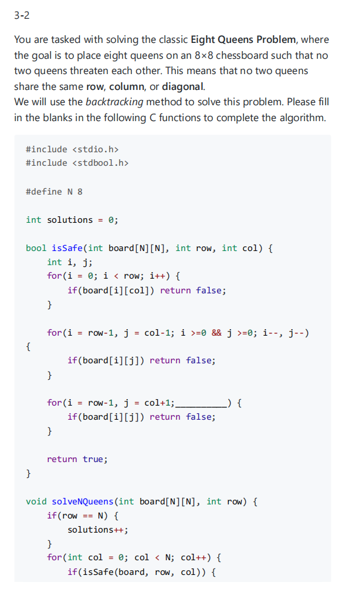
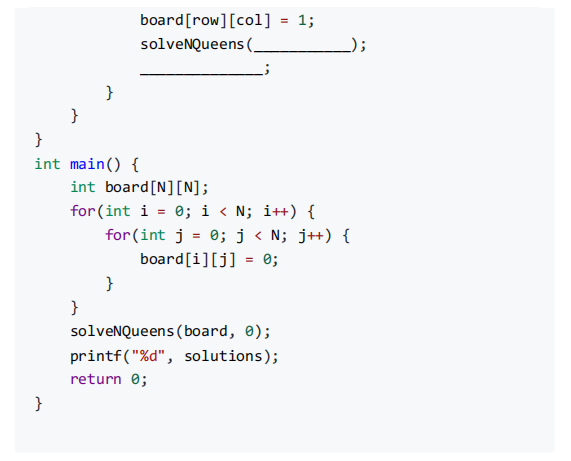

## Turnpike Reconstruction Problem

给定$\dfrac{N^2-N}{2}$个距离值，重建$N$个点的坐标，使得这些点两两距离恰好是给定的距离集合. 假设$x_1= 0$.

处理方法采用回溯法，过程：

1. 固定 $x_1 = 0，x_N = max$;
2. 每次取最大剩余距离$D_{max}$;
3. 尝试将新点放在左端($x = D_{max}$)或右端($x = x_N - D_{max}$);
4. 检查新点到已放置点的距离是否都在剩余距离集合中;
5. 可行则递归，否则回溯.

**需要注意的是，剪枝时如果不同的子树大小不同，优先选择小的子树先bfs**.

伪代码如下：

???+ tips "关键函数"

    ```c
    bool Reconstruct ( DistType X[ ], DistSet D, int N, int left, int right ){ 
        /* X[1]...X[left-1] and X[right+1]...X[N] are solved */
        bool Found = false;
        if ( Is_Empty( D ) ) return true; /* solved */
        D_max = Find_Max( D );
        /* option 1：X[right] = D_max */
        /* check if |D_max-X[i]|D is true for all X[i]’s that have been solved */
        OK = Check( D_max, N, left, right ); /* pruning */
        if ( OK ) { /* add X[right] and update D */
            X[right] = D_max;
            for ( i=1; i<left; i++ )  Delete( |X[right]-X[i]|, D);
            for ( i=right+1; i<=N; i++ )  Delete( |X[right]-X[i]|, D);
            Found = Reconstruct ( X, D, N, left, right-1 );
            if ( !Found ) { /* if does not work, undo */
                for ( i=1; i<left; i++ )  Insert( |X[right]-X[i]|, D);
                for ( i=right+1; i<=N; i++ )  Insert( |X[right]-X[i]|, D);
            }
        }
        /* finish checking option 1 */
        if ( !Found ) { /* if option 1 does not work */
            /* option 2: X[left] = X[N]-D_max */
            OK = Check( X[N]-D_max, N, left, right );
            if ( OK ) {
                X[left] = X[N] – D_max;
                for ( i=1; i<left; i++ )  Delete( |X[left]-X[i]|, D);
                for ( i=right+1; i<=N; i++ )  Delete( |X[left]-X[i]|, D);
                Found = Reconstruct (X, D, N, left+1, right );
                if ( !Found ) {
                    for ( i=1; i<left; i++ ) Insert( |X[left]-X[i]|, D);
                    for ( i=right+1; i<=N; i++ ) Insert( |X[left]-X[i]|, D);
                }
            }
            /* finish checking option 2 */
        } /* finish checking all the options */
        return Found;
    }
    ```

这个算法的时间复杂度最坏情况为 $O(2^N)$，因为每个位置有两种选择（左或右）；但实际运行时通常远小于 $O(2^N)$，因为剪枝效果好.

空间复杂度是 $O(N^2)$，因为存储 $\dfrac{N(N-1)}{2}$ 个距离；递归栈深度：$O(N)$

代码实现的关键点是设置了一个桶，使用数组计数实现多重集合，$O(1)$时间检查和删除距离.

### PTA习题

???+ notes "3.3-2"
    In a turnpike reconstruction problem, the distance set is given as $\{1, 1, 2, 4, 4, 5, 5, 5, 6, 6, 7, 9, 10, 11, 12\}$. In now backtracking state(a node in the backtracking tree), we temporarily identify four points: $x_1=0,x_2=12,x_3=1,x_4=2$, which next try is possible？

    A.$x_5=3$ $\quad$ B.$x_5=4$ $\quad$ C.$x_5=5$ $\quad$ D.$x_5=6$ $\quad$ E.$x_5=7$ $\quad$ F.$x_5=8$ $\quad$ G.$x_5=9$ $\quad$ 

    答案是

## Alpha-Beta Pruning

### Tic-tac-toe 问题 (Minimax)

在 $3 \times 3$ 的对角中进行井字棋游戏，一方只要横纵斜同色就获胜.

使用如下评估函数来判断当前局势：

$$f(P) = W_{\text{Computer}} - W_{\text{Human}}$$

作为玩家的你希望缩小这个值，而作为你对手的电脑希望扩大它.

### Game Tree

$\alpha$-pruning: 修剪掉max一层的节点，因为其兄弟节点和更上一层另一子树的节点保证了它的取值不会影响到grandparent一层的值.

举例：（此处?的值是无关紧要的）

<center></center>

$\beta$-pruning: 修剪掉min一层的节点.

<center></center>

当二者同时被使用的时候，搜索的复杂度会被降低到 $O(\sqrt{N})$.

???+ tips "算法伪代码"

    ```python
    function AlphaBeta(state, depth, α, β, isMaxPlayer):
        if state是终局 or depth = 0:
            return 评估值
        
        if isMaxPlayer:
            maxEval = -inf
            for each child in state的后继状态:
                eval = AlphaBeta(child, depth-1, α, β, false)
                maxEval = max(maxEval, eval)
                α = max(α, eval)
                if β <= α:  // β剪枝
                    break
            return maxEval
        else:
            minEval = +inf
            for each child in state的后继状态:
                eval = AlphaBeta(child, depth-1, α, β, true)
                minEval = min(minEval, eval)
                β = min(β, eval)
                if β <= α:  // α剪枝
                    break
            return minEval
    ```

### PTA习题

???+ tips "xyx-1"

    <center></center>

    都是c.如果忘了算法也可以通过分析得出，从左向右自顶向下预设某个节点的值未知，去推导该值会不会对结果产生影响.
    
    * α-β 剪枝的核心：max 层维护 α（下界），min 层维护 β（上界）<br>
    * β 剪枝：在 max 节点，如果找到的值 ≥ β，则剪枝<br>
    * α 剪枝：在 min 节点，如果找到的值 ≤ α，则剪枝

## 回溯算法补充问题

### PTA习题

???+ tips "2025fall-yy-mid"

    <center></center>

    <center></center>

    答案是`fabs(2 * sum - total)`和`sum -= a[p]`

???+ tips "2025fall-ch-mid"

    <center></center>

    <center></center>

    答案：`i >= 0 && j <= N-1 ; i--, j++`, `board;row+1`, `board[row][col] = 0`.
    