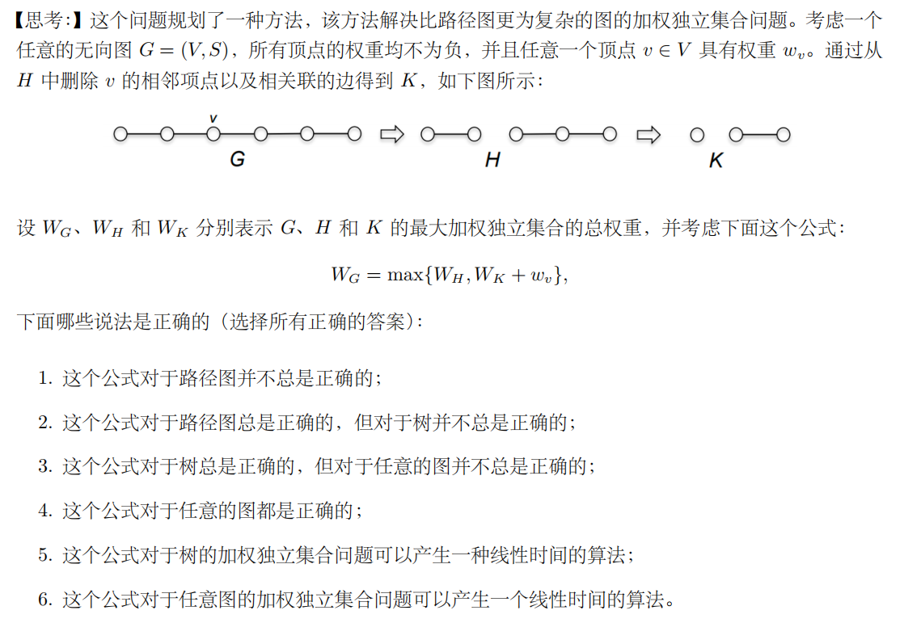
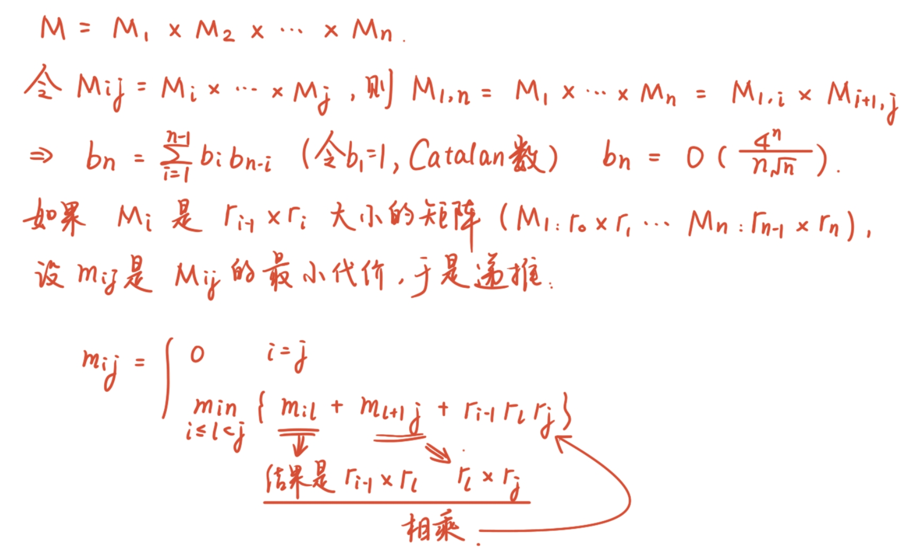
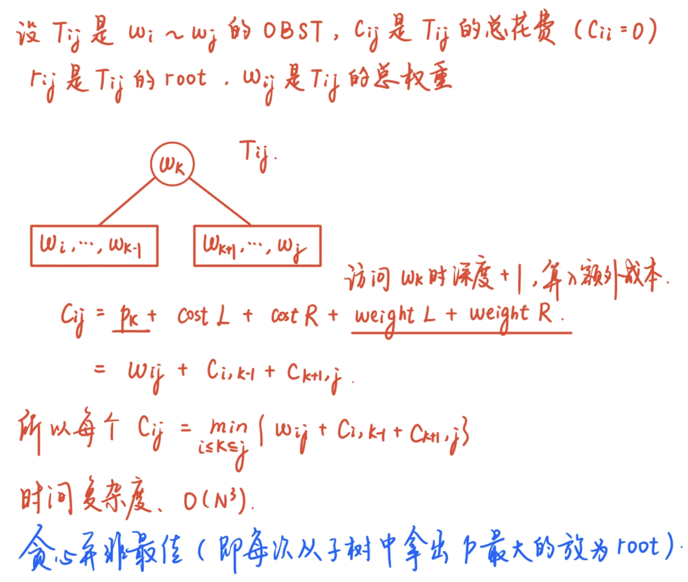
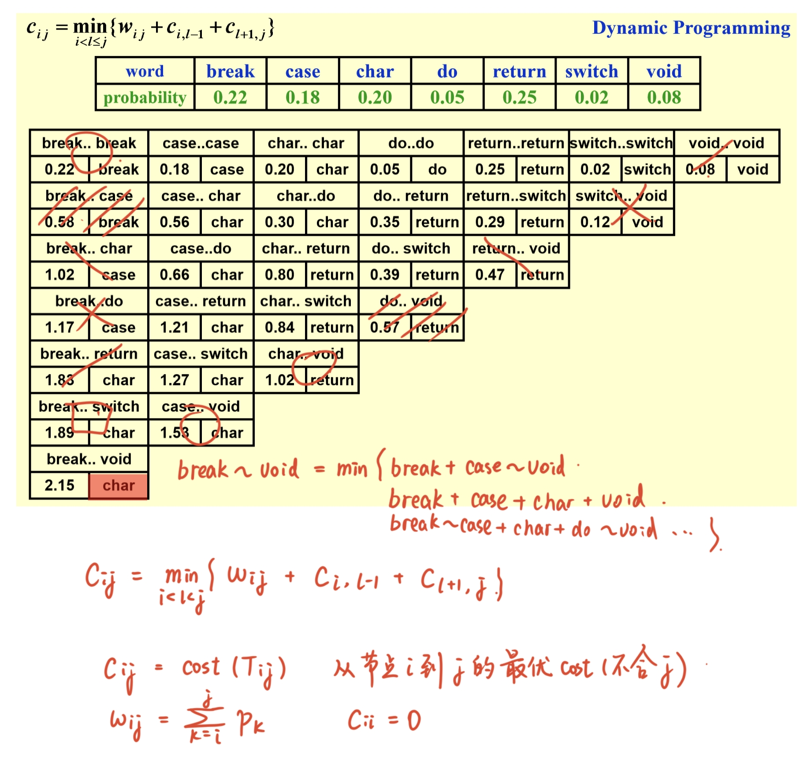
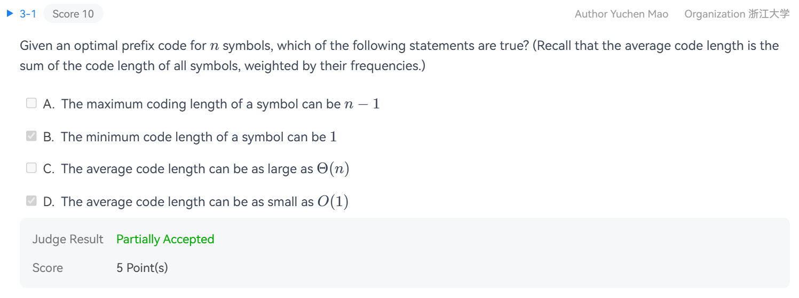
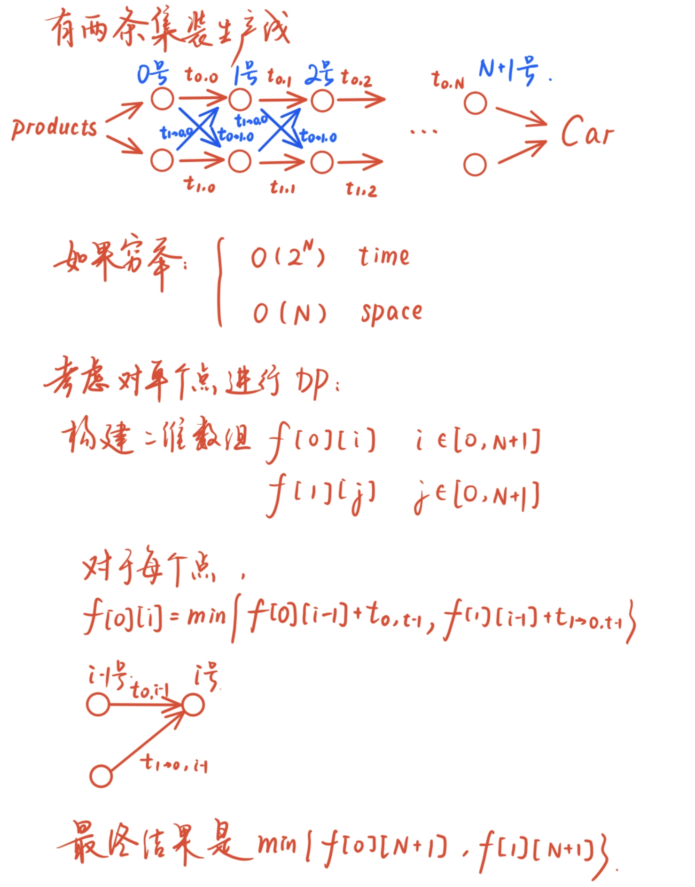
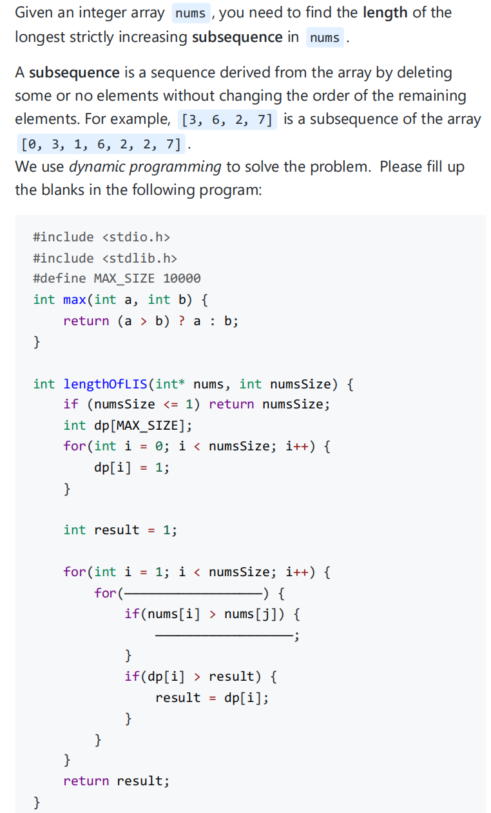
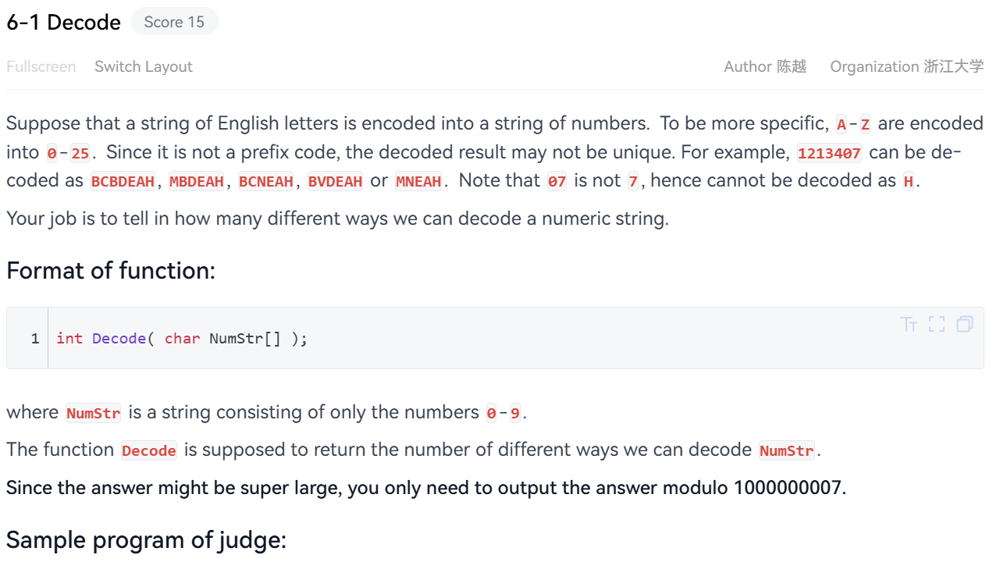
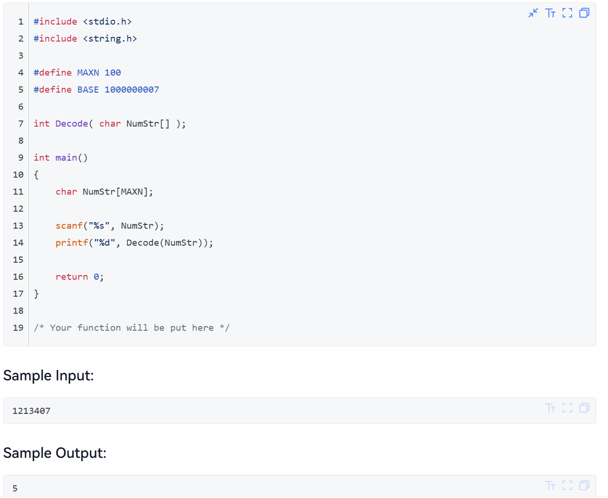

???+ into "参考资源"

    《算法导论》[P359开始（英文版）](https://www.cs.mcgill.ca/~akroit/math/compsci/Cormen%20Introduction%20to%20Algorithms.pdf)或者P204开始（中文版）.

    [Algorithm Design](https://www.cs.princeton.edu/~wayne/kleinberg-tardos/) 看Chap6.

    [代码随想录的动态规划部分](https://programmercarl.com/%E5%8A%A8%E6%80%81%E8%A7%84%E5%88%92%E7%90%86%E8%AE%BA%E5%9F%BA%E7%A1%80.html#%E7%AE%97%E6%B3%95%E5%85%AC%E5%BC%80%E8%AF%BE)

动态规划主要是考虑状态转移的构建方法，按照课后作业的问题、wyy的讲义和Algorithm Design、算法导论的内容进行笔记梳理.

## 加权独立集合问题

考虑一个无向图$G$，其上所有点都在同一条线上，每个点都有一个非负权重. 称$G$的独立集合是顶点互不相邻的子集. 我们需要找到具有最大顶点权重和的独立集合.

首先考虑最优子结构是如何构造的，设$G_n(V,E)$具有边$(v_1,v_2),\cdots,(v_{n-1},v_n)$，最优解是$S_n$，此时总权值之和是$W_{n}$.

* 如果$v_n \notin S$，则$S$是$G_{n-1}$的最优解；<br>
* 如果$v_n \in S$，由限制条件，$v_{n-1} \notin S$，则$W_{n} = W_{n-2}+\omega_n$.

于是可以导出最优子结构是

$$W_{n} = \max \{W_{n-1},W_{n-2}+\omega_n\} \Longrightarrow W_{i} = \max \{W_{i-1},W_{i-2}+\omega_i\}.$$

时间复杂度：$O(n)$.

???+ tips "代码"

    ```cpp
    class Solution{
        public:
        vector<int> maxsum(vector<int> w,int n){
            vector<int> A(n+1,0);
            A[0] = 0;
            A[1] = w[0];
            for (int i = 2; i <= n; i++)
                A[i] = max(A[i-1],A[i-2]+w[i-1]);
            return A;
        }
        vector<int> A = maxsum(const vector<int>& w, int n);
        vector<int> Sol(vector<int> A, vector<int> w, int n){ //解的重构函数
            vector<int> S;
            int i = n;
            while (i >= 2){
                if (A[i-1] >= A[i-2] + w[i-1]){
                    i = i-1;
                }else{
                    S.push_back(i-1);
                    i = i-2;
                }
            }
            if (i == 1)
                S.push_back(0);
            return S;
        }
    }
    ```

???+ tips "思考题1"

    算法递推仍然正确，只需要考虑初始条件的修改：$W_0 = 0; W_1 = \max\{W_0,\omega_1\}$ 
    
    最终答案会变成$\max(0, W_n)$（允许空集）

???+ tips "思考题2"

    <center></center>

    答案：2，5

### PTA习题

???+ tips "4.7-1 Missile Interception(最长递减子序列问题)"

    ```cpp
    #include<iostream>
    #include<vector>

    using namespace std;

    int main(){
        int N;
        vector<int> height(2000);
        vector<int> count(2000,1);
        cin >> N; 
        for (int i = 0; i < N; i++)
            cin >> height[i];

        for (int i = 1; i < N; i++)
            for (int j = 0; j < i; j++)
                if (height[j] >= height[i])
                    count[i] = max(count[i],count[j]+1);

        int maxcnt = 1;
        for (int i = 1; i < N; i++)
            maxcnt = max(maxcnt,count[i]);
        cout << maxcnt << endl;
    }
    ```

## 矩阵相乘

现在需要对4个矩阵进行乘法操作：

$$M_{1(10\times 20)} \times M_{2(20\times 50)} \times M_{3(50\times 1)} \times M_{4(1\times 100)}$$

需要找到最佳的顺序，使得开销时间最小.

<center></center>

伪代码如下：

```c
void OptMatrix( const long r[ ], int N, TwoDimArray M ) 
{   int i, j, k, L; 
    long ThisM; 
    for(i = 1; i <= N; i++)   
        M[i][i] = 0; 
    for(k = 1; k < N; k++ ){ /* k = j - i */ 
        for( i = 1; i <= N - k; i++) { /* For each position */ 
            j = i + k;    
            M[i][j] = Infinity; 
            for( L = i; L < j; L++ ) { 
                ThisM = M[i][L]+ M[L+1][j]+ r[i-1]* r[L]* r[j]; 
                if ( ThisM < M[i][j] )  /* Update min */ 
                    M[i][j] = ThisM; 
            }  /* end for-L */
        }  /* end for-Left */
    }
}
```

时间复杂度：$O(N^3)$.

## Optimal Binary Search Tree

将$N$个word($w_i$对应的被搜索到的概率是$p_i$，单词序上 $w_1< w_2 < \cdots <w_N$ ) 放入一个BST中，找到最佳的顺序使得所有word被搜索到的期望时间之和最小.

首先可以看出，期望时间之和运算公式是$T(N) = \sum\limits_{i=1}^N p_i(1+d_i)$.

<center></center>

在PPT上的图递推逻辑：

<center></center>

### PTA习题

???+ tips "2025fall-zgc-mid"

    <center></center>

    弥补了进考场前看不到OBST的遗憾.

    答案是ABD.

## All-Pairs Shortest Path

单源算法：$|V|$次，$T=O(|V|^3)$.

DP伪代码：

```cpp
/* A[ ] contains the adjacency matrix with A[ i ][ i ] = 0 */ 
/* D[ ] contains the values of the shortest path */ 
/* N is the number of vertices */ 
/* A negative cycle exists iff D[ i ][ i ] < 0 */ 
void AllPairs( TwoDimArray A, TwoDimArray D, int N ) {   
    int i, j, k;
    for (i = 0; i < N; i++)  /* Initialize D */ 
        for(j = 0; j < N; j++)
            D[i][j] = A[i][j]; 
    for (k = 0; k < N; k++)  /* add one vertex k into the path */
        for (i = 0; i < N; i++) 
            for (j = 0; j < N; j++) 
                if (D[i][k] + D[k][j] < D[i][j]) 
                    D[i][j] = D[i][k] + D[k][j]; // Update shortest path
}
```

**成立条件：有负权边仍成立, 但是如果有负权的cycle就会失效.（相比之下，Dijkstra更弱一点，必须要求所有边的权值非负.**

$T(N) = O(N^3)$，但是在稠密图中速度更快一点.

## Product Assembly

生产线选择问题

<center></center>

代码：

???+ tips "DP代码以及路径重建代码"
    ```cpp
    vector<vector<int>> f(2,vector<int>(N+1));
    f[0][0] = 0; f[1][0] = 0;
    for (stage = 1; stage <= N; stage++){
        for (line = 0; line <= 1; line++){
            f[line][stage] = f[line][stage-1]+t_process[line][stage-1];
        }
    }
    solution = min(f[0][n],f[1][n]);
    ```

    ```cpp
    vector<vector<int>> f(2,vector<int>(N+1));
    f[0][0] = 0;
    f[1][0] = 0;
    for (stage = 1; stage <= N; stage++){
        for(line = 0; line <=1; line++){
            f_stay = f[line][stage-1] + t_process[line][stage-1];
            f_move = f[1-line][stage-1] + t_transit[1-line][stage-1];
            f[line][stage] = min(f_stay,f_move);
        }
    }
    line = f[0][N] < f[1][N] ? 0:1;
    for (stage = n; stage > 0; stage --){
        plan[stage] = line;
        line = L[line][stage];
    }
    ```

## PTA习题

???+ tips "2025fall-ch-mid"

    <center></center>

    答案：`int j = 0; j < i; j++`, `dp[i] = max(dp[i], dp[j]+1)`

???+ tips "2025fall-zgc-mid"

    <center></center>

    <center></center>

    以下是我临场写的比较笨拙的代码，考场上只有一个样例点没过（空字符串输入，所以遗憾-1，下面的代码已经补上这个问题了）.另外值得吐槽的是，平时作业可以使用C++，本着在学OOP的原则所以我好久没用过C了，结果这次期中只能用C，所以你可以看到我写的依托可笑代码:

    ```c
    #include<stdlib.h>
    int chartoint(char s){
        return (s - '0');
    }
    int Decode( char NumStr[] ){
        int p = 0;
        while (NumStr[p]) p++;
        if (p == 0) return 0;  // 这个判断值1分，因为下面的dp[0]初值赋了1.
        int* dp = malloc(sizeof(int) * (p+1));
        dp[0] = 1;
        dp[1] = 1;
        int in1 = chartoint(NumStr[0]);
        int in2 = chartoint(NumStr[1]);
        int s = in1 * 10 + in2;
        dp[2] = (s <= 25 && s >= 10) ? 2 : 1;
        
        for (int i = 2; i <= p; i++){
            int pre = chartoint(NumStr[i-2]);
            int cur = chartoint(NumStr[i-1]);
            int sum = pre*10+cur;
            if (sum >= 10 && sum <= 25){
                dp[i] = (dp[i-1] + dp[i-2])%1000000007;
            }else{
                dp[i] = dp[i-1] % 1000000007;
            }
        }
        return (dp[p]%1000000007);
    }
    ```

???+ tips "Final Practice 2 Code Completion"

    Suppose you are a baker planning to bake some hand-made cream breads.

    To bake a cream bread, we need to use one slice of bread and one kind of cream. Each hand-made cream bread has a taste score to describe how delicious it is, which is obtained by multiplying the taste score for bread and the taste score for cream. (The taste scores could be negative, howerver, two negative tast scores can still produce delicious cream bread.)

    The bread and cream are stored separately.

    The constraint is that you need to examine the breads in a given order, and for each piece of bread, you have to decide immediately (without looking at the remaining breads) whether you would like to take it.

    After you are finished with breads, you will take the same amount of cream in the same manner. The breads and creams you take will be paired in the same order as you take them.

    Given $N$ taste scores for bread and $M$ taste scores for cream, you are supposed to calculate the maximum total taste scores for all hand-made cream bread.

    Input Specification:

    Each input file contains one test case. For each case, the first line contains two integers $N$ and $M(1\leq N, M\leq 10^3)$, which are the numbers of bread and cream, respectively.

    The second line gives $N$ taste scores for bread.

    The third line gives $M$ taste scores for cream.

    The taste scores are integers in $[-10^3,10^3]$.

    All the numbers in a line are separated by a space.

    Output Specification:

    Print in a line the maximum total taste score.

    Sample Input:

    ```in
    3 4
    -1 10 8
    10 8 11 9
    ```

    Sample Output:

    ```out
    188
    ```

    Hint:

    The maximum total taste score for the sample case is $188$.

    <center></center>

    **题解：**

    C语言真恶心，还是cpp好，但是考试不给用.

    ```c
    #include<stdio.h>
    #include<stdlib.h>
    int max(int a, int b){
        return a>b?a:b;
    }

    int max_of(int a, int b, int c){
        return max(max(a,b),c);
    }

    int main(){
        int N,M;
        scanf("%d %d", &N,&M);
        int* bread = (int*) malloc(sizeof(int) * N);
        int* cream = (int*) malloc(sizeof(int) * M);
        
        for (int i = 0; i < N; i++)
            scanf("%d",&bread[i]);
        for (int i = 0; i < M; i++)
            scanf("%d",&cream[i]);

        int** dp = (int**) malloc((N+1) * sizeof(int*));
        for (int i = 0; i <= N; i++)
            dp[i] = (int*) malloc((M+1) * sizeof(int));

        for (int i = 1; i <= N; i++)
            for (int j = 1; j <= M; j++)
                dp[i][j] = 0;

        for (int i = 1; i <= N; i++)
            for (int j = 1; j <= M; j++)
                dp[i][j] = max_of(dp[i-1][j],dp[i][j-1],dp[i-1][j-1]+bread[i-1]*cream[j-1]);
        printf("%d\n", dp[N][M]);
    }
    ```

    ```cpp
    #include<iostream>
    #include<vector>
    #include<algorithm>

    using namespace std;
    int main(){
        int N,M;
        cin >> N >> M;
        vector<int> bread(N);
        vector<int> cream(M);
        for (int i = 0; i < N; i++)
            cin >> bread[i];
        for (int i = 0; i < M; i++)
            cin >> cream[i];

        vector<vector<int>> dp(N+1, vector<int>(M+1,0));
        for (int i = 1; i <= N; i++) 
            for (int j = 1; j <= M; j++) 
                // 视作 三种选择：不选当前面包 或 不选当前奶油 或 选当前面包和当前奶油配对
                dp[i][j] = max({dp[i-1][j], dp[i][j-1], dp[i-1][j-1] + bread[i-1] * cream[j-1]});
        cout << dp[N][M];
    }    
    ```