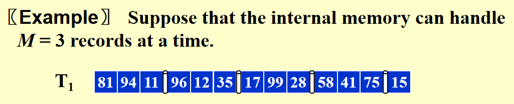
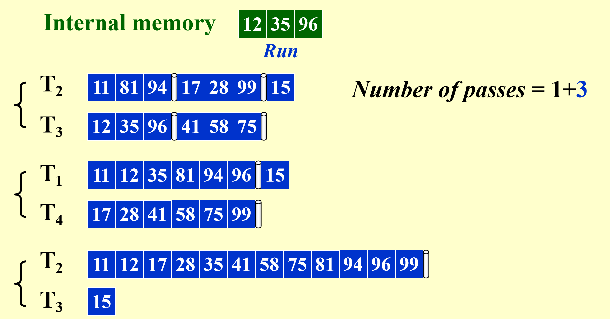
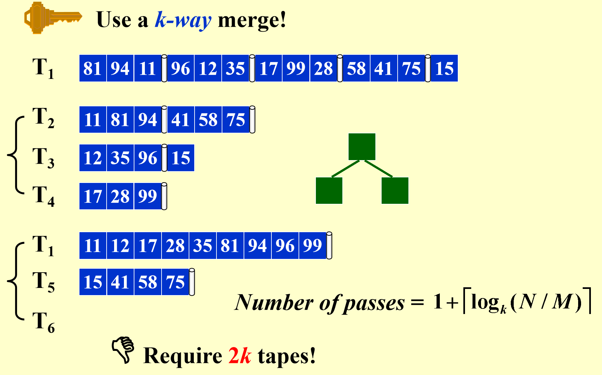
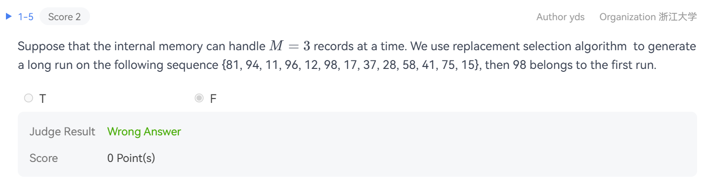
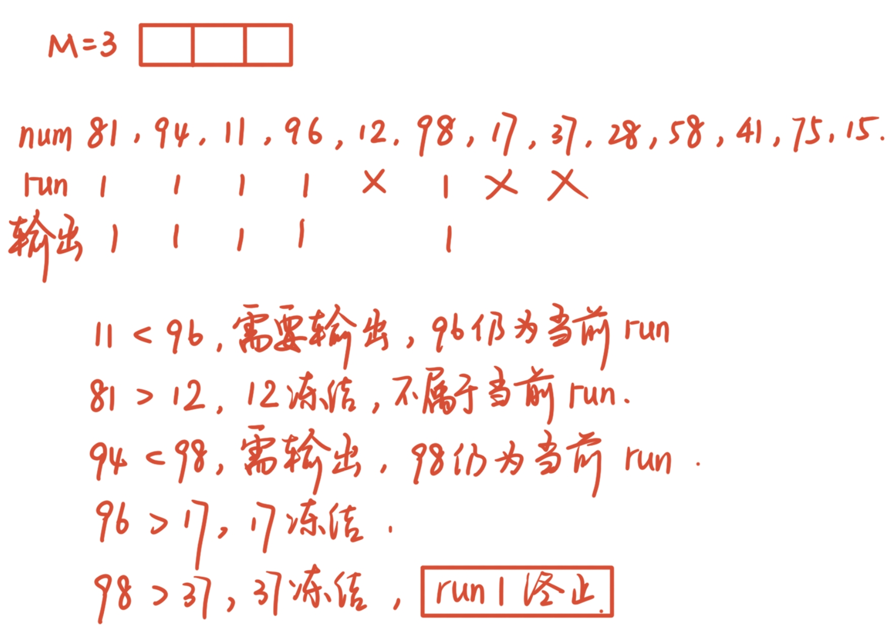
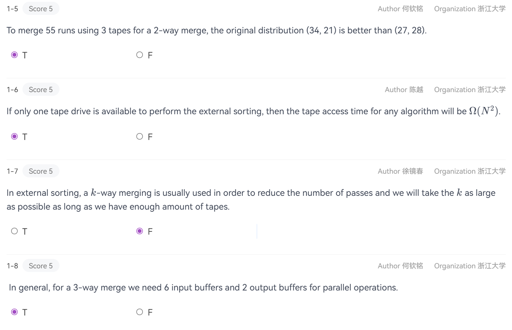
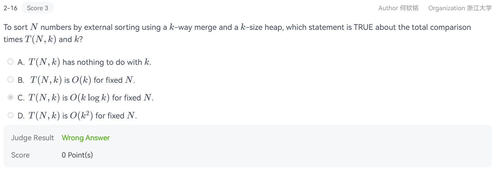

## External Sorting的引入

引入外部排序的动机之一是传统的内排算法（如快速排序）依赖于随机访问（$O(1)$ 时间获取任意元素）. 但在磁盘上，寻道（Seek）和旋转延迟非常高. 磁带则更极端，只能顺序访问；同时，原先的排序算法都是利用主存 (Main Memory) 运行的内部排序，在数据量不大（即主存能够容纳所有待排序数据）可以顺利地完成排序工作，但数据量很大，主存无法容下所有待排序数据时就会失效.

于是我们需要将排序放在**磁盘（Tape）**中，引入了**External Sorting**，其核心工具是**归并排序（Mergesort）**，它利用顺序读写的特性，最小化磁头移动次数. 其基本流程如下：

1. 生成置换段（Runs）： 将大文件切成内存能处理的小块，在内存中排好序，写回外存.  
2. 归并段（Merging）： 将多个已排序的段合并成更大的有序段，直到整个文件有序.

???+ tips "举例"

    

    对于大小为3的internal memory, 每一次run实现的是从磁盘中取出3个数，在内部排好，返回给新的tape.

    tape可以重复使用，因为原先放进去的东西取完了之后就立刻清空了，所以过程大致如下：

    

    追加Question: Given 10,000,000 records of 128 bytes each, and the size of the internal memory is 4MB.  How many passes we have to do?
    
    Answer: $\text{runs} = \dfrac{10^7 \times 128 Bytes}{4MB} = 320 \quad \text{passes} = 1+ \log(320 \text{runs}) = 1 + 9$

外部排序的开销主要取决于读写磁盘的次数. 每进行一趟归并，整个文件都要被读写一次.

我们主要关心的是以下的问题：

* Seek time，也就是pass的数量;
* Time to read or write one block of records
* Time to internally sort $M$ records
* Time to merge $N$ records from input buffers to the output buffer

## k-Way Merge

### Plain-Ver. ($2k$ tapes)

如果想要降低pass数，可以考虑使用k路归并，也就是不只使用2条tape线路，而是k条tape线路进行merge.

现在估测一下**归并趟数（Passes）**. 定义$N$是总记录数，$M$是内存能处理的记录数，$k$是归并路数（$k$-way merge），则初始生成的段数量约为 $N/M$，且每次 $k$ 路归并，段的数量会减少到原来的 $1/k$.

设需要 $x$ 趟归并，则满足 $(1/k)^x \cdot (N/M) = 1$. 取对数得 $x = \log_k(N/M)$，所以总趟数公式：

$$ 1 + \lceil \log_k(N/M) \rceil \text{（“1” 是初始生成段的那一趟）} $$

用上面的输入举例：

但是就会出现问题：需要$2k$个tape，消耗太多资源，不够好!

### Modified-Ver. ($k+1$ tapes)

如果想要在2-way merge时只使用3个tape呢？

这时候我们就要考虑Fibonacci式的任务分配，比如在总数34时分拆成13+21，这样可以做到$1 + 8 = 9$passes.

进一步地，扩展到k-way时，我们实际上要保证的是：

$$F_N^{(k)} = \sum\limits_{i=1}^{N-1} F_{N-i}^{(k)}$$

这样就能做到始终只需要恰好多出1条tape作缓冲，总计花费$(k+1)$条tape来实现k-Way Merge.

### Buffer Handling

缓冲区分配方案为了进行 2 路归并（2-way merge） 并实现并行，内存被划分为：

1. 输入缓冲区（Input Buffers）： 为每个输入源（$T_2$ 和 $T_3$）分配 $2$ 个 缓冲区（即“双缓冲”），共需 $2 \times 2 = 4$ 个缓冲区.

2. 输出缓冲区（Output Buffer）：分配 $2$ 个 缓冲区（一个在写出，另一个由 CPU 填充），共需 $2$ 个缓冲区.

所以总计需要 $6$ 个缓冲区.

但是图中的memory总共只能放 $3$ 个block，与实现完美的双缓冲并行 $2$ 路归并（至少需要 $6$ 个block 空间，2个给输入$A$，$2$个给输入$B$，$2$个给输出）矛盾了！

如果我们进行 $2$ 路归并，只能给输入 $A$ 一个块，输入 $B$ 一个块，输出一个块. 这种配置下，无法实现并行操作。CPU 处理完一个块后，必须停下来等待磁盘加载下一个块，导致硬件利用率极低.

> 如果是$k$-way，需要$2k$个input buffer以及$2$个output buffer.

### k的理想值

增加 $k$ 能减少pass数，但 $k$ 并非越大越好.

因为内存固定，增加 $k$ $\rightarrow$ 输入缓冲区数量增加 $\rightarrow$ 每个缓冲区的容量（Block size）减小 $\rightarrow$ 读取相同数据量所需的磁盘寻道次数（Seek time）暴增.

于是可以推测 $k$ 存在最优值，超过该值后，磁头来回摆动的寻道开销将超过趟数减少节省的时间.

### Replacement Selection（置换选择）

为了进一步减少归并趟数，可以使用**Huffman Tree结构**生成长度平均为 $2M$ 的段. 如果能让初始段变长，初始段的总数 $N/M$ 就会变小.

原理：内存中维护一个大小为$M$的最小堆. 每次输出当前可用的最小值，再用新读入的值替换已输出的值. 新读入的值如果 $\geq$ 刚输出的值，可以继续属于当前run；如果 $<$ 刚输出的值，则标记为下一个run.

这种方法在数据“部分有序”时极其强大，平均段长可达 $2M$ ，比普通方法长一倍.

以某年期末涉及到的题目举例：

???+ tips "Final Exercise 1.1-5"

    

    

## PTA习题

???+ tips "8.1-5~8"

    

    TTFT，需要补充的是最后一题，曾经期末出了这道题：

    > In general, for a 3-way merge we need 6 input buffers and 2 output buffers for decreasing the number of passes. (F)

    事实上，将输入输出缓冲区分开不能降低pass数，而是便于进行并行操作从而提升处理效率.

???+ tips "Final Practice 2 2-16"

    

    A
