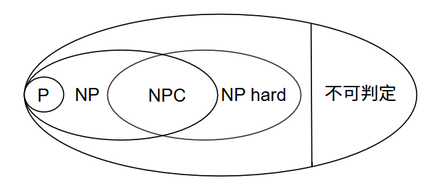
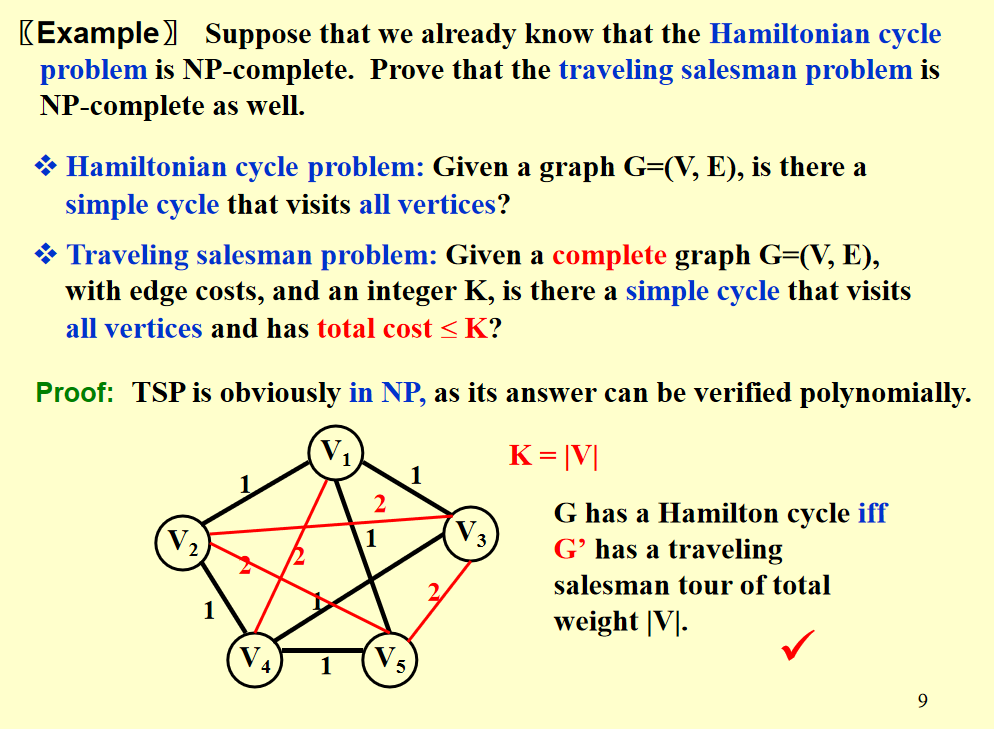
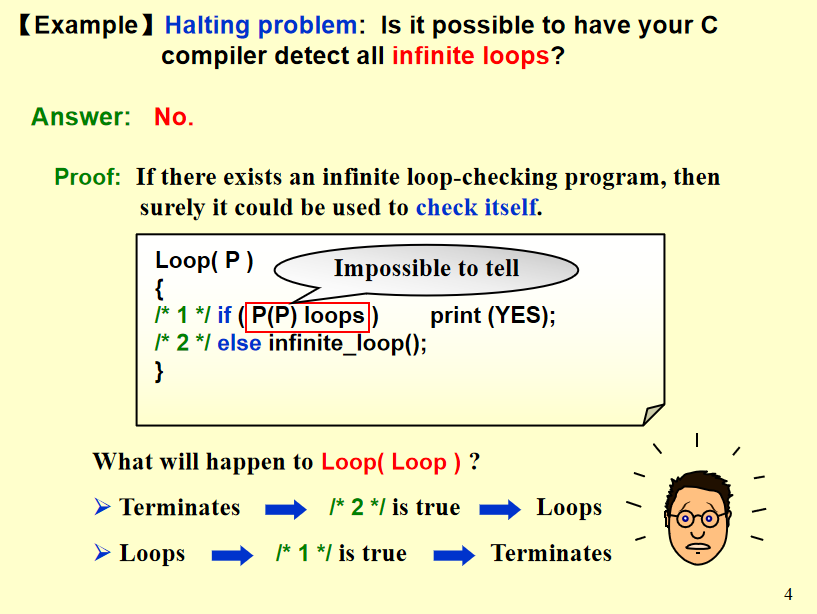
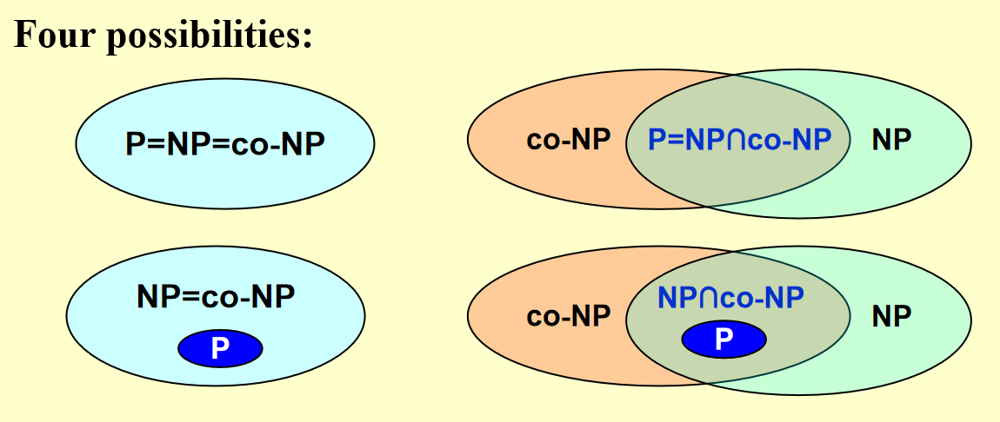
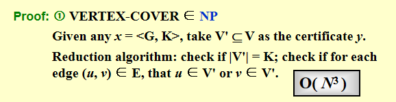
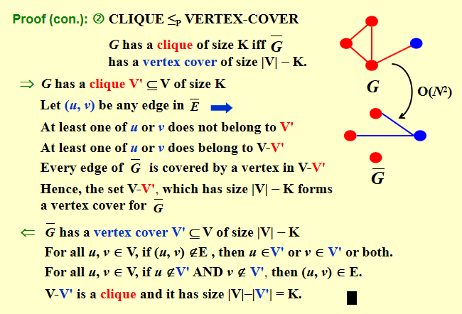
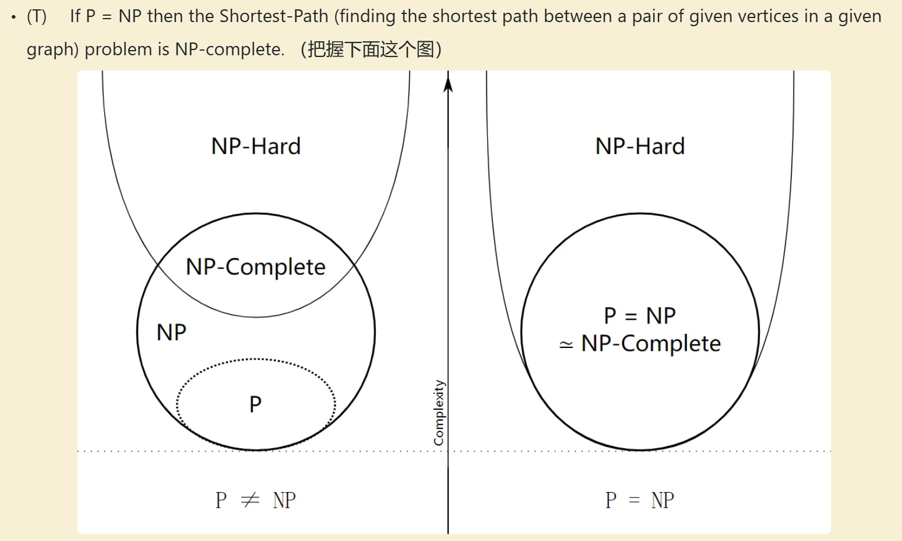
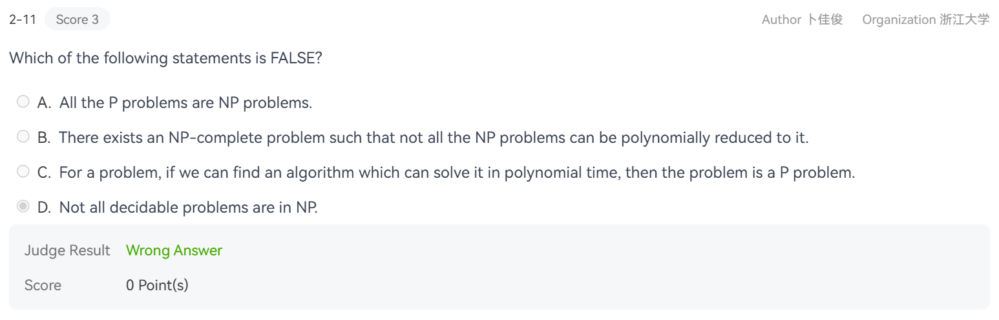
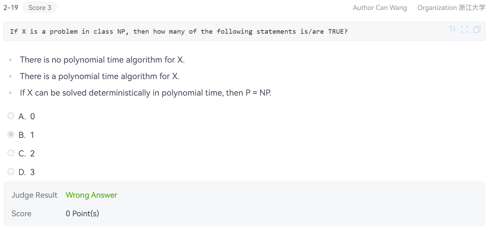
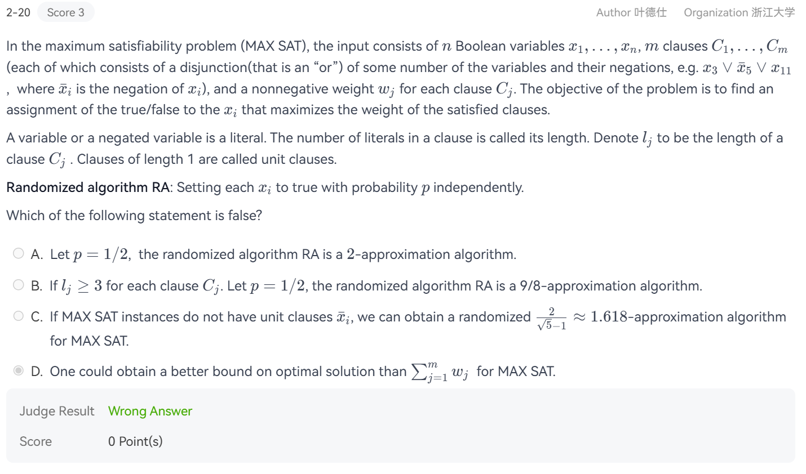

???+ info "参考资源"

    这章节云里雾里，我的笔记也做得乱七八糟.

    <a href="reference/lec16.pdf" download="np.pdf">MIT6.046J(2015 Spring)-Lec16 Notes</a>
    $\quad$
    [HobbitQia助教哥哥的笔记](https://note.hobbitqia.cc/ADS/)
    $\quad$
    [Starstone的笔记本](https://starstone3.github.io/incourse/ADS/np/)

    [希尔伯特问题、图灵判定问题与DNA中的「自指」 - gwave的文章 - 知乎](https://zhuanlan.zhihu.com/p/452735420)

???+ warning "期末补天"

    是$\textbf{NP-complete}$: Vertex cover problem & Hamiltonian cycle problem & Satisfiability problem.
    Halting problem是$\textbf{NP-hard}$，但是并非$\textbf{NP}$.

## 定义

$\textbf{P}$ 和 $\textbf{NP}$ 是对一类问题解的描述. 虽然单看缩写仿佛是对立的，但指涉的问题范围上二者“几乎”一致（事实上，当前未验证的猜想是$\textbf{P} \neq \textbf{NP}$是否成立）.

$\textbf{P}$: the set of problems that are solvable in polynomial time. If the problem
has size $n$, the problem should be solved in $n^{O(1)}$. 如果一个判定问题属于$\textbf{P}$，则具有一个多项式时间算法输出`YES`或者`NO`的问题答案.

$\textbf{NP}$: The problem is $\textbf{NP}$ if we can prove any solution is true in polynomial time. 

Nondeterministic Polynomial Problem. the set of decision problems solvable in nondeterministic polynomial time.
The output of these problems is a `YES` or `NO` answer. Nondeterministic refers
to the fact that a solution can be guessed out of polynomially many options in
$O(1)$ time. If any guess is a YES instance, then the nondeterministic algorithm
will make that guess. 翻译成中文之后的等价命题是，该问题的解能够在多项式时间内验证其正确性. 所以我们可以先进行一堆猜测，然后逐一验证其合理性来试图获得`YES`的结果.

需要注意的是，针对某个问题的解的正确/错误输入是非对称的(asymmetry).

如果问题$X$是$\textbf{NP-complete}$，则$X\in \textbf{NP}$且$X$是$\textbf{NP-hard}$.

为了定义$\textbf{NP-hard}$，首先引入reduction的概念:

A reduction from problem $A$ to problem $B$ is a polynomial-time algorithm that converts inputs to problem $A$ into equivalent inputs to problem $B$. Equivalent means that both problem $A$ and problem $B$ must output the same `YES` or `NO`
answer for the input and converted input.

于是可以得到，如果$B\in\textbf{P}$或者$B\in\textbf{NP}$，都能推出$A \in \textbf{NP}$.

$\textbf{NP-hard}$: 如果对于所有的$Y \in \textbf{NP}$，都存在规约的方法达到$X$，则称$X$是$\textbf{NP-hard}$.

在$\textbf{P} \neq \textbf{NP}$的条件下，$X \notin \textbf{P}$.

如果能够在多项式时间内解决所有的$\textbf{NP-complete}$问题，则我们能够在多项式时间内解决所有的$\textbf{NP}$问题，那么就有$\textbf{P} = \textbf{NP}$.

关系图：

???+ tips "举例: Traveling salesman problem/ Hamiltonian cycle problem"
    Hamilton cycle problem: Given a graph $G=(V, E)$, is there a simple cycle that visits all vertices?

    Traveling salesman problem: Given a **complete** graph $G=(V, E)$, with edge costs $w_i$, and an integer $K$, is there a simple cycle that visits all vertices and has total cost $K$?

    Hamiltonian Cycle的寻找是指数规模的时间复杂度，验证解是多项式时间复杂度，所以$\in\textbf{NP}$.

    现在我们的讨论基于假设Hamilton cycle problem是$\textbf{NPC}$问题，希望推出Traveling salesman problem是$\textbf{NPC}$问题.

    

    我们在把一个图拓展为完全图时，将图原来就有的边权值定义为1，新添加的边权值定义为2，那么对于原来的图是否有Hamiltonian cycle，就可以转换为拓展后的完全图在TSP问题上是否有解的问题(令$K = |v|$).

    由于完全图的边数为$\dfrac{n^2+n}{2}$,因此这个转换过程是多项式时间复杂度的. 综上，我们从Hamiltonian cycle是$\textbf{NPC}$问题推出了TSP是$\textbf{NPC}$问题.

## Halting Problem

It's **impossible** to have C compiler detect all infinite loops.即不存在某个算法，能判断任何程序是否会停下来（这似乎叫做“自指”？）.

证明方法可以通过这张传神的PPT看出来：

如果真的存在一个这样的能检测无限循环的代码，那么我们用它来检测自身：

* 如果结果是`Yes`（没有死循环），那么在其输出后，再加上一个死循环；$\Longrightarrow$ 进入了永不停机的死循环!
* 如果其结果是`No`（存在死循环），则立刻停机. $\Longrightarrow$ 矛盾！

于是这样的程序是不存在的. 事实上，总有一些问题是无法证明也无法证伪的，通常他们具有“自指”的结构.

Turing Machine定义:

* 确定性图灵机 (Deterministic Turing Machine):每次只执行一条指令，根据当前指令，转到唯一确定的下一条指令，执行路径是线性的、确定的；
* 非确定性图灵机 (Nondeterministic Turing Machine):可以从有限集合中自由选择下一步. 如果某个选择能导向解，它总是会选择正确的那个，可以理解为"同时尝试所有可能".（这是理论模型，现实中不存在，但可以帮助理解问题的本质难度）

## 3SAT 问题

第一个被发现的$\textbf{NP-complete}~\text{problem}$是3SAT问题，描述如下：

> Given a boolean formula of the form: $(x_1 \lor x_3 \lor \bar{x_6}) \land ( \bar{x_2} \lor x_3 \lor \bar{x_7}) \land \cdots$ is there an assignment of variables to `True` and `False`, such that the entire formula evaluates to True?

Cook 在1971年证明了，所有属于$\textbf{NP}$的问题都可以被多项式规约到Satisfiability问题.  证明方法是: solving this problem on a nondeterministic Turing machine in polynomial time.

## A Formal-language Framework

### 基础定义

**Abstract Problem**: 抽象问题$Q$是问题的实例集合$I$和解集合$S$之间的二元关系.

举例：无向图$G(V,E)$中$(u,v)$两节点之间的最短路问题$\text{ShortestPath}$，如果实例是$I = \{\langle G,u,v\rangle \mid u,v \in V\}$, 则对应的解是$S = \{ \langle u,w_1,w_2,\cdots,w_k,v\rangle \mid \langle u,w_1\rangle,\langle w_1,w_2\rangle,\cdots \langle w_k,v\rangle \in E\}$，于是$\forall i \in I, \text{ShortestPath}(i) = s \in S$.

而如果我们考虑验证解正确性的决策问题(decision problem) $\text{Path}$，那么我们的实例变成了$I = \{\langle G,u,v,k\rangle \mid u,v \in V, k \geq 0\}$，解变成了$S = \{ 0,1 \}$. 于是$\forall i \in I, \text{Path}(i) = 0~\text{or}~1$.

我们把得到的整个$I$编码成包含0,1的字符串，就可以将问题$Q$转化成具体问题(concrete problem).

形式语言理论(Formal-language Theory):

字母表：

* An alphabet $\Sigma$ is a finite set of symbols;

语言：

* A language $L$ over $\Sigma$ is any set of strings made up of symbols from $\Sigma$;
* Denote empty string by $\epsilon$;
* Denote empty language by $\Phi$;
* Language of all strings over $\Sigma$ is denoted by $\Sigma^{*}$.

语言的运算：

* (补集) The complement of $L$($\bar{L}$) is denoted by $\Sigma^{*}-L$;
* (连接) The concatenation of two languages $L_1$ and $L_2$ is the language

$$L = \{ x_1x_2 \mid x_1 \in L_1 \text{and} x_2 \in L_2 \}.$$

* (闭包，此处是克林星闭包) The closure of Kleene star of a language $L$ is the language

$$L^*= \{\epsilon\} \cup L \cup L^2 \cup L^3 \cup \cdots,$$

where $L^k$ is the language obtained by concatenating(追加) $L$ to itself $k$ times.

算法与语言的关系：

* Algorithm $A$ accepts a string $x \in \{0, 1\}^*$ if $A(x) = 1$. 
* Algorithm $A$ rejects a string $x$ if $A(x) = 0$. 
* A language $L$ is decided by an algorithm $A$ if every binary string in $L$ is accepted by $A$ and every binary string not in $L$ is rejected by $A$. 
* To accept a language, an algorithm need only worry about strings in $L$, but to decide a language, it must correctly accept or reject every string in $\{0, 1\}^*$

基于以上<del>又臭又长还几乎没任何解释</del>的定义部分，得到$\textbf{P}$的全新定义方法：

$$\textbf{P} = \{ L \subseteq \{0, 1\}^* : \text{there exists an algorithm}~A~\text{that decides}~L~\text{in polynomial time} \}$$

接下来看$\textbf{NP}$问题的新定义，不同的是需要更多元来刻画这个问题：

* A **verification algorithm** is a two-argument algorithm $A$, where one argument is an ordinary input string $x$ and the other is a binary string $y$ called a **certificate**. 
* A two-argument algorithm $A$ verifies an input string $x$ if there exists a certificate $y$ such that $A(x, y) = 1$. 
* The language verified by a verification algorithm $A$ is

$$L = \{ x \in \{0, 1\}^* : ~\text{there exists}~y \in \{0, 1\}^*~\text{such that}~ A(x, y) = 1\}.$$

于是 $\textbf{NP}$ 问题的新定义是：

A language $L$ belongs to $\textbf{NP}$ iff there exist a two-input polynomial-time algorithm $A$ and a constant $c$ such that

$$L = \{ x \in \{0, 1\}^* :~\text{there exists a certificate}~ y~\text{with}~ \lfloor y\rfloor = O(|x|^c)~\text{such that}~ A(x, y) = 1 \}$$

We say that algorithm $A$ verifies language $L$ in polynomial time.

进一步地，语言的多项式约化如下：

A language $L_1$ is polynomial-time reducible to a language $L_2 (L_1 \leq_P L_2)$ if there exists a polynomial-time computable function $f: \{0, 1\}^* \to \{0,1\}^*$ such that $\forall x \in \{0, 1\}^*, x \in L_1$ iff $f(x) \in L_2$.

We call the function $f$ the **reduction function**, and a polynomial-time algorithm $F$ that computes $f$ is called a **reduction algorithm**.

### $\textbf{co-NP}$的引入

记复杂度类$\textbf{co-NP} = \{L \mid \bar{L} \in \textbf{NP}\}$, 其中$\bar{L} = \Sigma^{*}-L$是$L$的补语言.

???+ tips "直观理解"

    这里的`co`是complement的意思.

    $\textbf{NP}$问题的特征：

    * `YES`实例容易验证（有多项式时间可验证的证书） 
    * `NO`实例难以验证（可能需要穷举）

    $\textbf{co-NP}$问题的特征：
    
    * `NO`实例容易验证（有多项式时间可验证的证书） 
    * `YES`实例难以验证

    关系分类：

    * 如果$\textbf{co-NP} = \textbf{NP}$：
        可能是$\textbf{P} = \textbf{NP}$，或者$\textbf{P} \subset \textbf{NP}$;
    * 如果$\textbf{co-NP} \neq \textbf{NP}$：
        可能是$\textbf{P} = \textbf{NP} \cap \textbf{co-NP}$，或者$\textbf{P} \subset \textbf{NP} \cap \textbf{co-NP}$;

    

根据上面的规约，定义语言$L\subseteq \{0,1\}^* \in \textbf{NP-complete}$当且仅当

* $L \in \textbf{NP}$;
* $\forall L' \in\textbf{NP}, L' \leq_p L$.

### Hamilton Cycle (哈密顿回路问题)

$\textbf{NP}$ 版本："图$G$有哈密顿回路吗？"(属于NP)

* `YES`实例：$G$有哈密顿回路 
* 证书：一个回路序列 
* 验证：$O(n)$时间检查是否是有效回路 

$\textbf{co-NP}$ 版本："图$G$没有哈密顿回路吗？"(不知道是否属于 $\textbf{co-NP}$)

* `YES`实例：$G$没有哈密顿回路 
* 证书：需要验证（需要证明所有可能都不是） 
* 验证：困难！需要检查所有$n!$种可能 

### Clique Problem (最大团问题) 向 Vertex Cover Problem (顶点覆盖问题-存在性)的规约

> 实际上二者可以互相规约，这可以从证明的互推看出来.

<del>PPT叽里咕噜说什么呢好费解</del>

首先给出上面两个问题的定义：

* Clique Problem: 给定无向图 $G=(V,E)$ 和整数 $K$，判断 $G$ 是否包含大小为 $K$ 的完全子图（即任意两个顶点间都有边相连的子图）.

* Vertex Cover Problem：给定无向图 $G=(V,E)$ 和整数 $K$，判断 $G$ 是否包含大小为 $K$ 的顶点集合 $V' \subseteq V$，使得 $G$ 的每条边至少有一个端点属于 $V'$.

假设我们已经知道了Clique Problem是 $\textbf{NP-complete}$，如何规约证明Vertex Cover Problem也是 $\textbf{NP-complete}$？

???+ tips "Proof"

    

    

    首先，Vertex Cover Problem 属于 $\textbf{NP}$（验证算法的时间复杂度为 $O(N^3)$）.

    对于 Clique Problem 的实例 $(G, K)$， 构造补图 $G'=(V, E')：E'$ 包含所有 $G$ 中不存在的边（即 $(u,v) \in E' \iff (u,v) \notin E$）.

    将 Clique Problem 的参数 $K$ 转换为 Vertex Cover Problem 的参数 $K' = |V| - K$.

    证明等价性（$G$ 有大小为 $K$ 的 Clique $\iff$ $G'$ 有大小为 $K'$ 的 Vertex Cover）：

    * 必要性 ：若 $G$ 有大小为 $K$ 的 Clique $C$，则 $V \setminus C$ 是 $G'$ 的 Vertex Cover. 对 $G'$ 中的任意边 $(u,v)$，因 $(u,v) \notin E$（补图定义），故 $u,v$ 不能同时属于 $C$（否则 $C$ 不是完全子图），因此至少有一个属于 $V \setminus C$，即 $V \setminus C$ 覆盖 $G'$ 的所有边。

    * 充分性 ：若 $G'$ 有大小为 $K'$ 的 Vertex Cover $V'$，则 $V \setminus V'$ 是 $G$ 的 Clique.
    
        对 $V \setminus V'$ 中的任意两个顶点 $u$ 和 $v$，因 $(u,v) \notin E'$（否则 $V'$ 需包含 $u$ 或 $v$，与 $u,v \notin V'$ 矛盾），故 $(u,v) \in E$，即 $V \setminus V'$ 是完全子图，大小为 $|V| - |V'| = K$.

## PTA习题

???+ tips "xyx-2"

    

???+ tips "Final Practice 2 2-11"

    

    复习一下英语语法：

    **All problems are not easy. 不是所有的问题都很简单（√）** 所有的问题都不简单（×） 
    **Not all decidable problems are in $\textbf{NP}$. 不是所有的可判定问题都属于$\textbf{NP}$.**

    B错，因为根据$\textbf{NPC}$的定义，所有$\textbf{NP}$问题都可以归约到任何一个$\textbf{NP-complete}$问题
    
    D对，因为Decidable只意味着存在算法可以判定，不限制时间复杂度.

???+ tips "Final Practice 3 2-19,20"

    

    3个表述全错，因为$X$并不一定是$\textbf{NP-complete}$问题，如果是，则由属于$\textbf{P}$可以推知$\textbf{P} = \textbf{NP}$，但$X$也可以是属于$\textbf{NP}$与$\textbf{P}$的交集中，从而不能推出这个结论.

    

    > A、B 选项：对于长度为 $l$ 的子句，该子句不被满足的概率为 $p^{l}$，故被满足的概率为 $1 - p^{l}$，对 应的总近似比就是 $\frac{1}{1 - p^{l}}$；
    
    > C 选项是结论，当不存在负的单位子句 $\bar{x}_{i}$ 时，纯随机算法的近似比即为 $\frac{2}{\sqrt{5}-1}$；
    
    > D 选项中的 $\sum_{j=1}^m w_j$ 时一个平凡上界，对应所有子句都被满足的情况，可以通过子句间的互斥、冲突等关系得到更紧的上界。

    > [VictorWang's Notebook](https://victorwang712.github.io/Note/computer_science/advanced_data_structure/mistakes)