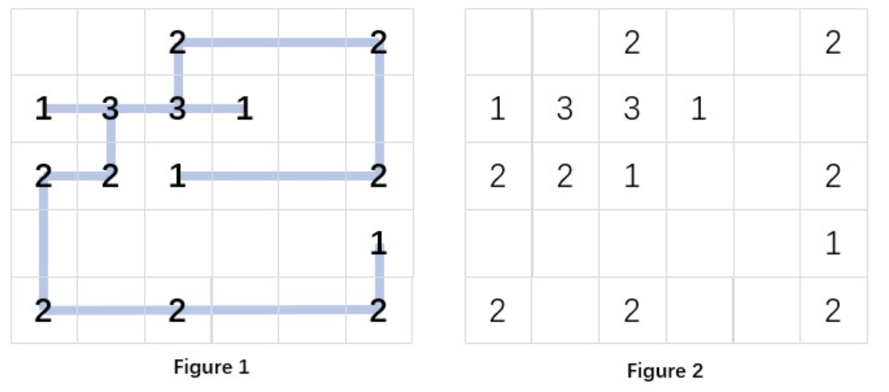
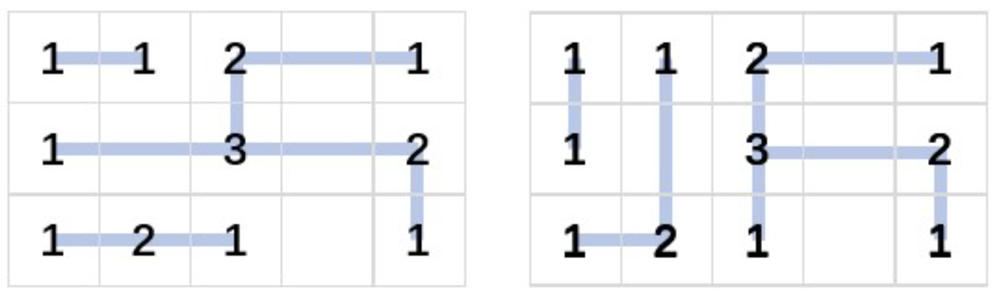

## Project 3 - Recover the Design

> 没做出来，放弃了.

???+ question "Project Description"

    The garden designer drew a diagram of the fence layout, as shown in Figure 1. Here we assume that the garden is an \(n \times m\) rectangular space consists of unit squares.  All the fences in the diagram are either horizontal or vertical, and are connected together by connectors at certain designated positions. When the workers carried the connectors to the corresponding positions, they found that the design drawing was gone... So now you are facing the situation in Figure 2: several k-way connectors are placed at some positions. Your job is to restore the diagram, that is, to recover Figure 1 from Figure 2.

    Note: the fences cannot be bent, nor can they cross each other without a connector.  The corners can only be formed through connectors.

    <center></center>

    **Input Specification:**

    Each input file contains one test case. For each case, the first line gives two positive integers: \(n\) and \(m\) (\(1 < n,m \leq 50\)), which are the numbers of rows and columns in the garden, respectively.

    Then \(n\) lines follow, each containts m numbers, which are separated by spaces.  Each number is either a positive \(k\) (\(1 \leq k \leq 4\)) which is the degree of the connector, or \(0\), meaning that there is no connector at this position.

    **Output Specification:**

    For each case, if there is no solution, simply print in a line `No Solution`.  Else scan the garden row by row, each from left to right, to output the status of each connector in a line.  The output format is the following:

    ```plaintext
    row col up down left right
    ```

    where `row` and `col` are the numbers of the row and the column of the connector's position (row numbers are counted top-down from 1, and column numbers are counted left to right from 1); the status of the 4 directions `up`, `down`, `left` and `right` are either 1 or 0, corresponding to whether or not a piece of fence is connected in that direction, respectively.

    On the other hand, the solution may not be unique. Output one will do.
    
    The numbers in a line must be separated by a space, and there must be no extra space at the beginning or the end of the line.

    **Sample Input 1:**

    ```plaintext
    5 6
    0 0 2 0 0 2
    1 3 3 1 0 0
    2 2 1 0 0 2
    0 0 0 0 0 1
    2 0 2 0 0 2
    ```

    **Sample Output 1:**

    ```plaintext
    1 3 0 1 0 1
    1 6 0 1 1 0
    2 1 0 0 0 1
    2 2 0 1 1 1
    2 3 1 0 1 1
    2 4 0 0 1 0
    3 1 0 1 0 1
    3 2 1 0 1 0
    3 3 0 0 0 1
    3 6 1 0 1 0
    4 6 0 1 0 0
    5 1 1 0 0 1
    5 3 0 0 1 1
    5 6 1 0 1 0
    ```

    **Sample Input 2:**

    ```plaintext
    5 6
    0 0 2 0 0 2
    1 3 3 1 0 0
    2 2 1 0 0 1
    0 0 0 0 0 1
    2 0 2 0 0 2
    ```

    **Sample Output 2:**

    ```plaintext
    No Solution
    ```

    **Sample Input 3:**

    ```plaintext
    3 5
    1 1 2 0 1
    1 0 3 0 2
    1 2 1 0 1
    ```

    **Sample Output 3:**

    ```plaintext
    1 1 0 0 0 1
    1 2 0 0 1 0
    1 3 0 1 0 1
    1 5 0 0 1 0
    2 1 0 0 0 1
    2 3 1 0 1 1
    2 5 0 1 1 0
    3 1 0 0 0 1
    3 2 0 0 1 1
    3 3 0 0 1 0
    3 5 1 0 0 0
    ```

??? tips "Hint for Sample 3"

    There are 2 solutions as shown below.  Sample output 3 gives the first one.  The second one will be judged as a correct answer as well.

    <center></center>

???+ tips "Grading Policy"

    Programming: Write the program (10 pts.) with sufficient comments.

    Testing: Provide a set of test cases to fill in a test report (3 pts.).  Write analysis and comments (3 pts.).

    Documentation: Chapter 1 (1 pt.), Chapter 2 (2 pts.), and finally a complete report (1 point for overall style of documentation).
