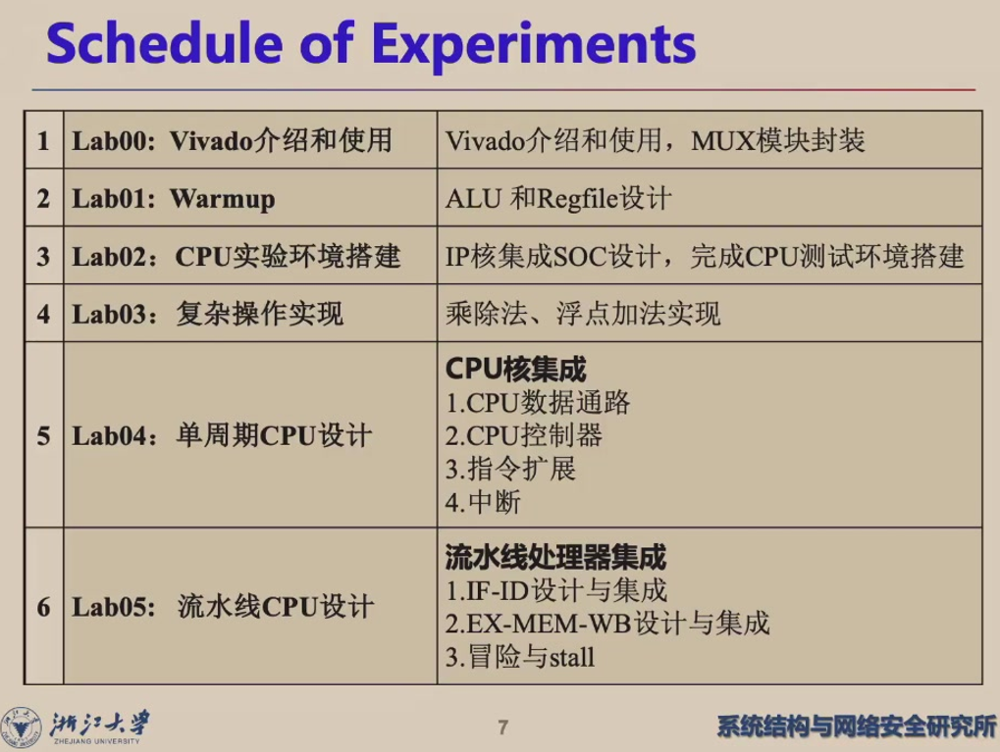
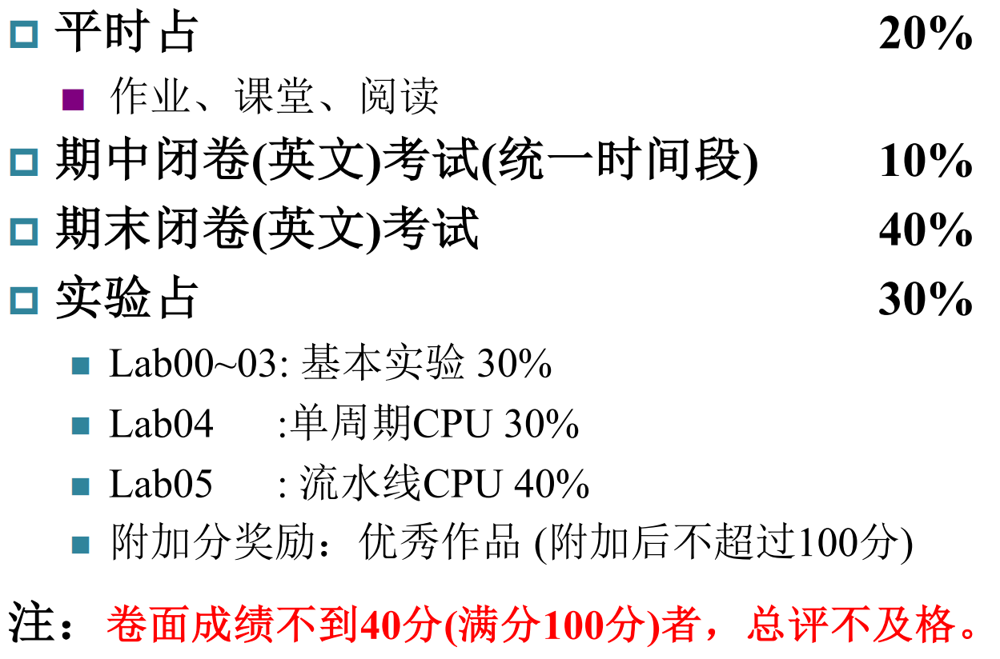

本文将依照林芃老师授课以及教材等材料进行整理.

!!! tips

    摘编自[Miracle96的经验帖](https://www.cc98.org/topic/6082358)：

    > 期末考试我就采用了不验算的策略，虽然延长了 30 分钟，但我也在 2 个小时之内做完了，自认为这个策略还算成功。可惜选择题错了三个（考的特别细，比如问你浮点数 inf 和 nan 的区别），

    > 因为是半开卷，所以可以在 A4 上面抄一些方便你进制转化的东西，比如 1/8 = 0.125, 1/16 = ?, 1/32 = ?，然后可以抄 ppt 上的经典例题，以及一些经典的课本习题，抄汇编代码。这次我就抄到了 3 个选择题的答案（磁盘读写的例题、jal 的跳转范围、浮点数的表示范围），后面的 cache 计算题也可以对着你抄的例题画葫芦画出来（不是说不用理解，而是让你确信自己做的没错，不会乱了手脚）。

    > 笔记： 看马德ppt并抄到A4上,或参考这篇博客

    > A4：个人感觉这次抄的比较全，基本没有A4 miss的情况(笑) A4纸下载

    > IEEE754浮点数，特别是NaN和inf

    > 汇编：最好抄一个汇编写递归的程序如斐波那契，考试时照猫画虎。以及长距离跳转,lui+add构建32位立即数, 数组越界判断(bgeu)等常用指令组合

    > CPU这块看个人，感觉抄了的都没考（心虚

    > Cache抄bit数的计算，虚拟内存，TLB画个图

    > I/O抄了 三种方式(polling,interrupt-driven,DMA)的定义, 硬盘读取时间的计算，Amdahl's Law, 同步和异步总线

!!! tips

    * 笔记

        [NoughtQ的笔记](https://note.noughtq.top/system/co/)
        $\quad$
        [mem佬的笔记](https://mem.ac/course/co/)

    * 课后习题答案：

        <a href="co_answer.pdf" download="CO_answer.pdf">点击下载</a>

    * 历年卷：

        [【计算机学院】2023-2024春夏 计算机组成 期末回忆卷（计组）](https://www.cc98.org/topic/5922030 )

        [【学习天地】2023-2024春夏lp班计组期中【tag: 计算机组成 计组 】 ](https://www.cc98.org/topic/5886264 )

        [【信电ISEE】【2023-2024】个人向计组概念题整合](https://www.cc98.org/topic/5800575 )

        [【信电ISEE】【2023-2024秋冬】信工大三上期末复习资料及历年卷汇编（计组，信控计，算法，通原）](https://www.cc98.org/topic/5794294 )

        （据HobbitQia助教哥哥的改卷体验，信电的计组资源也可以参考一下）

    * A4：

        [【学习天地】计算机组成 / 计组 A4 参考](https://www.cc98.org/topic/6092970)

!!! tips
    Outline：

    

    

    Grading Policy：

    

