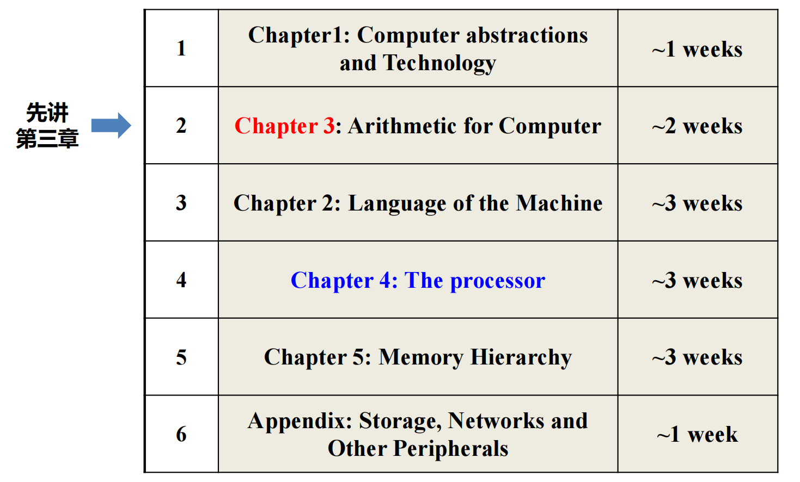
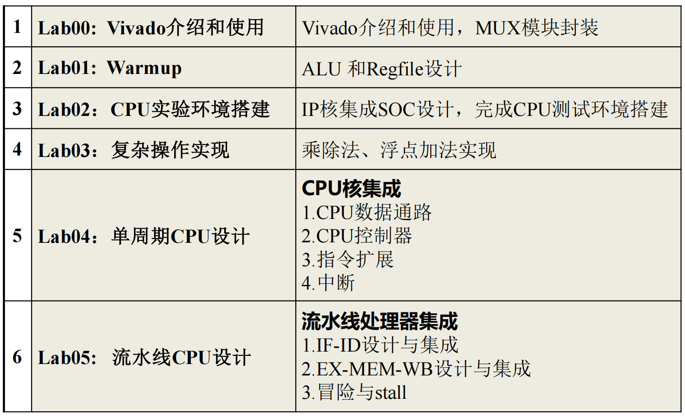

本文将依照林芃老师授课以及教材等材料进行整理.

!!! tips
    Outline：

    

    

    Grading Policy (2024秋冬版本)：

    * 平时 20%： Homework, Check-in, Reading

    * exam 10+40%：
      * Mid 10%
      * Final 40%，斩杀线40分

    * lab 30%： 
      * lab 00-03: 基本实验，30%
      * lab 04: 单周期CPU，30%
      * lab 05: 流水线CPU，40%
      * 附加分：优秀作品额外bonus，不溢出