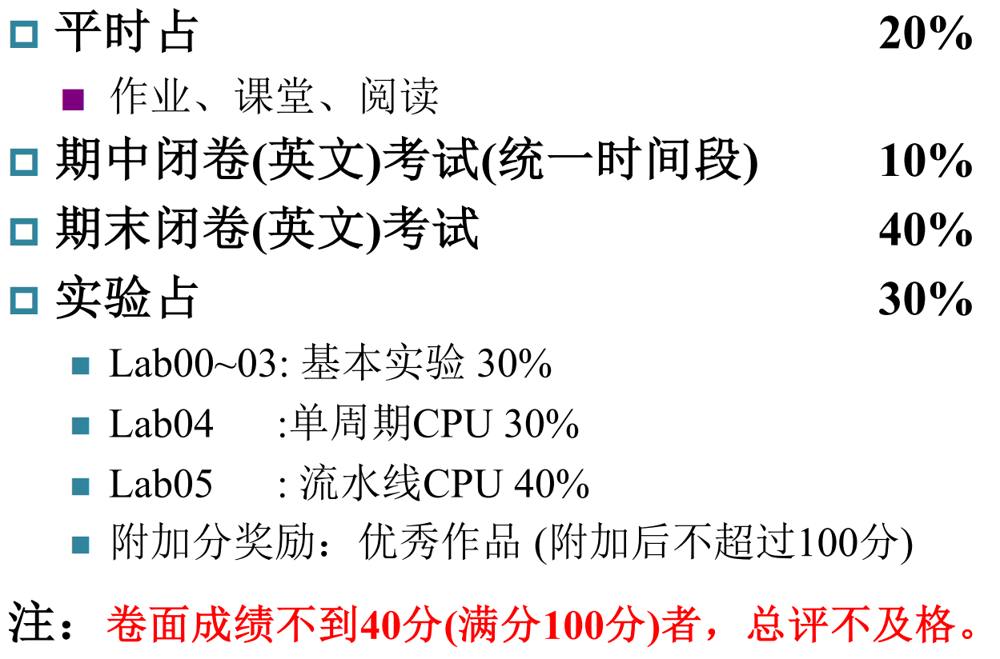

本文将依照林芃老师授课以及教材等材料进行整理.

!!! tips

    * 笔记

        [NoughtQ的笔记](https://note.noughtq.top/system/co/)
        $\quad$
        [mem佬的笔记](https://mem.ac/course/co/)

    * 课后习题答案：

        <a href="co_answer.pdf" download="CO_answer.pdf">点击下载</a>

    * 历年卷：

        [【计算机学院】2023-2024春夏 计算机组成 期末回忆卷（计组）](https://www.cc98.org/topic/5922030 )

        [【学习天地】2023-2024春夏lp班计组期中【tag: 计算机组成 计组 】 ](https://www.cc98.org/topic/5886264 )

        [【信电ISEE】【2023-2024】个人向计组概念题整合](https://www.cc98.org/topic/5800575 )

        [【信电ISEE】【2023-2024秋冬】信工大三上期末复习资料及历年卷汇编（计组，信控计，算法，通原）](https://www.cc98.org/topic/5794294 )

        （据HobbitQia助教哥哥的改卷体验，信电的计组资源也可以参考一下）

    * A4：

        [【学习天地】计算机组成 / 计组 A4 参考](https://www.cc98.org/topic/6092970)

!!! tips
    Outline：

    

    

    Grading Policy：

    

