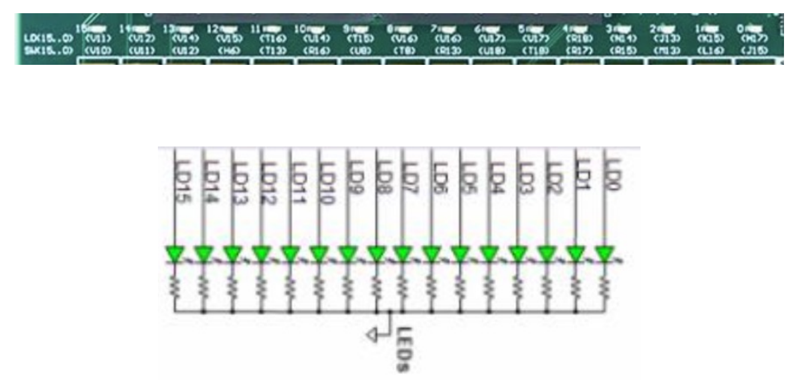
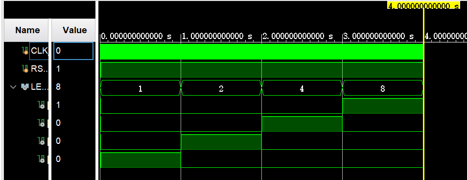
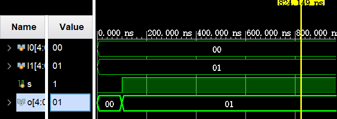

主要记录一下lab0的手搓过程，免得以后又忘记了Verilog里面各种东西的写法.

!!! warning

    我使用的Vivado版本是2022.2，slides上面是2017年的版本，所以会有很多细节上的出入. 事实上，本文档也记录了很多版本出入上的困惑.

    lab0包含的任务有：预热（Water_LED的仿真试验、自定义模块IP核的生成）、正式任务（基本逻辑模块的原理学习、Xilinx IP的生成）.

    林芃班的验收规则：

    * 流水灯仿真波形 PPT 39

    * 流水灯运行结果 PPT 54

    * MUX2T1_5仿真波形 PPT 78

    * 多选器控制LED运行结果 PPT 167
        
        1. 注意推荐使用`.v`形式完成：通过`Add Sources->Add or create design source->Create File` 创建所需模块，然后实现各模块功能

        2. ppt79-94以及ppt142-149中自定义IP模块的封装和调用可以先做了解

## 预热

### 流水灯Water_LED的仿真代码书写

如图为NEXYS-A7上的16个并行LED流水灯原理图, 所有的阴极（负极）接地（共阴极），当阳极接高电平时点亮.

<center></center>

将学在浙大上给出的`Water_LED.v`和`Water_LED_tb.v`代码分别导入Vivado的`Design Sources`和`Simulation Sources`中.

首先看`Water_LED.v`的代码逻辑：

```verilog
`timescale 1ns / 1ps
module Water_LED(
    input CLK_i,
    input RSTn_i,
    output reg [3:0]LED_o
    );
    reg [31:0]C0;
    
always @(posedge CLK_i)
    if(!RSTn_i) begin
        LED_o <= 4'b1;
        C0 <= 32'h0;
    end
    else begin
        if (C0 == 32'd100_000_000) begin
            C0 <= 32'h0;
            if (LED_o == 4'b1000)
                LED_o <= 4'b1;
            else LED_o <= LED_o << 1;
        end
        else begin
            C0 <= C0 + 1'b1;
            LED_o <= LED_o;
        end
    end   
    
endmodule
```

这段代码里面，`C0`是中间计数器，每计数$10^8$翻转一次，产生`1Hz`时钟来更新LED亮暗状态；

通过左移一位高电平的操作来逐一点亮LED，从而在视觉上形成流水的效果.

补全`Water_LED_tb.v`的代码：

```verilog
module Water_LED_tb;
    reg CLK_i;
    reg RSTn_i;
    wire [3:0]LED_o;
    
    Water_LED Water_LED_U(
        .CLK_i(CLK_i),
        .RSTn_i(RSTn_i),
        .LED_o(LED_o)
    );
    
    always #5 CLK_i = ~CLK_i;
    
    initial begin
        CLK_i = 0;
        RSTn_i = 0;
        #100 RSTn_i = 1;
        //Your code here.
        #4000000000 $finish;
    end    
    
endmodule
```

事实上只需要添加一行就行，不过记得延长一下仿真时间，否则会很快出结果且LED全为1，因为默认的$10^6$ps还不足以让LED产生进位.

结果图大概长这样：

<center></center>

### 添加约束文件

添加约束文件主要是两种方法，工具约束和脚本约束，比较推荐脚本约束。

#### 工具约束

上学期并没有讲过这个部分，但其实不麻烦，是在RTL Analysis的Schematic一节来完成，具体参见Slides.

#### 脚本约束

你也可以直接将给出的约束文件`Water_LED.xdc`加入到Constraint Sources中.

```verilog
set_property PACKAGE_PIN C12 [get_ports RSTn_i]
set_property IOSTANDARD LVCMOS33 [get_ports RSTn_i]
set_property PACKAGE_PIN H17 [get_ports {LED_o[0]}]
set_property IOSTANDARD LVCMOS33 [get_ports {LED_o[0]}]
set_property PACKAGE_PIN K15 [get_ports {LED_o[1]}]
set_property IOSTANDARD LVCMOS33 [get_ports {LED_o[1]}]
set_property PACKAGE_PIN J13 [get_ports {LED_o[2]}]
set_property IOSTANDARD LVCMOS33 [get_ports {LED_o[2]}]
set_property PACKAGE_PIN N14 [get_ports {LED_o[3]}]
set_property IOSTANDARD LVCMOS33 [get_ports {LED_o[3]}]
set_property PACKAGE_PIN E3 [get_ports CLK_i]
set_property IOSTANDARD LVCMOS33 [get_ports CLK_i]
```

<del>实验文档里面怎么有一个不同约束文件的图？？？但是看起来并不是这次的板子，令人疑惑，是祖传的slides不修改吗？</del>

接下来生成bitstream并program device之后就能看到流水灯效果了，是索引为3,2,1,0的四个端口出现了流水的效果.

<a href="../lab/lab0/water_led.mp4" download="water_led.mp4">点击下载效果视频</a>

## 自定义模块设计学习

!!! tips

    这个模块操作过于老旧，可以不做.


### IP核的生成

这一模块首先需要完成的任务是：利用vivado完成对MUX2T1_5的设计和封装.

首先新建一个项目，命名为MUX2T1_5，并新建`MUX2T1_5.v`文件，输入以下1bit MUX的代码：

```verilog
module MUX2T1_5(
    input[4:0]I0,
    input[4:0]I1,
    input s,
    output [4:0] o
    );
    assign o = s ? I1 : I0;
endmodule
```

接着新建仿真文件`MUX2T1_5_tb.v`，输入：

```verilog
module MUX2T1_5_tb(
    );
    reg [4:0] I0;
    reg [4:0] I1;
    reg s;
    
    wire [4:0] o;
    
    MUX2T1_5 MUX2T1_5_test(
        .I0(I0),
        .I1(I1),
        .s(s),
        .o(o)
    );
    initial begin
        s = 0;
        I0 = 0;
        I1 = 1;
        #50;
        s = 0;
        #50;
        s = 1;
    end
endmodule
```

跑出来结果：

<center></center>

slides上面的仿真代码，从波形倒推来讲比较复杂. 看意思是只要能验证MUX的设计代码功能成立，就可以进入封装部分了.

找到上面的`Tools->Create and Package New IP->Next`，一路点击底下的`Next>`至IP Location的选择，这里我的Vivado初始路径跟slides不是很一样，slides上面要求是`../mux2t1_5/mux2t1_5.srcs/sources_1/new`，而我这里是`../mux2t1_5/mux2t1_5.srcs`，所以还得往里面切2层找到目标路径.

finish之后，在弹出的窗口中选择`Review and Package->Package IP`即可，这样封装就完成了.

### 创建IP的流程（不含源文件）

分为2步，一是网表文件`.edf`的生成，二是根据`.edf`文件进行IP封装.

在`Settings-Synthesis-More Option`中输入`-mode out_of_context`，这表明在该级不插入任何I/O buffers.

在综合完成之后弹出的窗口中选择`Open Synthesized Design`，并在底部的Tcl Console中输入：`write_verilog -mode synth_stub E:/Vivadodemo/ip/MUX2T1_5.v`，其中存档路径是自己选择的.

接着在Tcl Console中输入：`write_edif E:/Vivadodemo/ip/MUX2T1_5.edf`，将生成的两份文件放到新建的一个项目中打包成IP就可以了.

## 正式任务1：基本逻辑模块的原理学习、Xilinx IP的生成

目标：熟悉多选器、逻辑运算、数据扩展等模块的设计原理，掌握存储器的生成方法.

### 任务1：熟悉基本模块功能

> 熟悉基本模块功能，在Vivado环境中采用Verilog进行基本模块的设计和仿真验证.

堪称迷惑的一个部分，列举了一堆数逻涉及的模块然后不知所云地抛出了一个“参考模块功能，自行设计逻辑模块”的指示，能不能写明白一点呢？以及，在最后说让我保持端口信息一致，那你为什么一会大写一会小写一会驼峰命名一会下划线？写个实验文档这么随意吗？？？

记录一下提到的逻辑模块和他们实现用到的代码：

!!! tips

    MUX: m位n选1的多路器

    ```verilog
    module MUXnT1_m(input [m-1:0] I0,
                    input [m-1:0] I1,
                    // etc.
                    input sel,
                    output reg [m-1:0] o
                    );
        // Some code here.
    endmodule     
    ```

    MUX2T1_5:

    ```verilog
    module MUX2T1_5(input [4:0] I0,
                    input [4:0] I1,
                    input sel,
                    output reg [4:0] o
                    );
        always @(*) begin
            if (sel == 1)
                o = I1;
            else
                o = I0;
        end
        
        // 以下语句是错误的，因为o是reg类型，不支持assign连续赋值.
        // assign o = sel ? I1 : I0;

    endmodule
    ```

    MUX2T1_32:

    ```verilog
    module MUX2T1_32(input [31:0] I0,
                     input [31:0] I1,
                     input sel,
                     output reg [31:0] o
                    );
        always @(*) begin
            if (sel == 1)
                o = I1;
            else
                o = I0;
        end
    endmodule
    ```

    MUX4T1_5:

    ```verilog
    module MUX4T1_5(input [1:0] s,
                    input [4:0] I0,
                    input [4:0] I1,
                    input [4:0] I2,
                    input [4:0] I3,
                    output reg [4:0] o
                    );
        always @(*) begin
            if (s == 2'b00)
                o = I0;
            else if (s == 2'b01)
                o = I1;
            else if (s == 2'b10)
                o = I2;
            else 
                o = I3;
        end
    endmodule
    ```

    MUX4T1_32:

    ```verilog
    module MUX4T1_32(input [1:0] s,
                    input [31:0] I0,
                    input [31:0] I1,
                    input [31:0] I2,
                    input [31:0] I3,
                    output reg [31:0] o
                    );
        always @(*) begin
            if (s == 2'b00)
                o = I0;
            else if (s == 2'b01)
                o = I1;
            else if (s == 2'b10)
                o = I2;
            else 
                o = I3;
        end
    endmodule
    ```

    MUX8T1_32:

    ```verilog
    module MUX8T1_32(input [31:0] I0,
                     input [31:0] I1,
                     input [31:0] I2,
                     input [31:0] I3,
                     input [31:0] I4,
                     input [31:0] I5,
                     input [31:0] I6,
                     input [31:0] I7,
                     input [2:0] s,
                     output reg [31:0] o
                    );
        always @(*) begin
        case (s)
            3'b000: o = I0;
            3'b001: o = I1;
            3'b010: o = I2;
            3'b011: o = I3;
            3'b100: o = I4;
            3'b101: o = I5;
            3'b110: o = I6;
            3'b111: o = I7;
            default: o = I0;  // 可选的默认情况
        endcase
    end
    endmodule
    ```

!!! tips

    算术函数模块

    32位无进位加法器：

    ```verilog
    module add_32(input [31:0] a,
                  input [31:0] b,
                  output [31:0] c
                );
        assign c = a ^ b;
    endmodule
    ```

    32位带进位加减器：
    
    这里`c == 1`时选择减法，`c == 0`时选择加法. 

    ```verilog
    module ADC32(input [31:0] A,
                  input [31:0] B,
                  input C0,
                  output [32:0] S
                );
        wire b0 = C0 ^ 1'b0;
        assign S = {1'b0,A} + {b0,B} + C0; 
    endmodule
    ```

    32位与运算：

    ```verilog
    module and32(input [31:0] A,
                  input [31:0] B,
                  output [31:0] res
                );
        assign res = (A & B);
    endmodule
    ```

    32位或运算：

    ```verilog
    module or32(input [31:0] A,
                  input [31:0] B,
                  output [31:0] res
                );
        assign res = (A | B);
    endmodule
    ```

    32位或非运算：

    ```verilog
    module nor32(input [31:0] A,
                  input [31:0] B,
                  output [31:0] res
                );
        assign res = ~(A | B); // | 是按位或， || 是逻辑或
    endmodule
    ```

    32位异或运算：

    ```verilog
    module xor32(input [31:0] A,
                  input [31:0] B,
                  output [31:0] res
                );
        assign res = A ^ B;
    endmodule
    ```

    32位逻辑右移运算（srl）：移位量由b[4:0]来控制

    ```verilog
    module srl32(input [31:0] A,
                  input [31:0] B,
                  output [31:0] res
                );
        assign res = A >> B[4:0];
    endmodule
    ```

    32位自或运算：（判断是否为全0）

    ```verilog
    module or_bit_32(input [31:0] A,
                  output o
                );
        assign o = |A;
    endmodule
    ```

    16位符号数-32位符号数算术拓展：

    ```verilog
    module Ext_32(input [15:0] imm_16,
                  output [31:0] imm_32
                );
        assign imm_32 = {16{imm_16[15]}，imm_16};
    endmodule
    ```

    1位信号-32位算术拓展：

    ```verilog
    module SignalExt_32(input S,
                  output [31:0] So
                );
        assign So = {32{S}};
    endmodule
    ```

### 任务2：生成IP并初始化存储内容

!!! tips

    这个模块中的IP Core生成操作过于老旧，可以不做.

> 学习并利用Vivado生成Xilinx库中的IP，以存储器ROM,RAM为例，并完成其存储内容的初始化.

#### ROM_D IP Core的生成

点击左侧的IP Catalog，在打开的窗口搜索栏中输入`mamory generator`，选择`Block Memory Generator`或者`Distributed Memory Generator`. 其中前者是同步访问，后者是异步访问.

先双击打开`Distributed Memory Generator`，`Depth`输入1024，`Data Width`输入32，存储类型调成ROM -> OK，接着在操作窗口中选择跟memory config同级的RST & Initialization，你需要点击Browse按钮来添加Coefficients File并查验.

!!! tips

    这里slides又开始顺序颠倒不说人话了，coe文件实则需要自己创建完再在这个窗口中选中，需要自行编辑一个`.coe`文件.

    个人是VSCode打开这个文件夹然后按照slides-124的指示添加`ROM.coe`文件：

    ```coe
    memory_initialization_radix=16;
    memory_initialization_vector=
    00000000, 11111111, 22222222, 33333333, 44444444, 55555555, 
    66666666, 77777777, 88888888, 99999999, aaaaaaaa, bbbbbbbb, 
    cccccccc, dddddddd, eeeeeeee, ffffffff, 557EF7E0, D7BDFBD9, 
    D7DBFDB9, DFCFFCFB, DFCFBFFF, F7F3DFFF, FFFFDF3D, FFFF9DB9, 
    FFFFBCFB, DFCFFCFB, DFCFBFFF, D7DB9FFF, D7DBFDB9, D7BDFBD9, 
    FFFF07E0, 007E0FFF, 03bdf020, 03def820, 08002300;
    ```

点击生成之后，你就能看到类似slides-123上面的效果，查看ROM_D.veo模块，出现这样的片段即为成功：

```verilog
//----------- Begin Cut here for INSTANTIATION Template ---// INST_TAG
ROM_D your_instance_name (
  .a(a),      // input wire [9 : 0] a
  .spo(spo)  // output wire [31 : 0] spo
);
// INST_TAG_END ------ End INSTANTIATION Template ---------
```

#### RAM_B IP Core的生成

按slides的操作进行，看到`.veo`文件中包含这个片段就说明完成了.

```verilog
//----------- Begin Cut here for INSTANTIATION Template ---// INST_TAG
RAM your_instance_name (
  .clka(clka),    // input wire clka
  .wea(wea),      // input wire [0 : 0] wea
  .addra(addra),  // input wire [9 : 0] addra
  .dina(dina),    // input wire [31 : 0] dina
  .douta(douta)  // output wire [31 : 0] douta
);
// INST_TAG_END ------ End INSTANTIATION Template ---------
```

!!! tips

    RAM IP Core的生成过程中有一个问题，为什么不能勾选`Primitives Output Register`？

    理由：默认的输出端口会勾选输出寄存器，导致数据会往后延迟一个时钟周期，所以应该不勾选.

## 正式任务2：利用自定义模块构建实验平台

!!! tips

    这个模块IP Core相关部分操作过于老旧，可以不做. 最好使用`.v`文件模块化打包的操作来实现.

这个部分就更加混沌了，IP核的封装不太明白为什么不使用`.v`直接模块化打包进去，所幸助教哥哥的验收要求中规避了IP Core的生成.

这个是主文件：

```verilog
module OExp01_muxctrl(
    input wire [4:0]I0,
    input wire [4:0]I1,
    input wire [1:0]s,
    input wire s1,
    input wire [2:0]s2,
    output wire [4:0]o_0 );
    wire [4:0] MUX2T1_5_0_o;
    wire [4:0] MUX2T1_5_1_o;
    wire [7:0] MUX8T1_8_0_o;

    MUX2T1_5_0 MUX2T1_5_0
    (.I0(I0),
    .I1(I1),
    .o(MUX2T1_5_0_o),
    .s(s1));
    
    MUX2T1_5_0 MUX2T1_5_1
    (.I0(I0),
    .I1(I1),
    .o(MUX2T1_5_1_o),
    .s(1'b1));

    MUX4T1_5_0 MUX4T1_5_1(.I0(MUX8T1_8_0_o[3:0]),
    .I1({MUX2T1_5_1_o[0],MUX2T1_5_0_o[3:0]}),
    .I2(5'b1),
    .I3(5'b0),
    .o(o_0),   //这个是最终输出
    .s(s));
    
    MUX8T1_8_0 MUX8T1_8_0
    (.I0({MUX2T1_5_0_o[3:0],MUX2T1_5_1_o[3:0]}),
    .I1({MUX2T1_5_1_o[3:0],MUX2T1_5_0_o[3:0]}),
    .I2(8'b1),
    .I3(8'b1),
    .I4(8'b1),
    .I5(8'b1),
    .I6(8'b1),
    .I7(8'b1),
    .o(MUX8T1_8_0_o),
    .s(s2));
endmodule
```

接下来就是把三个模块分别补上去就完成了.

添加约束文件：

```xdc
#switch
set_property IOSTANDARD LVCMOS33 [get_ports {s[0]}]
set_property PACKAGE_PIN J15    [get_ports {s[0]}]                 
set_property IOSTANDARD LVCMOS33 [get_ports {s[1]}]
set_property PACKAGE_PIN L16    [get_ports {s[1]}]                 
set_property IOSTANDARD LVCMOS33 [get_ports  s1]
set_property PACKAGE_PIN M13    [get_ports  s1]                 
set_property IOSTANDARD LVCMOS33 [get_ports {s2[0]}]
set_property PACKAGE_PIN R15    [get_ports {s2[0]}]                 
set_property IOSTANDARD LVCMOS33 [get_ports {s2[1]}]
set_property PACKAGE_PIN R17     [get_ports {s2[1]}]                 
set_property IOSTANDARD LVCMOS33 [get_ports {s2[2]}]
set_property PACKAGE_PIN T18     [get_ports {s2[2]}]                 
set_property IOSTANDARD LVCMOS33 [get_ports {I0[0]}]
set_property PACKAGE_PIN U18    [get_ports {I0[0]}]                 
set_property IOSTANDARD LVCMOS33 [get_ports {I0[1]}]
set_property PACKAGE_PIN R13    [get_ports {I0[1]}]                 
set_property IOSTANDARD LVCMOS18 [get_ports {I0[2]}]
set_property PACKAGE_PIN T8    [get_ports {I0[2]}]                  
set_property IOSTANDARD LVCMOS18 [get_ports {I0[3]}]
set_property PACKAGE_PIN U8    [get_ports {I0[3]}]                 
set_property IOSTANDARD LVCMOS33 [get_ports {I0[4]}]
set_property PACKAGE_PIN R16    [get_ports {I0[4]}]                 
set_property IOSTANDARD LVCMOS33 [get_ports {I1[0]}]
set_property PACKAGE_PIN T13    [get_ports {I1[0]}]                 
set_property IOSTANDARD LVCMOS33 [get_ports {I1[1]}]
set_property PACKAGE_PIN H6     [get_ports {I1[1]}]                 
set_property IOSTANDARD LVCMOS33 [get_ports {I1[2]}]
set_property PACKAGE_PIN U12    [get_ports {I1[2]}]                 
set_property IOSTANDARD LVCMOS33 [get_ports {I1[3]}]
set_property PACKAGE_PIN U11    [get_ports {I1[3]}]                 
set_property IOSTANDARD LVCMOS33 [get_ports {I1[4]}]
set_property PACKAGE_PIN V10    [get_ports {I1[4]}]  

set_property IOSTANDARD LVCMOS33 [get_ports {o_0[0]}]
set_property PACKAGE_PIN H17     [get_ports {o_0[0]}]
set_property IOSTANDARD LVCMOS33 [get_ports {o_0[1]}]
set_property PACKAGE_PIN K15    [get_ports {o_0[1]}]
set_property IOSTANDARD LVCMOS33 [get_ports {o_0[2]}]
set_property PACKAGE_PIN J13     [get_ports {o_0[2]}]
set_property IOSTANDARD LVCMOS33 [get_ports {o_0[3]}]
set_property PACKAGE_PIN N14    [get_ports {o_0[3]}]
set_property IOSTANDARD LVCMOS33 [get_ports {o_0[4]}]
set_property PACKAGE_PIN R18     [get_ports {o_0[4]}]  
```

约束文件中，最右侧的5个小灯从左至右对应了`o[4:0]`信号；

底下的按钮，从左至右分别对应是 `I1[4:0]`,`I0[4:0]`,`s2[2:0]`,`s1`,`s[1:0]`.