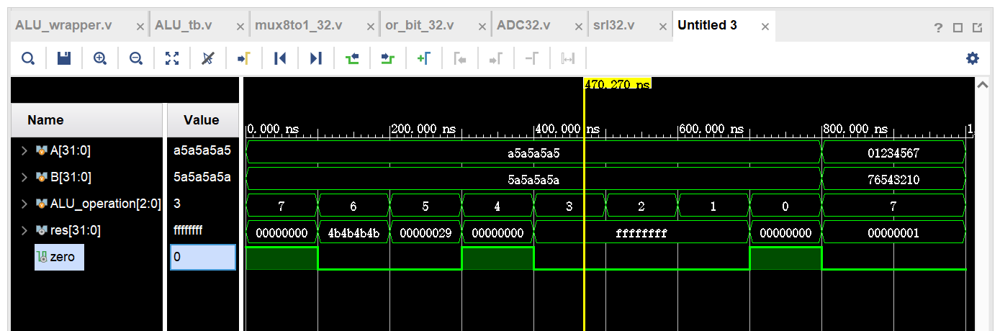
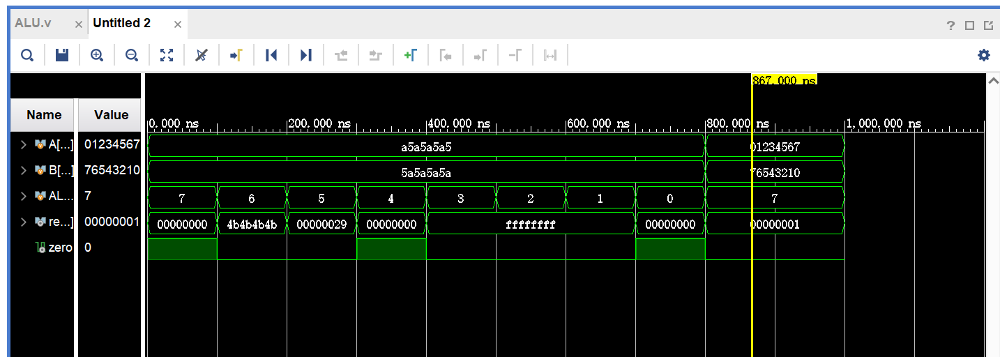
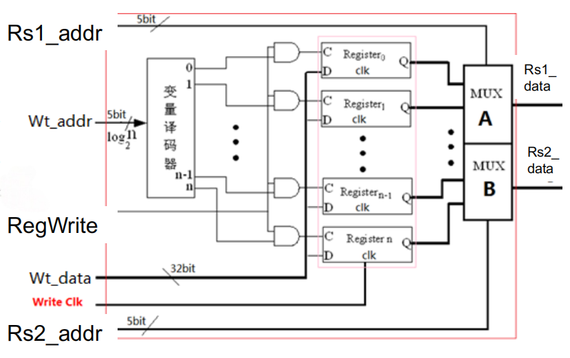
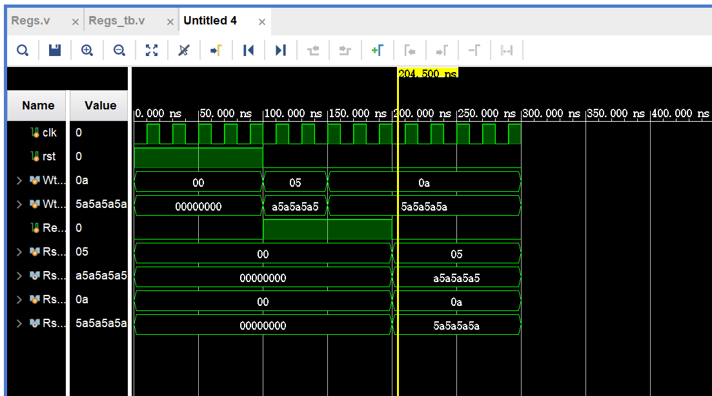
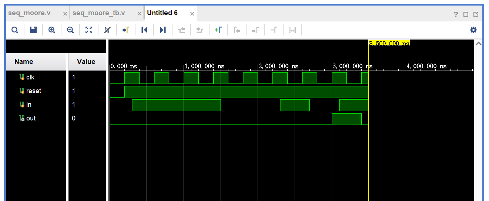

???+ tips "验收要求"

    1. 注意`srl`操作对应：`A >> B[4:0]`;

    2. ALU仿真波形PPT1 19

        * 需要按两种⽅式实现ALU：
        
            （1）结构化描述的ALU（⼦模块调⽤的⽅法，见后续PPT⻚）；
            
            （2）功能性描述的ALU（见后续PPT⻚）

            （3）可选：采用逻辑原理图输入设计ALU

        * 两种⽅式实现ALU的都需要仿真测试得到PPT1 15⻚所示波形

        * 对应仿真激励⽂件可以参考：`lab1\OExp01\OExp01-ALU\OExp01-ALU.srcs\sim_1\new\ALU_tb.v`

    3. regfile仿真结果（PPT1 21）

        * 对应仿真激励⽂件可以参考：`lab1\OExp01\OExp01-Regs\OExp01-Regs.srcs\sim_1\new\Regs_tb.v`

    4. 三段式状态机仿真波形（PPT2 23）

        * 对应仿真激励⽂件可以参考：`lab1\OExp01\OExp01-seq_moore\seq_moore.srcs\sim_1\new\tb.v`

## ALU, Regfiles设计

<del>这部分的实验文档用“颠三倒四”来形容不为过。</del>

### ALU的两种实现：结构化描述与功能性描述

#### 结构化描述

ALU在数逻lab8中已经出现过. 此处需要新建一个项目将lab0中的一堆`.v`代码导入，再自己写一个顶层代码综合起来.

考虑到我一点也不想生成IP核，最后选择了顶层代码书写的方法.

这是我写的`ALU_wrapper.v`代码，其他的模块只要自己建好导入进去就行了：

```verilog
module ALU_wrapper(
    input [31:0] A,
    input [31:0] B,
    input [2:0] ALU_operation,
    output [31:0] res,
    output zero
    );
    
    wire [31:0] So, res1, I0, I1, I3, I4, I5, I7, I2;
    wire [32:0] res2;
    
    SignalExt_32 SignalExt_32_0(  // module name & instance name 
        .S(ALU_operation[2]),
        .So(So)
    );
    
    xor32 xor32_1(
        .A(So),
        .B(B),
        .res(res1)
    );
    
    and32 and32_1(
        .A(A),
        .B(B),
        .res(I0)
    );
    
    or32 or32_1(
        .A(A),
        .B(B),
        .res(I1)
    );
    
    ADC32 ADC32_1(
        .A(A),
        .B(res1),
        .C0(ALU_operation[2]),
        .S(res2)
    );
    
    xor32 xor32_0(
        .A(A),
        .B(B),
        .res(I3)
    );
    
    nor32 nor32_0(
        .A(A),
        .B(B),
        .res(I4)
    );
    
    srl32 srl32_0(
        .A(A),
        .B(B),
        .res(I5)
    );
    
    assign I7 = {31'b0,res2[32]};
    assign I2 = res2[31:0];
    
    MUX8T1_32 mux8to1_32(
        .I0(I0),
        .I1(I1),
        .I2(I2),
        .I3(I3),
        .I4(I4),
        .I5(I5),
        .I6(I2),
        .I7(I7),
        .s(ALU_operation[2:0]),
        .o(res)
    );
    wire zero0;
    
    or_bit_32 or_bit_32_0(
        .A(res),
        .o(zero0)
    );
    
    assign zero = ~zero0;
endmodule
```

仿真波形：

<center></center>

#### 功能性描述

```verilog
module ALU_wrapper(
    input [31:0] A,
    input [31:0] B,
    input [2:0] ALU_operation,
    output reg [31:0] res,
    output zero
);
    
    wire [31:0] So;
    wire [31:0] res1;
    wire [32:0] res2;
    wire [31:0] I0, I1, I2, I3, I4, I5, I7;
    
    assign So = { 31'b0 , ALU_operation[2] };
    assign res1 = ALU_operation[2] ? ~B : B;
    assign I0 = A & B;                
    assign I1 = A | B;   

    wire b0;
    assign b0 = ALU_operation[2] ^ 1'b0;
    assign res2 = {1'b0,A} + {b0,res1} + ALU_operation[2];
    assign I2 = res2[31:0];

    assign I3 = A ^ B;             
    assign I4 = ~(A | B);          
    assign I5 = A >> B[4:0];           
    assign I7 = {31'b0, res2[32]};      

    always @(*) begin
        case(ALU_operation[2:0])
            3'b000: res = I0;
            3'b001: res = I1;
            3'b010: res = I2;
            3'b011: res = I3;
            3'b100: res = I4;
            3'b101: res = I5;
            3'b110: res = I2; 
            3'b111: res = I7;  
            default: res = 32'b0;
        endcase
    end
    assign zero = ~(|res);
endmodule
```

仿真波形：

<center></center>

<del>逻辑原理图的部分我就不做了，嫌麻烦.</del>

### Regfiles实现

Register files是数字系统的功能组件之一，此处我们需要实现\(32 \times 32 bits\)的寄存器组件，进行行为级描述并输出仿真结果.

原理图：
<center></center>

端口要求：

1. 二个读端口：
    `Rs1_addr;Rs1_data`和`Rs2_addr;Rs2_data`

2. 一个写端口，带写信号
    `Wt_addr;Wt_data`和`RegWrite`

slides上面已经给出了代码，<del>但是变量名写错了，楽</del>。修改完得到：

```verilog
module Regs(input clk,
            input rst,
            input [4:0] Rs1_addr, 
            input [4:0] Rs2_addr, 
            input [4:0] Wt_addr, 
            input [31:0]Wt_data, 
            input RegWrite, 
            output [31:0] Rs1_data, 
            output [31:0] Rs2_data
        );
    reg[31:0] register[1:31];
    integer i;
    
    assign Rs1_data = (Rs1_addr == 0) ? 0 : register[Rs1_addr];  // read
    assign Rs2_data = (Rs2_addr == 0) ? 0 : register[Rs2_addr];  // read

    always @(posedge clk or posedge rst)
        begin 
            if (rst == 1) 
                for (i = 1; i < 32; i = i+1)
                    register[i] <= 0;                            // reset
            else if ( (Wt_addr != 0) && (RegWrite == 1))
                register[Wt_addr] <= Wt_data;                    // write
        end
endmodule
```

添加一下仿真：

```verilog
module Regs_tb;
    reg clk;
    reg rst;
    reg [4:0] Wt_addr; 
    reg [31:0]Wt_data; 
    reg RegWrite; 
    reg [4:0] Rs1_addr;
    wire [31:0] Rs1_data; 
    reg [4:0] Rs2_addr;
    wire [31:0] Rs2_data;
Regs Regs_U(
      .clk(clk),
      .rst(rst),
      .Rs1_addr(Rs1_addr),
      .Rs2_addr(Rs2_addr),
      .Wt_addr(Wt_addr),
      .Wt_data(Wt_data),
      .RegWrite(RegWrite),
      .Rs1_data(Rs1_data),
      .Rs2_data(Rs2_data)
);

always #10 clk = ~clk;

initial begin
     clk = 0;
     rst = 1;
     RegWrite = 0;
     Wt_data = 0;
     Wt_addr = 0;
     Rs1_addr = 0;
     Rs2_addr = 0;
     #100
     rst = 0;
     RegWrite = 1;
     Wt_addr = 5'b00101;
     Wt_data = 32'ha5a5a5a5;
     #50
     Wt_addr = 5'b01010;
     Wt_data = 32'h5a5a5a5a;
     #50
     RegWrite = 0;
     Rs1_addr = 5'b00101;
     Rs2_addr = 5'b01010;
    
    #100 $stop();

end
endmodule
```

最后跑出来结果是：

<center></center>

## 三段式状态机

三段式描述下的状态机是将输出信号与状态跳转分开描述，并且状态跳转用组合逻辑来控制的状态寄存器.

这个部分要求设计三段式的Moore型状态机以解决序列检测问题，即检测输入的二进制代码串中是否存在指定的代码序列.

初始拿到的`seq_moore.v`文件如下（已经做了排版美化工作）：

```verilog
//1110010
`timescale 10ns/1ns

module seq(
    clk,
    reset,
    in,
    out
);
    input clk;
    input reset;
    input in;
    output out;

    //define state
 
    //internal variable
 
    //first segment:state transfer
 
    //second segment:transfer condition
 
    //three segment: state output

    //moore type fsm
 
endmodule
```

slides已经给出了清晰的完整代码，所以基本只需要在抄下来的过程中理解究竟在做什么.

以下是我压行之后搞出来的东西：

```verilog
`timescale 10ns/1ns
module seq(
    input clk,
    input reset,
    input in,
    output out);

    //define state
    parameter [2:0] s0 = 3'b000,
                    s1 = 3'b001,
                    s2 = 3'b010,
                    s3 = 3'b011,
                    s4 = 3'b100,
                    s5 = 3'b101,
                    s6 = 3'b110,
                    s7 = 3'b111;
    //internal variable
    reg [2:0] curr_state;
    reg [2:0] next_state;
    wire out;
    //first segment:state transfer
    always @(posedge clk or negedge reset)
        begin
            curr_state = reset ? next_state : s0;
        end
    //second segment:transfer condition
    always @(curr_state or in)
        begin 
            case(curr_state)
                s0: begin next_state = (in)? s1 : s0; end
                s1: begin next_state = (in)? s2 : s0; end
                s2: begin next_state = (in)? s3 : s0; end
                s3: begin next_state = (in)? s3 : s4; end
                s4: begin next_state = (in)? s1 : s5; end
                s5: begin next_state = (in)? s6 : s0; end
                s6: begin next_state = (in)? s2 : s7; end
                s7: begin next_state = (in)? s1 : s0; end
                default: next_state = s0;
            endcase
        end
   //three segment: state output
   //moore type fsm
   assign out = (curr_state == s7) ? 1:0;
endmodule
```

仿真文件里面有一些没处理干净的参数（`[7:0] data`, `i`），抹掉就行了，得到提纯版本的：

```verilog
`timescale 10ns/1ns
module tb_seq();
    reg clk;
    reg reset;
    reg in;
    wire out;
 
    always #20 clk = ~clk;
 
    initial
    begin
        clk = 0;
        reset = 0;
        #20 reset = 1;
    end

//011100101
initial
    begin
        in = 0; #30
        in = 1; #40
        in = 1; #40
        in = 1; #40
        in = 0; #40
        in = 0; #40
        in = 1; #40
        in = 0; #40
        in = 1; #40
        $finish;
    end

seq seq_u1(
    .clk(clk),
    .reset(reset),
    .in(in),
    .out(out)
    );
endmodule
```

跑出来仿真：

<center></center>

于是lab1就<del>在这种赤石的氛围中</del>结束了！
