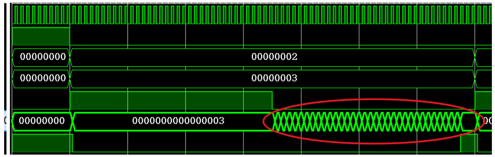
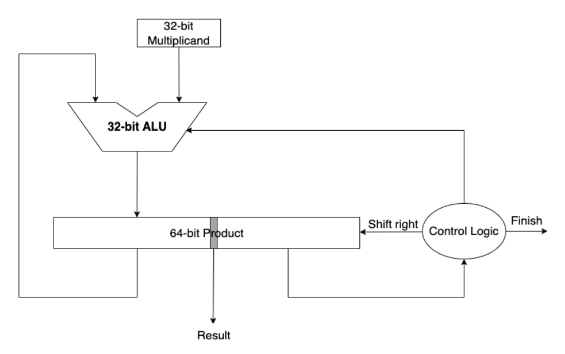
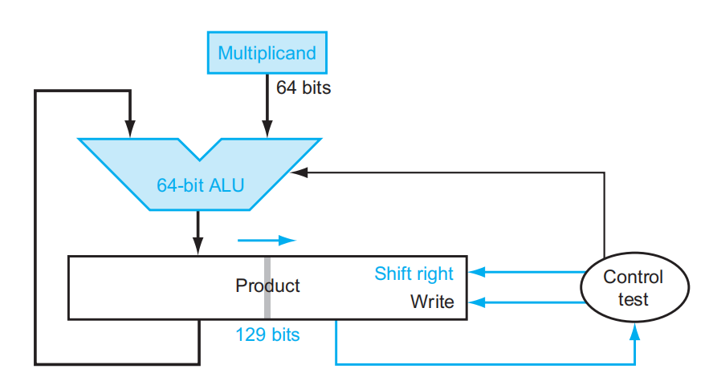
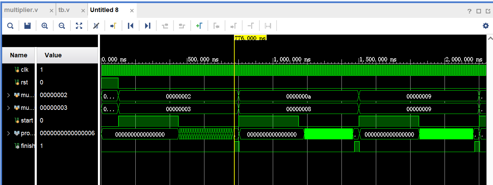
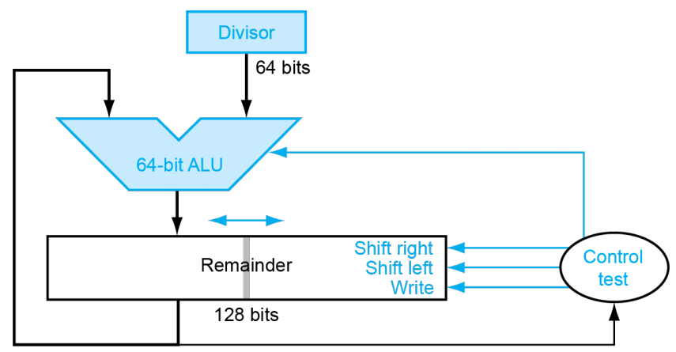
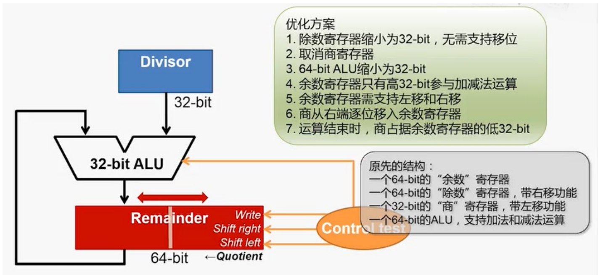
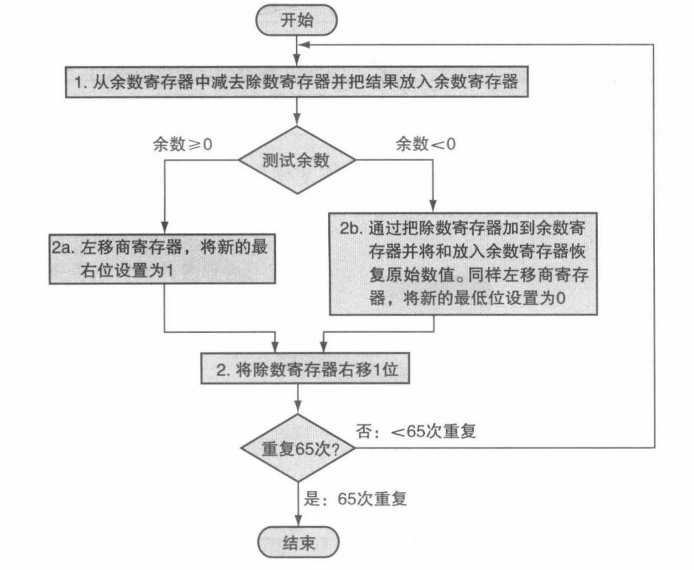
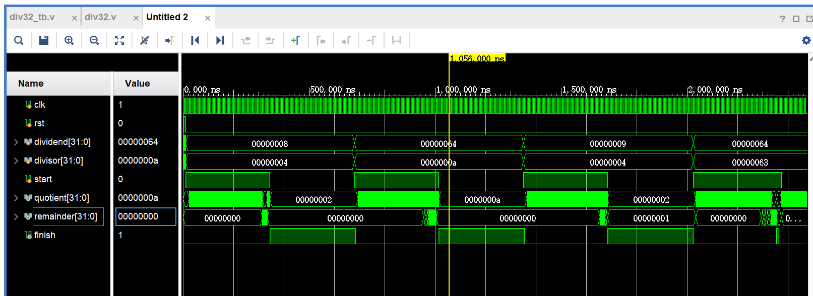

???+ tips "验收要求"

    * 32位整数乘法PPT P20
        仿真激励文件可以参考： `.\OExp03\OExp03-mul32\mul32.srcs\sim_1\new\tb.v`

        测试tb文件中给的输入样例，实现PPT P20所示效果，在计算开始后必须体现移位过程，即需要体现这段波形：

        <center></center>

    * 32位整数除法PPT P35

        仿真激励文件可以参考： `.\OExp03\OExp03-div32\div32.srcs\sim_1\imports\new\div32_tb.v`

        测试tb文件中给的输入样例，实现PPT P35所示效果，在计算开始后quotient和remainder的输出也需要体现移位过程

        实现过程可以参考这个示例：

        <center></center>

    * 选做：32位浮点加法PPT P73
        仿真激励文件可以参考： `.\OExp03\OExp03-float_add\float_add.srcs\sim_1\new\tb.v`

        熟悉浮点加法过程，在tb文件的输入下得到正确答案

## Multiplier(乘法器)

这个实验要求完成32位无符号乘法器，其实验slides上要求采用的算法是课堂上讲的V3版本.

原理图如下：

<center></center>

代码如下：

```verilog
module mul32(
    input clk,
    input rst,
    input [31:0] multiplicand,
    input [31:0] multiplier,
    input start,
    output reg [63:0] product,
    output reg finish
);
    reg [5:0] count;
    reg [31:0] multiplier_reg;
    reg processing;
    
    always @(posedge clk or posedge rst) begin
        if (rst) begin
            product <= 64'b0;
            finish <= 1'b0;
            count <= 6'b0;
            multiplier_reg <= 32'b0;
            processing <= 1'b0;
        end 
        else begin
            if (start) begin
                product <= 64'b0;
                multiplier_reg <= multiplier;
                count <= 6'b0;
                processing <= 1'b1;
                finish <= 1'b0;
            end 
            else if (processing && count < 6'd32) begin
                if (multiplier_reg[0]) begin
                    product <= (product + {multiplicand, 32'b0}) >> 1;
                end else begin
                    product <= product >> 1;
                end
                multiplier_reg <= multiplier_reg >> 1;
                count <= count + 1'b1;
            end 
            else if (processing && count == 6'd32) begin
                finish <= 1'b1;
                processing <= 1'b0;
            end
        end
    end
endmodule
```

有几个注意点：

1. 这里使用`always @()`语句，所以所有的变量都是reg;

2. 必须使用阻塞赋值 `<=`，否则可能引发赋值上的一系列问题；

仿真图像：

<center></center>

## Divider(除法器)

这个实验要求完成32位无符号除法器，其实验slides上要求采用的算法是课堂上讲的Improved Version：

<center></center>

原理图如下：

<center></center>

其流程图如下：

<center></center>

代码：

```verilog
module div32(
    input    clk,
    input    rst,
    input    start,
    input    [31:0] dividend, 
    input    [31:0] divisor,
    output  reg  finish,
    output  reg  [31:0] quotient,
    output  reg  [31:0] remainder
); 
    reg [5:0] count;
    reg [63:0] remainder_reg;
    reg processing;
    
    always @(posedge clk or posedge rst) begin
        if (rst) begin
            finish <= 1'b0;
            quotient <= 32'b0;
            remainder <= 32'b0;
            remainder_reg <= 64'b0;
            count <= 6'b0;
            processing <= 1'b0;
        end else begin
            if (start && !processing) begin
                finish <= 1'b0;
                remainder_reg <= {32'b0, dividend};
                count <= 6'b0;
                processing <= 1'b1;
            end
            else if (processing && count < 6'd32) begin
                remainder_reg <= remainder_reg << 1;
                 
                if (remainder_reg[62:31] >= divisor) begin
                    remainder_reg[63:32] <= remainder_reg[62:31] - divisor;   //由于是非阻塞赋值，必须是62:31，这非常关键！！
                    remainder_reg[0] <= 1'b1;
                end else begin
                    remainder_reg[0] <= 1'b0; 
                end
                remainder <= remainder_reg[63:32];
                quotient <= remainder_reg[31:0];
                count <= count + 6'd1;
            end
            else if (processing && count == 6'd32) begin
                remainder <= {remainder_reg[63:32]};   //这里不再需要移位操作.
                quotient <= remainder_reg[31:0];
                finish <= 1'b1;
                processing <= 1'b0;
            end
        end
    end
endmodule
```

仿真波形：

<center></center>

## （选做）Floating-Point Adder

首先看看瓜豪文档的思考题：

???+ question "思考题"

    请结合理论课所学，回答以下问题：

    * 双精度浮点数 `x, y, z`，若 `x = -1.5e38, y = 1.5e38, z=1.0`
        * `(x+y)+z = ?`；
        * `x+(y+z) = ?`；
        * 两者有区别吗？请解释你的回答。
    * 假设使用单精度浮点数，编写以下代码
        ```c
        float x = SOME_VALUE_0;
        float sum = 0.0f;
        for(int i = 0; i < SOME_VALUE_1; ++i) sum += x;
        printf("%f\n", sum - 100.0f);
        ```
        * 如果 `SOME_VALUE_0 := 0.1, SOME_VALUE_1 := 1000`，你将得到什么结果？
        * 如果 `SOME_VALUE_0 := 0.125, SOME_VALUE_1 := 800`，你将得到什么结果？
        * 请结合浮点数定义，解释两者差异。
