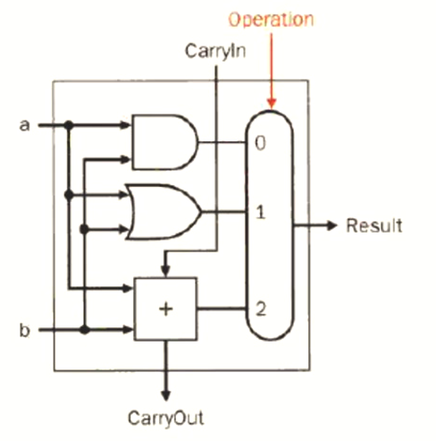
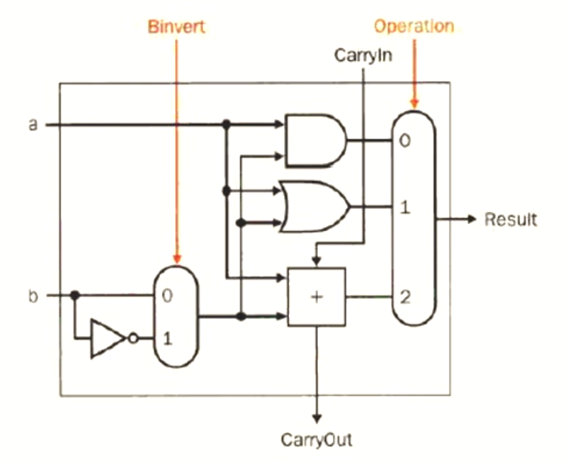
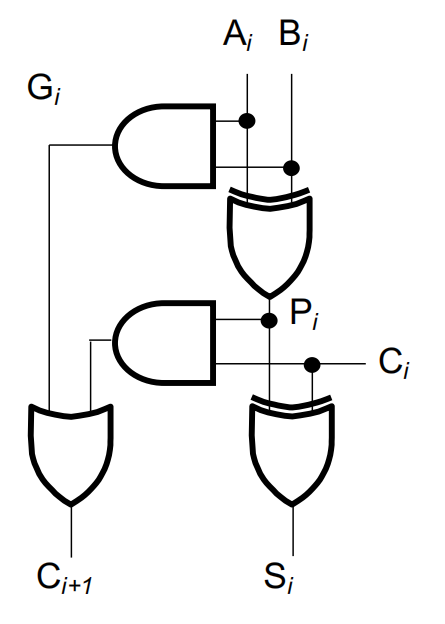
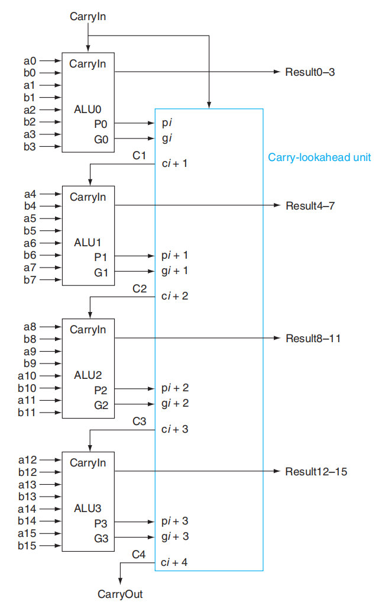
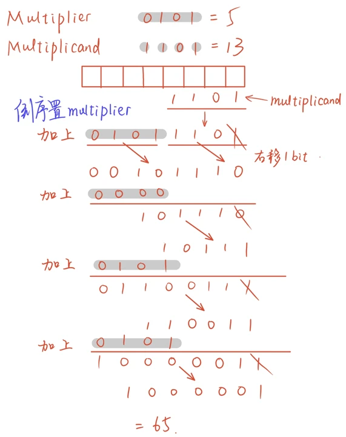
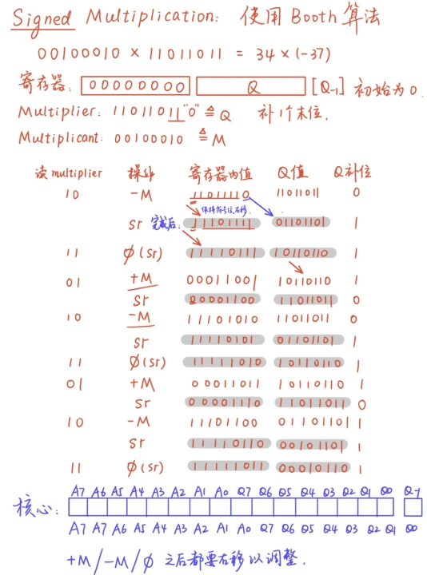
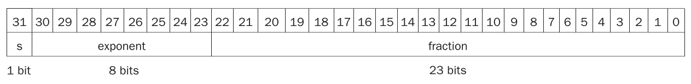
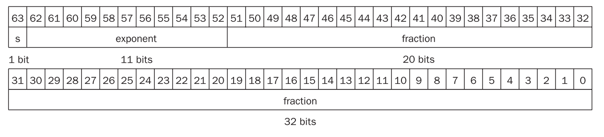

## Chapter 3: Arithmetic for Computer

Computer words are composed of bits, thus one word is a vector of binary numbers. In RISC-V, there are 32bit/word or 64bits/word, in which 32 bits contains 4 bytes.

???+ tips "资源"
    [NoughtQ佬的笔记](https://note.noughtq.top/system/co/3)，讲得非常清晰，感觉比听智云效率高很多.
    但是需要注意一个问题，其中的Improved Version除法器原理图中，remainder寄存器在lp老师的slides上面是128bits而非129bits.

    Homework: 3.7, 3.20, 3.26, 3.27, 3.32
    
    林芃老师曰：“课上我们默认32bits是1 word，64bits叫做double word.
    
    “教材上有一些用法混乱，之后会指出。”

* 数字表示法：

    1. ASCII - text characters (External)

    2. Binary Number (Internal)

        Natural form of computers

        requires formatting routines for I/O

        Binary numbers的复杂性导致我们无法从一串二进制码中看出唯一确定的含义.

        eg.$1001_2$这个数字在Unsigned情况下值为9，在signed情况下值可能为-1或者-7

* Arithmetic Operations:

    Addition: adding bit by bit, carries $\rightarrow$ next digit

    Substraction: using 2's complement，比如00000111-00000110，先变成00000111+1_11111010，计算完之后减去.

    Overflow:

    | Operation | Operand A | Operand B | overflow judge (MSB) | Result   |
    | --------- | --------- | --------- | -------------------- | -------- |
    | +         | $\geq 0$  | $\geq 0$  | 01                   | $<0$     |
    | +         | $<0$      | $<0$      | 10                   | $\geq 0$ |
    | -         | $\geq 0$  | $<0$      | 01                   | $<0$     |
    | -         | $<0$      | $\geq 0$  | 10                   | $\geq 0$ |

    上面这张表展示了溢出的判定情况，如当$A,B>0,result<0$且最高2位显示为01时，即可认为是overflow了.

### ALU Design

* ALU (Arithmetic Logic Unit):

    设计时采用模块化设计(Modular design)的思路.

    first function: AND, OR

    second function: add (half adder / full adder)

    1 bit ALU:

    <center></center>

    于是减法可以用如下的ALU实现：

    <center></center>

    于是我们得到了第4个指令：`sub`.

    目前还缺少比较运算，其指令是：`slt rd,rs,rt`。具体含义：`slt`(set less than)，`rd`是register destination, `rs`是register source, `rt`是register target. 功能上，`rs < rt` 时 `rd = 1`，否则`rd = 0`.

    另外，`sne`是set not equal的意思.

    Constructing an ALU：有两种方法，Modular design (模块化设计) 和 sharable logic with "select"

#### Adder

1. ripple carry adder（行波进位加法器）: slow

    原理推导：

    $$\begin{cases}
            C_{i+1} = A_iB_i + B_iC_i + C_iA_i\\
            S_i = A_i \oplus B_i \oplus C_i
        \end{cases}$$

    原理图：

    <center></center>

2. Group Carry Lookahead Logic

    为了加快运算速度，考虑替换掉\(C_{1,2,etc.}\)，先定义：

    $$\begin{cases}
            G_i = A_iB_i & (\text{Carry generated})\\
            P_i = A_i \oplus B_i & (\text{Carry propagated})
        \end{cases}$$

    原理推导：

    $$C_{i+1} = G_i + P_i \cdot C_i \Longrightarrow \begin{cases}
        C_1 = G_0 + (P_0 \cdot C_0) \\
        C_2 = G_1 + (P_1 \cdot G_0) + (P_1 \cdot P_0 \cdot C_0) \\
        C_3 = G_2 + (P_2 \cdot G_1) + (P_2 \cdot P_1 \cdot G_0) + (P_2 \cdot P_1 \cdot P_0 \cdot C_0) \\
        C_4 = G_3 + (P_3 \cdot G_2) + (P_3 \cdot P_2 \cdot G_1) + (P_3 \cdot P_2 \cdot P_1 \cdot G_0) + (P_3 \cdot P_2 \cdot P_1 \cdot P_0 \cdot C_0)
        \end{cases}$$

    所以对于当前位而言，如果$P_i = 1$，或者前面的位上存在 $P_j = 1$ 且该生成项$P_j$所在位到当前位之间的所有$G_k = 1(j\leq k\leq i)$，当前位的进位值为 1，否则为 0.

    <center></center>

<del>Carry skip adder & Carry select adder 没搞懂，据说不考，先跳过了.</del>

#### Multiplication

Group Carry Lookhead Logic

完整版看NoughtQ佬的笔记，此处只记录下自己在看V3版本的流程梳理：

<center></center>

然后是Booth算法来处理signed multiplication:

核心思想：将连续的1串转换为一次减法和一次加法，如：0111 = 1000 - 0001（即8-1=7）. 这样连续的1只需要2次操作，而不是多次加法

编码规则：检查乘数的当前位和前一位，分以下4种情况讨论：

| 当前位 | 前一位 | 操作    | 含义      |
| ------ | ------ | ------- | --------- |
| 0      | 0      | 不做    | 0串的中间 |
| 0      | 1      | +被乘数 | 1串的结束 |
| 1      | 0      | -被乘数 | 1串的开始 |
| 1      | 1      | 不做    | 1串的中间 |

记每组操作为两个阶段：

1. +M / -M / 不加不减；

2. Shift Right

从中我们可以看出，如果是$64\times 64bits$，则一共有64组操作.

以$00100010 \times 11011011 = 34 \times (-37)$为例，其操作流程是：

<center></center>

RISC-V中的乘法指令：

```assembly
mul rd, rs1, rs2     // 64 位乘法，rd保存 128 位乘积的低 64 位
mulh rd, rs1, rs2    // 64 位乘法，rd保存 128 位符号数之间的乘积的高 64 位
mulhu rd, rs1, rs2   // 64 位乘法，rd保存 128 位无符号数之间的乘积的高 64 位
mulhsu rd, rs1, rs2  // 64 位乘法，rd保存 128 位无符号数与符号数的乘积的高 64 位
```

#### Division

RISC-V中的除法指令：

```assembly
div rd, rs1, rs2    // rd保存符号数除法的商
divu rd, rs1, rs2   // rd保存无符号数除法的商
rem rd, rs1, rs2    // rd保存符号数除法的余数
remu rd, rs1, rs2   // rd保存无符号数除法的余数
```

### Floating Point Numbers

#### Floating-Point Standard

RISC-V浮点数标准来自IEEE 754标准，其将二进制数统一成了**规范化数**形式：$1.xxxxx_2 \times 2^{yyyy}$.

浮点数表示法组成：符号$S$、指数(exponent)$E$、尾数(fraction)$F$.

浮点数表示法（Sign and Magnitude）中的数字表示形式为：

$$(-1)^S \times F \times 2^E$$

单精度(float)下，数的范围是

$$2.0_{10} \times 10^{-38} \to 2.0 \times 10^{38}$$

<center></center>

双精度下，数的范围是

$$2.0_{10}\times 10^{-308} \to 2.0_{10} \times 10^{308}$$

<center></center>
