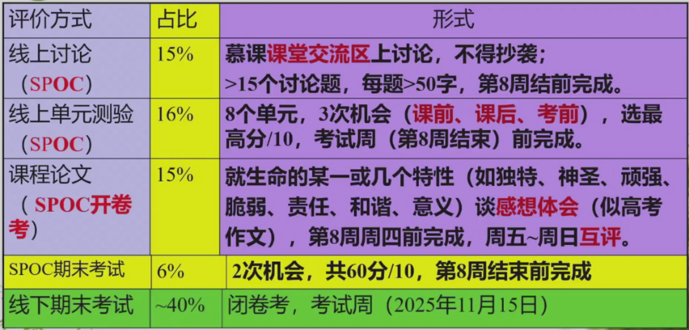

!!! tips

    摘自[日斤的经验帖](https://www.cc98.org/topic/6227386)：

    > 比较适合高中选了生物的文科生，内容不算难但是非常广。这门课真要搞明白还是需要一些生物基础和背诵能力的。一开始听着觉得很有意思，后面我就开始水课了。期末复习主要是面向书本（我是考前前一周每天晚上看一看，其实还是量比较大的）和历年卷（98特有的通识课传承）复习，据说有给分随机或者偏低的情况但我觉得还好。总之复习了拿一个比较高的绩点和获得8个还算愉快的周四晚我觉得比较值得。

    [生命教育概论资源整合+回忆卷](https://www.cc98.org/topic/5878013)
    $\quad$
    [2024-2025春学期回忆卷](https://www.cc98.org/topic/6166619)
    $\quad$
    [2024-2025冬学期回忆卷](https://www.cc98.org/topic/6088910)
    $\quad$
    [2024-2025秋学期回忆卷](https://www.cc98.org/topic/6032985)

    [MOOC答案](https://www.cc98.org/topic/6076010)

    [知识点整理](https://www.cc98.org/topic/5925967)

!!! tips

    评分政策：

    

    还有8分平时分由老师控制，暂时不详给分/扣分的事项.