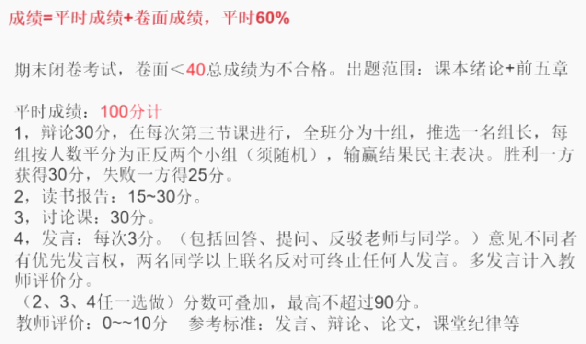
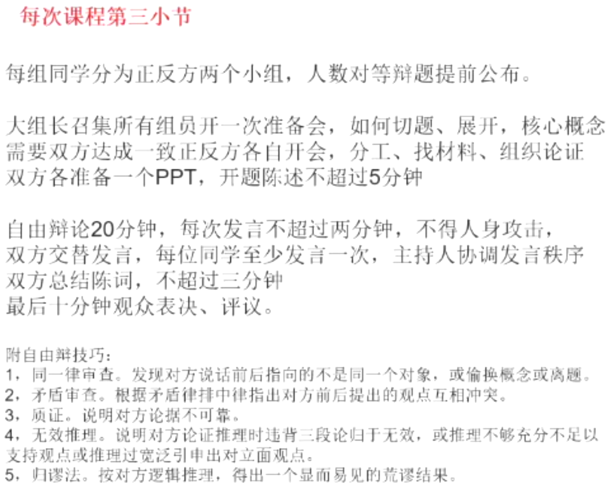
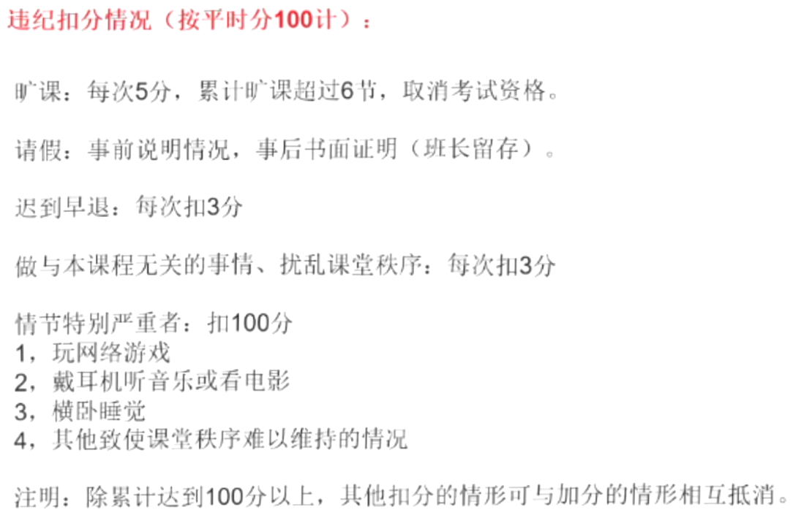

!!! tips "评分标准"

    摘自[wci的思政课经验分享帖子](https://www.cc98.org/topic/6093564):

    > 期末是闭卷考试，40分单选，共40题，3道大题，分别考察辩证唯物主义，唯物史观，政治经济学。
    
    > 关于考试:高中选考政治的同学，前面唯物辩证法和唯物史观的部分和高中差不多，重点是后面的政治经济学部分。如何备考选择题部分:比较基础，都是课本上的知识点，建议先整本书过一遍，然后刷题器上刷点选择题，提高一下印象，考试看到选项能想起来就差不多了。    
    
    > 大题部分:时间实在不够的话，找最精简的框架，只背重要的原理，一半就几句话，考试的时候先写原理，后面自己编，抄点材料。另外，时间是够的，所以多写一点，多答几点最好。

    评分规则：

    

    辩论规则：

    

    违纪处理：

    

