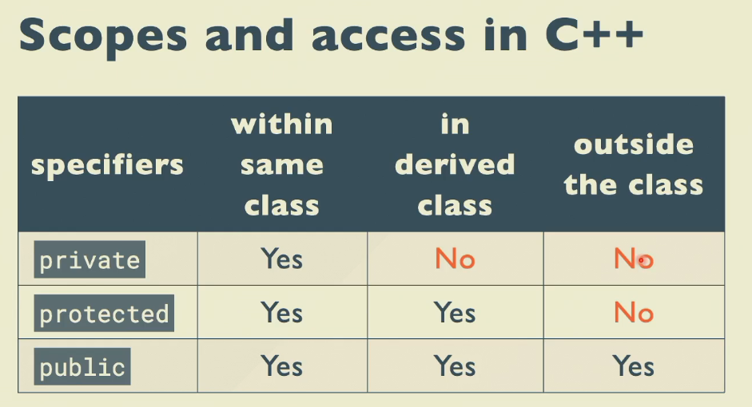

## inline&macro

资源网站：<https://godbolt.org>

函数主体的展开：使用inline之后函数的汇编在调用时直接展开，而不是`call`，一定程度上节省了内存.

## 继承

```cpp
struct A{
    int x, y, z;
};

struct B{
    A a;
};

struct C : public A{};

int main(){
    B b; // B 包含一个 A 类型的成员 a
    C c; // C 继承自 A
}

// b c的内存格局是一样的，因为b中有一个A类型的成员，而c是从A继承而来
// 但是访问成员的方式不同：b.a.x vs c.x
```

## 访问权限

private,protected,public:



```cpp
class Base{
public:
    Base() : data(10){cout << "Base constructor called." << endl;}
    ~Base(){cout << "Base destructor called." << endl;}
    void print(){cout << "Base data: " << data << endl;}
    void setdata(int i) { data = i; }
private:int data;
};

class Derived : public Base{
public: void foo() {setdata(20);print();}
};

int main()
{
    Derived d;
    d.print();
}
```
