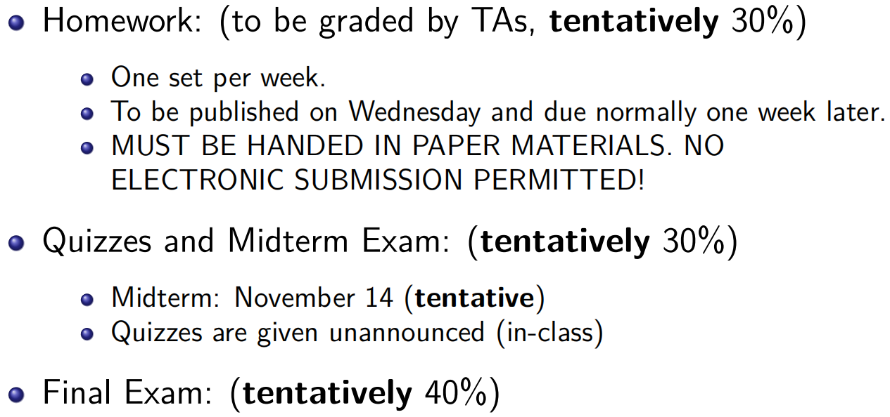
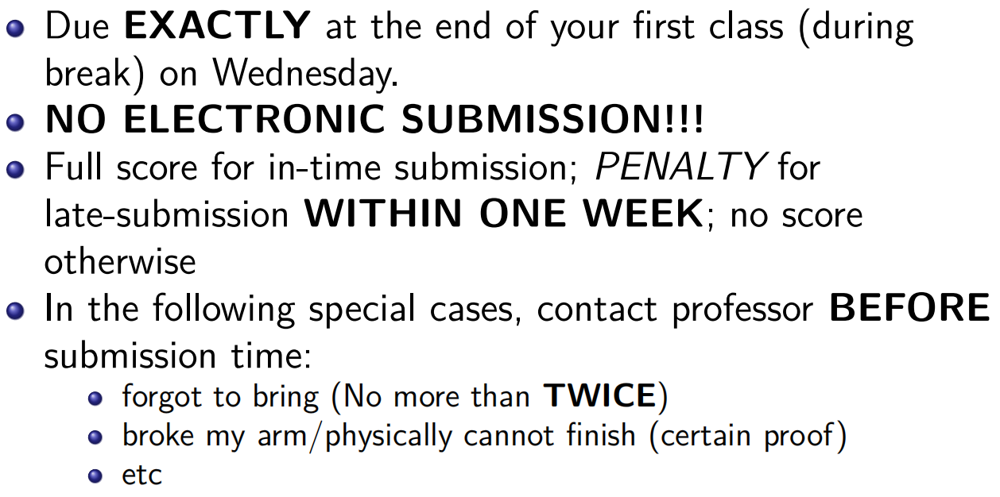

本文将根据曹超/Lim Lih-King两位老师的授课内容整理.

!!! tips

    Grading Policies:

    

    Homework Policies:

    

<table>
<thead>
    <tr>
        <th>笔记列表</th>
        <th>内容概要</th>
    </tr>
</thead>
<tbody>
    <tr>
        <td><a href="electricity/">电学笔记</a></td>
        <td>Electricity Notes</td>
    </tr>
    <tr>
        <td><a href="magnetism/">磁学笔记</a></td>
        <td>Magnetism Notes</td>
    </tr>
    <tr>
        <td><a href="optics/">光学笔记</a></td>
        <td>Optics Notes</td>
    </tr>
    <tr>
        <td><a href="quantum/">量子力学笔记</a></td>
        <td>Quantum Physics Notes</td>
    </tr>
</tbody>
</table>

