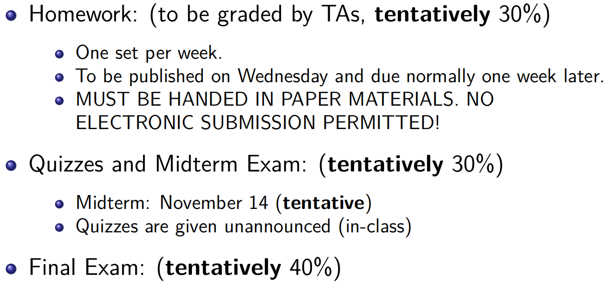
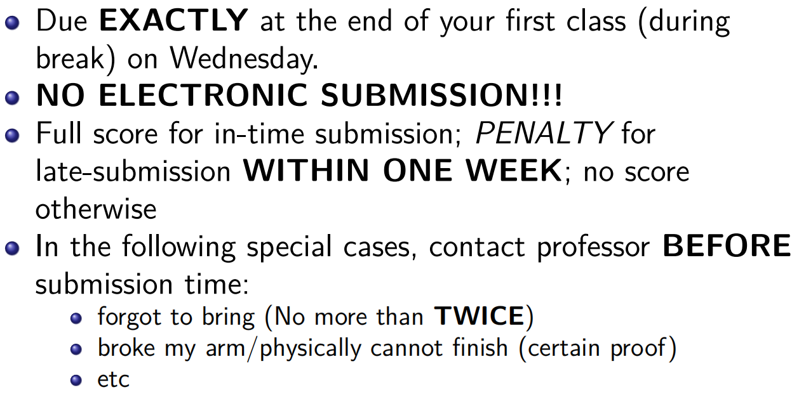

本文将根据曹超/Lim Lih-King两位老师的授课内容整理.

实时更新的[课堂小测题目整理](https://www.overleaf.com/read/fsgjdnmbhyxd#5498f3)

???+ tips "资源汇总"

    24级：

    [【学习天地】普物II 期中回忆卷 25-26秋冬 cc/llk班 （tags：普通物理学Ⅱ普物2 cc/llk ）](https://www.cc98.org/topic/6343416)

    [【学习天地】普物II 期中回忆卷 25-26秋冬 路欣老师班 （tags：普通物理学 普物2 lx ）](https://www.cc98.org/topic/6343000)

    23级：

    [【学习天地】24-25普物2期中cc/llk Markdown精装排版 tag：普通物理学](https://www.cc98.org/topic/6339638)

    22级：

    [【学习天地】23-24秋冬普物二（H）CC/LLK班期末回忆卷](https://www.cc98.org/topic/5799577)

!!! tips "考评方法"

    Grading Policies:

    

    Homework Policies:

    

