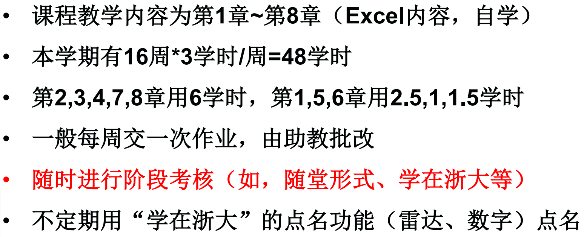
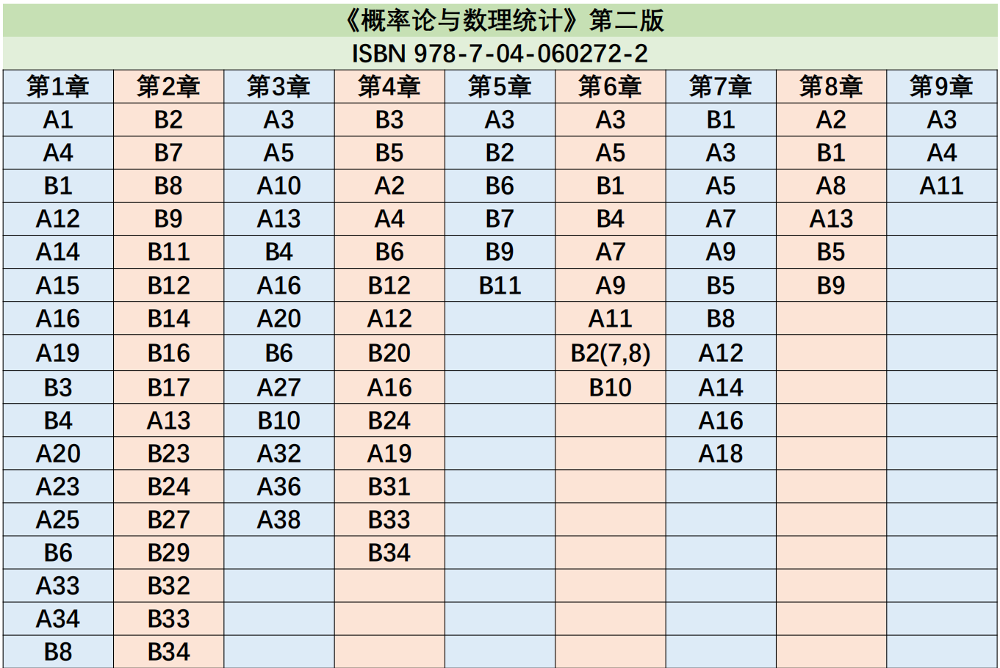
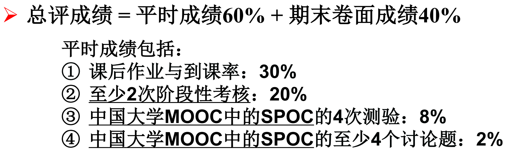
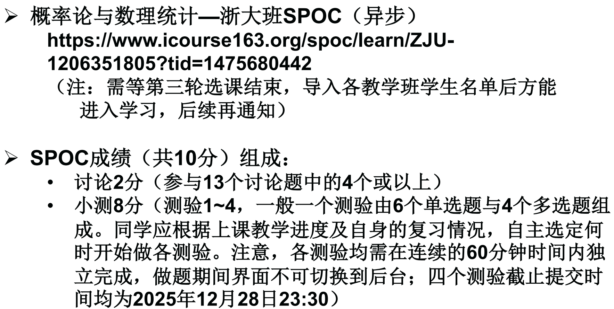
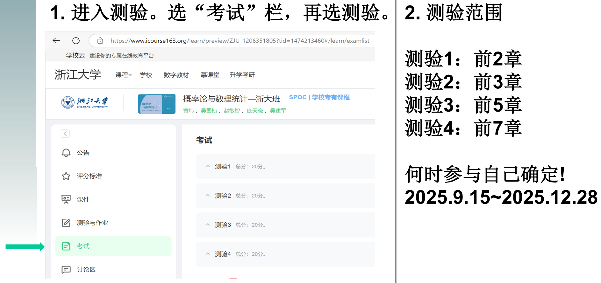

本文将依照吴国桢老师授课以及教材等材料进行整理.

!!! tips

    教材：<a href="textbook.pdf" download="教材.pdf">点击下载</a>
    
    课程大纲：

    

    全学期教材习题作业布置：

    

    评分规则：

    

    SPOC政策：

    

    SPOC使用方法：

    

!!! tips

    * 小测：（点击即可下载）

        <a href="quiz/1.pdf" download="24-25ssquiz1.pdf">2024-2025春夏赵敏智周四678第1次小测</a>
        $\quad$
        <a href="quiz/1-Answer.pdf" download="24-25ssquiz1-ans.pdf">2024-2025春夏赵敏智周四678第1次小测答案</a>

        <a href="quiz/2.pdf" download="24-25ssquiz2.pdf">2024-2025春夏赵敏智周四678第2次小测</a>
        $\quad$
        <a href="quiz/2-Answer.pdf" download="24-25ssquiz2-ans.pdf">2024-2025春夏赵敏智周四678第2次小测答案</a>

        <a href="quiz/3-all.pdf" download="24-25awquiz1.pdf">第1次小测往期总结</a>
        $\quad$
        <a href="quiz/3-new.pdf" download="24-25awquiz1-new.pdf">2024-2025秋冬第1次小测新增</a>
        $\quad$
        <a href="quiz/3-new2.pdf" download="24-25awquiz1-new2.pdf">2024-2025秋冬第1次小测补测新增</a>

        <a href="quiz/4-all.pdf" download="24-25awquiz2.pdf">第2次小测往期总结</a>
        $\quad$
        <a href="quiz/4-new.pdf" download="24-25awquiz2new.pdf">2024-2025秋冬第2次小测新增</a>

        <a href="quiz/5.pdf" download="24-25awquiz3.pdf">第3次小测往期总结</a>
        $\quad$
        <a href="quiz/5-Answer.pdf" download="24-25awquiz3-ans.pdf">第3次小测往期解析</a>
        $\quad$
        <a href="quiz/5-new.pdf" download="24-25awquiz3-appendix.pdf">2024-2025秋冬第3次小测新增</a>

        > 来源：

        > [2024-2025春夏赵敏智周四678第一次小测](https://www.cc98.org/topic/6158411)
        $\quad$
        [2024-2025春夏赵敏智周四678第一次小测答案](https://www.cc98.org/topic/6165120)

        > [【学习天地】概率论与数理统计第三次小测汇总（含答案）概统小测](https://www.cc98.org/topic/6092300)

    * 历年卷：（点击即可下载）

        <a href="exam/4.pdf" download="24-25ss.pdf">24-25春夏</a>
        $\quad$ 
        <a href="exam/4a.pdf" download="24-25ss-ans.pdf">24-25春夏答案</a>
        $\quad$
        <a href="exam/1.pdf" download="24-25aw.pdf">24-25秋冬</a>
        $\quad$
        <a href="exam/1a.pdf" download="24-25aw-ans.pdf">24-25秋冬答案</a>
        $\quad$
        <a href="exam/2.pdf" download="23-24ss.pdf">23-24春夏</a>
        $\quad$
        <a href="exam/2a.pdf" download="23-24ss-ans.pdf">23-24春夏答案</a>
        $\quad$
        <a href="exam/3.pdf" download="21-22ss.pdf">21-22春夏+答案</a>

        > 来源：

        > [【学习天地】概统版搜历年卷合集（24-25春夏考试前）（tag：概率论与数理统计、概统、历年卷、期末）](https://www.cc98.org/topic/6185391)

        > [【学习天地】2024-2025学年春夏学期《概率论与数理统计》期末考试回忆卷（tag：概统，概率论与数理统计）](https://www.cc98.org/topic/6221819 )

        > [【学习天地】2024-2025学年春夏学期《概率论与数理统计》期末考试回忆卷答案（tag：概统，概率论与数理统计](https://www.cc98.org/topic/6227269)