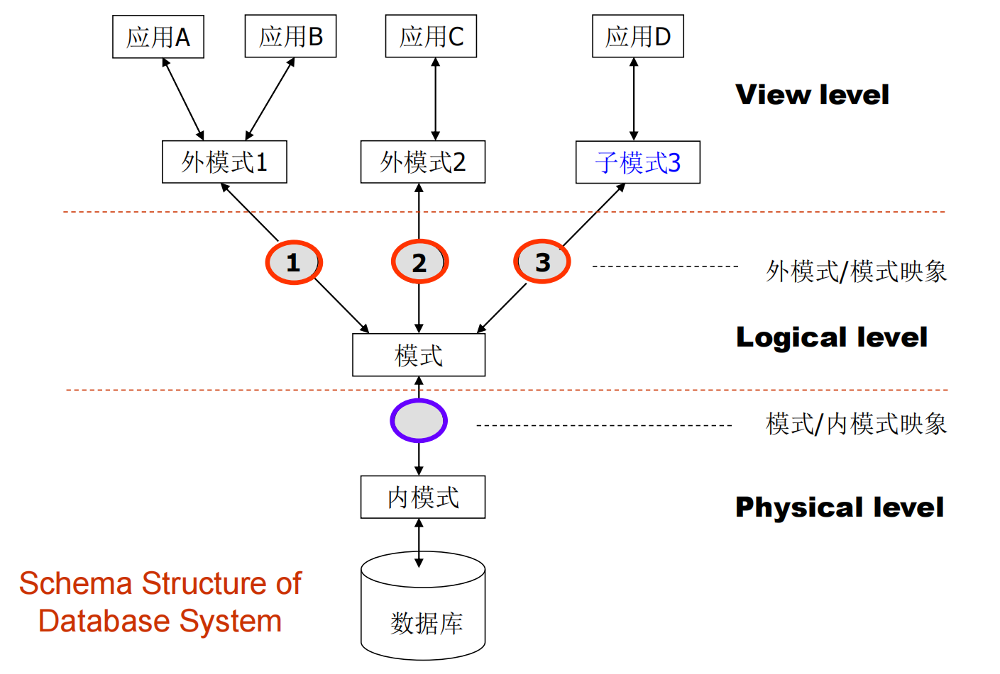
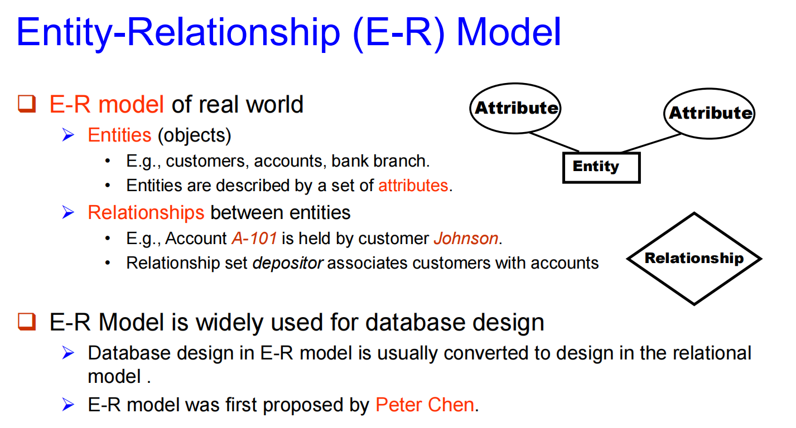
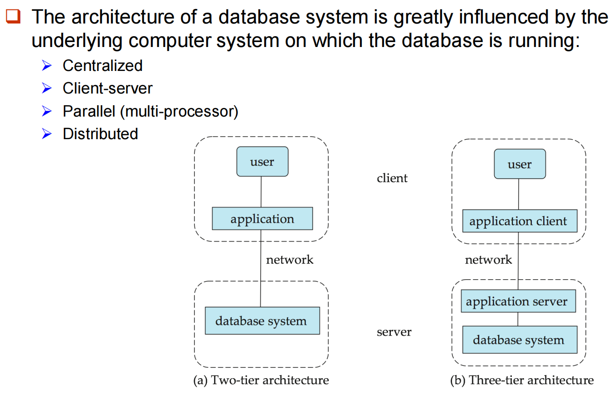

## DBMS

特点：

1. 数据获取和存储的高效率、规模性
2. 节省应用开发时间
3. Data independence， 包括 **physical data independence** 和 **logical data independence**.
4. 数据完整性（integrity）和安全性（security）
5. 并发读取（concurrenct access）和稳固性（robustness）

## View of Data

**Data Abstraction:**

1. Physical Leval
2. Logical Level
3. View Level

**Schema**（模式）: 不同level上的数据库结构

1. **Physical schema**: database structure design at the physical level 
2. **Logical schema**: database structure design at the logical level 
3. **Subschema**: schema at view level

Instance（实例）：the actual content of the database at a particular point in time

类比：type ↔ schema, variable ↔ instance

Physical Independence v.s Logical Independence：

* **Physical Data Independence**：the ability to modify the physical schema without changing the logical schema

* **Logical Data Independence**： protect application programs from changes in logical structure of data

**Data Models**：a collection of conceptual tools for describing data structure, relationships, semantics and constraints.

e.g. Entity-Relationship model, Relational model, Object-oriented model, Semi-structured data model, etc.

## Database Language

分为三种：

* **Data Definition Language (DDL)**: Specification notation for defining the database schema. 
* **Data Manipulation Language (DML)**: Language for accessing and manipulating the data organized by appropriate data model. 
分为两类：Procedural （eg. C, Java, Pascal）和 Non-procedure (eg. SQL)
* **Data Control Language (DCL)**

SQL：

SQL = DDL+DML+DCL，是应用最广的non-procedural语言.

## Database Design

ER model:

Relational Model：Transfer E-R diagrams into relational schema

## Database Users and Administrators

Database administrator (DBA，数据库管理员): A special user having central control over database and programs accessing those data.

## Database Architecture

