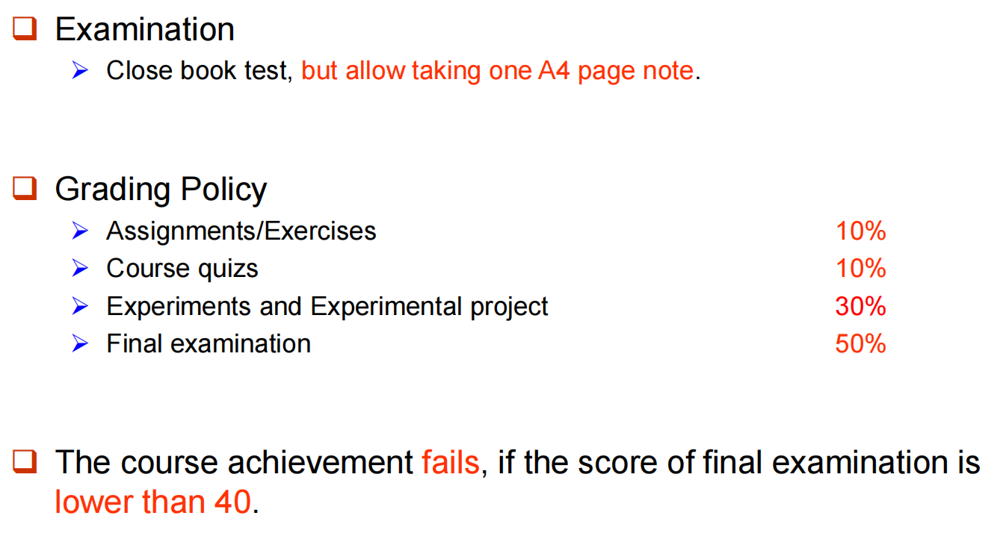

直到开学第一天也没有数据库课程的我应该怎么办……

???+ info "课程资源"

    [SQL刷题网站1: hackerrank](https://www.hackerrank.com/domains/sql)
    $\quad$
    [SQL刷题网站2: Leetcode](https://leetcode.cn/problemset/database/)

    [HobbitQia的笔记](https://note.hobbitqia.cc/DB/)

???+ info "课程信息"

    课程范围是 Chap 1-7, 12-19.

    评分规则：

    

    实验报告的格式：没有固定的格式或模板，只要写清楚过程、结果就好，可以自由发挥，也可以参照学在浙大上给的例子的格式来写。

    每次课程作业的期限为一周时间（作业1和作业2的ddl都为下周二晚24:00）。所有的数据库实验，以及图书管理系统的报告截止时间为第9周末（5月3日），MiniSQL的报告截止时间为第16周末（6月21日）
    
    摘自[怎么起名字的软工大二下课程回忆总结](https://www.cc98.org/topic/6229426)：

    > 分数构成：Projects 30% + Assignments 20% + Final 50%
    >
    > 学习体验：陈(岭)老师的数据库是事情最少的，没有点名没有小测。陈老师本身课讲得很快，第14周就讲完了所有内容，最后还让我们画了12306的E-R图（懂得都懂）。对于projects没什么好说的，minisql最好找好的队友和尽早开始，最后的debug会很耗时间。至于final，这学期都是客观题，因此有的考察点很细，要取得高分平时还是要认真听一下。

    摘自[计科大二下经验贴](https://www.cc98.org/topic/6234449)：
    
    > sjl老师是真正想要传道授业的那种老师，上课讲得很好(毕竟是课程组长)且从不点名（知道同学们喜欢自学）不过还是希望同学们到课听，这门课的知识点很杂也有一定难度所以建议上课听一遍（肯定有不懂的）再结合学长笔记看一遍就学的差不多了（推荐hobbitqia前辈的笔记），期末全是判断选择填空没有主观题（符合这门课杂的特点）所以复习一定要全面，lab5的前后端有难度，lab6 minisql更是重量级一定要找靠谱队友并提前开始留容错（我们组期中就开始写了，班上有大神期中已经快写完了），助教人很好不会刁难人。参考成绩96.