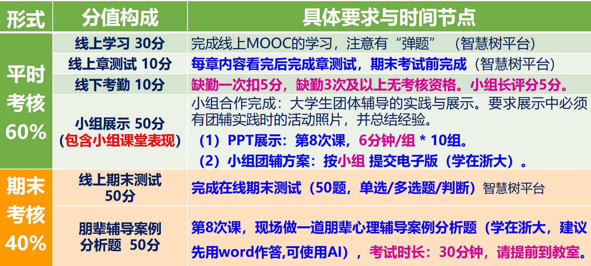

???+ tips "课程信息"

    
    
    智慧树[答案](https://www.docin.com/p-4412327421.html)
    
    线上任务：
    
    1. 第7周上课后1天23:59:59前全部完成！

???+ tips "课程资源"

    摘自[【学习天地】那些我上过的“水课”](https://www.cc98.org/topic/6411518)

    > 上课体验：4
    > 
    > 如果你是E人或比较高能量的人类，那这门课还是会体验很好的，但是对我这种不爱social的人类可能没什么感觉，梁老师上课还是努力带动上课气氛，助教们也很努力认真的，算是一个大投入的课程。
    >
    > 任务量：3.5
    > 
    > 上课是两个时间段，但是有一个是不用上的，自己抽空挂一下课时就好，主要任务是完成一次团辅活动，需要拉人和策划，并且占用课外时间，但是喜欢这种活动的同学可能是会比较享受的。最后有一个简短的开卷考试（可AI），要求word提交，因此方便的话还是带个电脑比较好。
    > 
    > 给分情况：4
    > 
    > 87/4.2 我们小组的团辅作业评分似乎是比较低的，但是最终还能上4，感觉应该是给分不错了。如果想得高分，可以好好搞一下团辅，比如早一点开始准备，不要拖到最后。