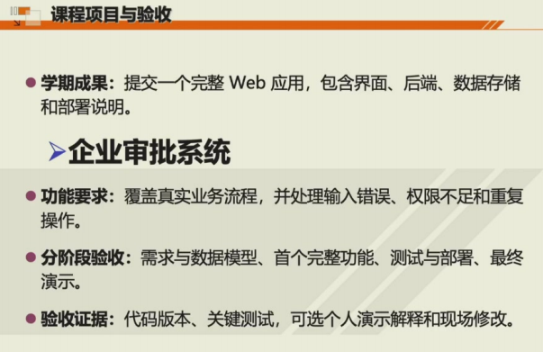

> [!IMPORTANT] +课程信息
>
> B/S体系，胡晓军老师

> [!NOTE] +课程资源
>
> [Wintermelon的参考仓库](https://github.com/WintermelonC/image_management)
>
> 本年度要求：
>
> 
>
> 大作业任务：
>
> - 开发一个针对企业内部业务流程的审批系统。
> - 系统涉及不同功能模块，例如：采购申请、业务流程审批、报销申请等。
> - 具体需求以老师发布在课程网站上的文档为准。
>
> 提交要求：
>
> - 每个人独立完成，并实现文档中提出的全部需求。
> - 提交内容需包括：代码、测试报告和相应的文档。
> - 必须使用 Git 进行版本管理，提交记录要能体现从项目创建到逐步完善的过程，最终会检查 Git 提交过程。
> - 期末可选择现场演示和讲解；如果文档清晰完备，也可以录制操作视频，与代码、文档一并提交到课程网站。
> - 可以使用 AI 辅助开发，但项目主体把控和业务实现建议自己完成。

