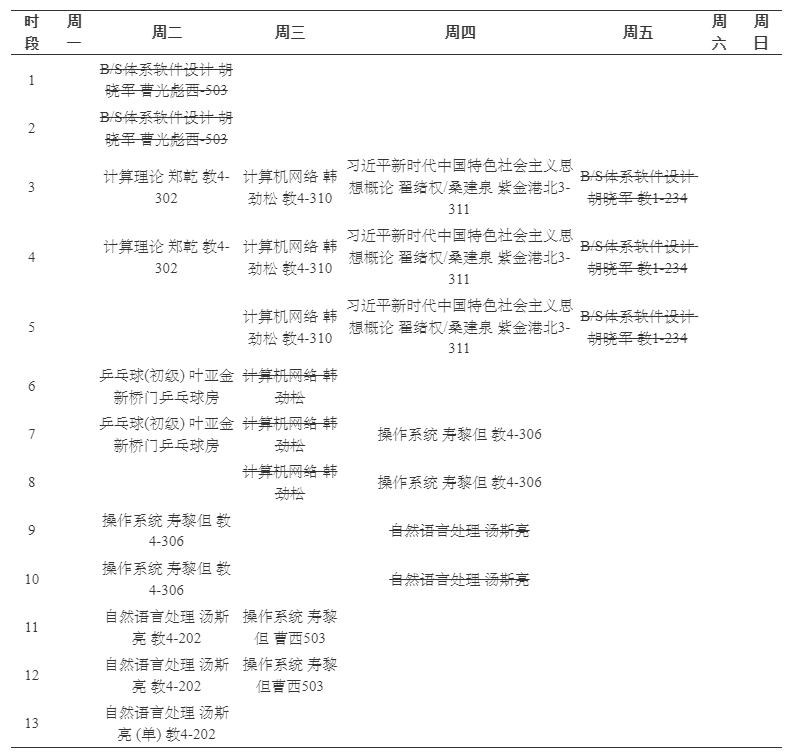

<table>
<thead>
    <tr>
        <th>专业必修课</th>
        <th>专业选修课+思政</th>
    </tr>
</thead>
<tbody>
    <tr>
        <td><a href="toc/">计算理论（TOC）</a></td>
        <td><a href="nlp/">自然语言处理</a></td>
    </tr>
    <tr>
        <td><a href="os/">操作系统（OS）</a></td>
        <td><a href="bs/">B/S体系软件设计</a></td>
    </tr>
    <tr>
        <td><a href="web/">计算机网络（Web）</td>
        <td><a href="xjp/">习概资料</td>
    </tr>
</tbody>
</table>

 

> [!NOTE] +资源整合
>
> 经验帖整合：
>
> * [【学习天地】CS 大三秋冬 课程回忆录（tag：计算理论，操作系统（OS），计算机网络（计网），汇编与接口，Java 应用技术，B/S 体系软件设计，量子计算理论基础与软件系统）](https://www.cc98.org/topic/6425001)
>
> * [软工 大三上课程回忆&学习总结（OS，计网，软工管，B/S，软测，毛概，物联网，区块链）](https://www.cc98.org/topic/6109417)

好好活着吧xd，这没招了.

