# Lab 0: Linux 内核调试

> [实验文档](https://os.pages.zjusct.io/fa26/doc-shoulidan/lab0/)

## 环境配置

拉取代码：

```bash
git@git.zju.edu.cn:os/fa26/shoulidan/os-3240xxxxxx.git
```

配置上游：

```bash
git remote add upstream git@git.zju.edu.cn:os/code.git
git remote -v
git branch -vv
```

得到结果：

```bash
root@zju-os /z/code (lab0)# git remote -v
origin  git@git.zju.edu.cn:os/fa26/shoulidan/os-3240104505.git (fetch)
origin  git@git.zju.edu.cn:os/fa26/shoulidan/os-3240104505.git (push)
upstream        git@git.zju.edu.cn:os/code.git (fetch)
upstream        git@git.zju.edu.cn:os/code.git (push)
root@zju-os /z/code (lab0)# git branch -vv
* lab0 179a69b [origin/lab0] 修改makefile路径
```

远程分支拉取：

```bash
git fetch origin
git fetch upstream
git branch -a
```

能看到一些旧仓库分支：

```bash
* lab0
  remotes/origin/HEAD -> origin/lab0
  remotes/origin/lab0
  remotes/upstream/HEAD -> upstream/lab5
  remotes/upstream/bonus-a
  remotes/upstream/bonus-b
  remotes/upstream/lab0
  remotes/upstream/lab1
  remotes/upstream/lab2
  remotes/upstream/lab3
  remotes/upstream/lab4
  remotes/upstream/lab5
```

估计之后还得多 `git fetch`几次. 

以后使用：

```bash
git push
```

即可实现提交到自己仓库的`origin/lab0`分支.

---

我选择的是 VSCode DevContainer作为开发容器. 环境配了2h，总算干掉了.

最初我是在 VSCode 中用 WSL 打开的 Windows 路径文件夹，因此遇到的报错是：

```bash
Setting up container for folder: e:\CSdiy\os-3240104505
...
C:\Windows\system32\cmd.exe /c if [ ! -f ...
此时不应有 !。
```

改成 WSL 原生路径就行了.

然后要注意不能开梯子，否则：

```bash
docker pull git.zju.edu.cn:5050/zju-cs-lab/tool/sys:latest
TLS handshake timeout
EOF
```

会无法克隆 ZJU Git上的文件夹.

再其次，C盘和D盘（WSL所在）空间需要大于20GB才能稳开启 Docker，否则也容易卡住.

最后，清除C盘空间时可能会把VSCode Launch Server缓存也清掉，这样会导致：

<center>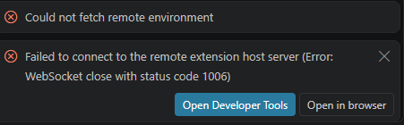</center>

到此算配置完成了：

<center>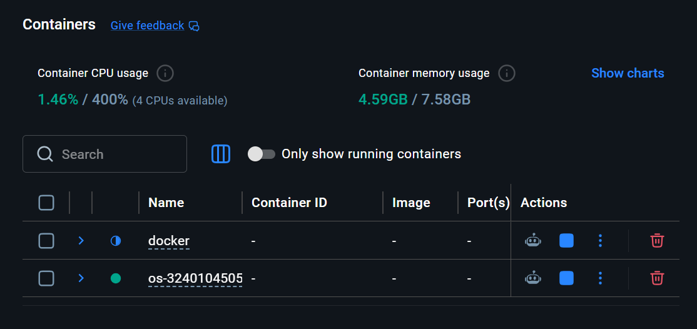</center>

<center>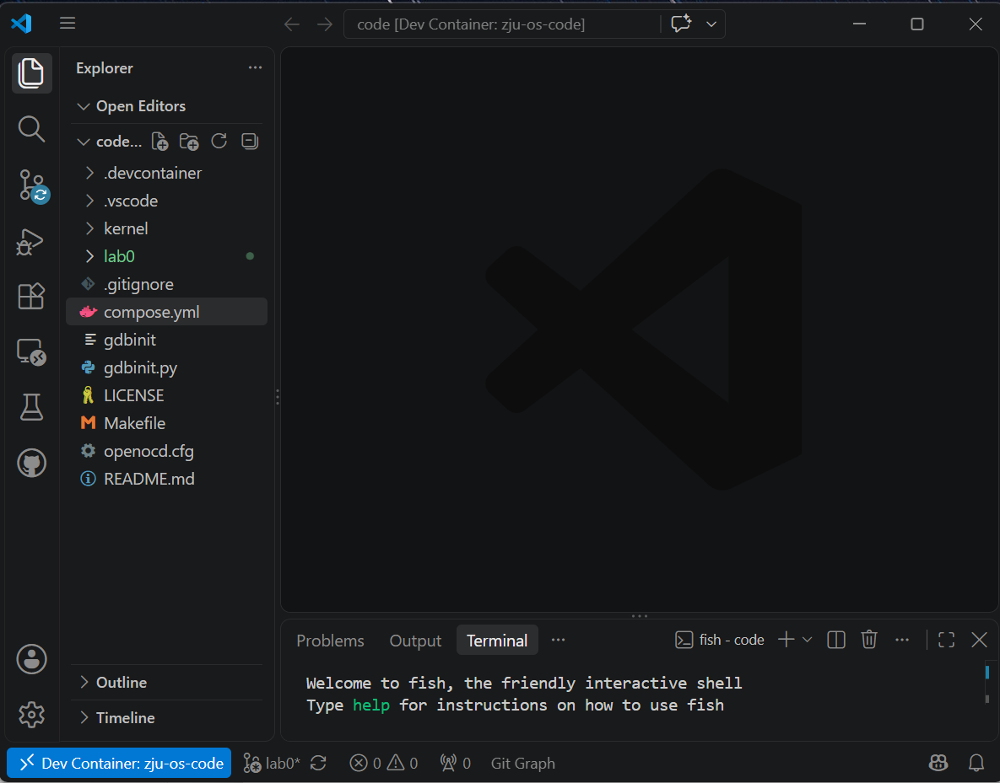</center>

> [!NOTE]
>
> 容器和镜像是什么关系？
>
> * 镜像是一个固定的模板，支持在各处地方复用来创建虚拟环境；
> * 容器是正在运行的虚拟环境，能够从镜像中创建，并且可以随时开启、终止和销毁.

## Linux 内核编译与调试

### 使用交叉编译链

用经典的hello world做测试：

```c
#include <stdio.h>
#include <stdlib.h>

int main(){
  printf("Hello world!\n");
}
```

生成 RISC-V 汇编：

```bash
riscv64-linux-gnu-gcc -S -O0 lab0/hello.c -o lab0/hello.s
```

编译并链接为 RISC-V 可执行程序 hello：

```bash
riscv64-linux-gnu-gcc -O0 lab0/hello.c -o lab0/hello
```

反汇编可执行程序，结果保存到 hello.dump

```bash
riscv64-linux-gnu-objdump -d lab0/hello > lab0/hello.dump
```

查看`hello.s`：

```bash
less lab0/hello.s
```

### 编译本地架构内核

```bash
cd ../../opt/linux-source-6.16
make defconfig
make -j$(nproc)
make distclean
```

结束：

<center>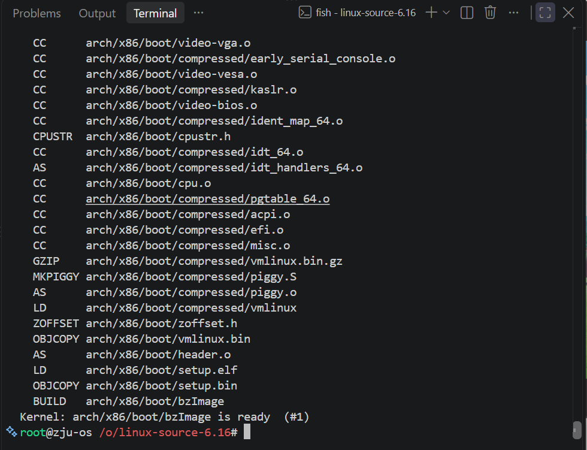</center>

> [!NOTE]
>
> - 运行 `make help`，了解上面运行的 `defconfig`、`distclean` 等 target 的含义
>
>     运行后可以看到：
>
>     <center>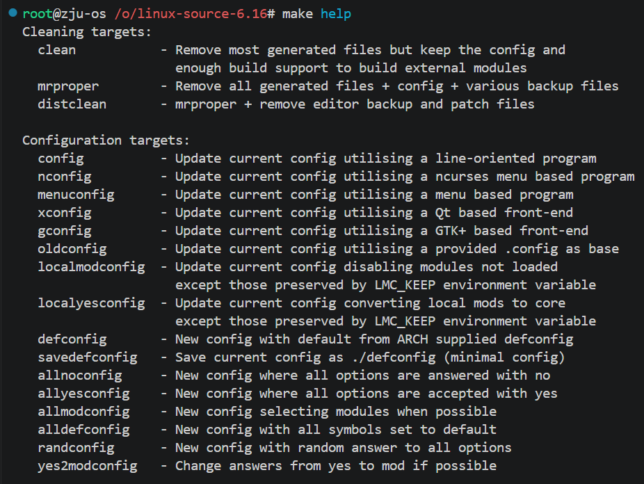</center>
>
>     * `defconfig`：New config with default from ARCH supplied defconfig，用法是`make ARCH=riscv defconfig`，含义是根据 RISC-V 架构提供的默认配置，生成当前内核配置文件：
>
>         ```
>         arch/riscv/configs/defconfig
>                     ↓
>                  .config
>         ```
>
>     * `distclean`：mrproper + remove editor backup and patch files，用法是`make ARCH=riscv distclean`，含义是在 `mrproper` 的基础上，继续删除编辑器备份文件、补丁残留文件.
>
> - 当构建失败时，你很可能需要查看详细的编译命令。如何开启构建过程的详细输出？
>
>     注意到 `help` 里面最后部分有：
>
>     <center>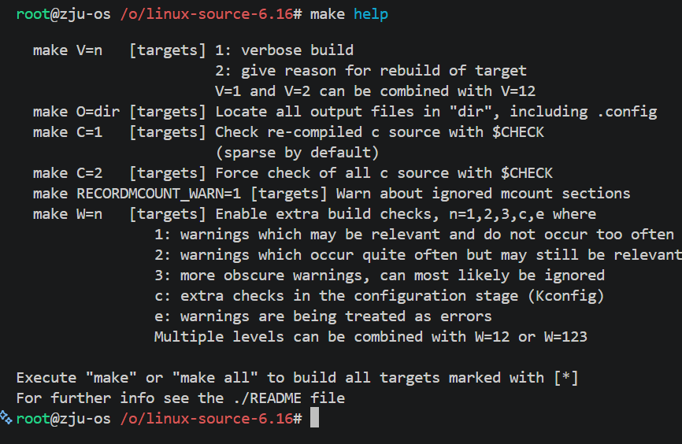</center>
>
>     因此编译时可以加上参数`V=12`，其中 `1` 表示实际执行的完整命令，包括编译器及其全部参数，头文件搜索路径，宏定义，优化与警告选项，链接命令；`2` 用于说明某个 target 为什么需要重新构建，可能情况是源文件比目标文件新、依赖文件发生变化、编译参数发生变化、目标文件不存在等.

### 交叉编译 RISC-V 架构内核

参考文档：[Embedded Handbook/General/Cross-compiling the kernel - Gentoo wiki](https://wiki.gentoo.org/wiki/Embedded_Handbook/General/Cross-compiling_the_kernel)

> [!NOTE]
>
> - 使用哪两个变量来指定目标架构？这两个变量的值在哪里找？
>
>     阅读可知可以在 Makefile 中显式指定 `ARCH=` 以及 `CROSS_COMPILE=`，放在bash中是：
>
>     ```bash
>     make ARCH="riscv" clean 
>     make ARCH=riscv CROSS_COMPILE=riscv64-linux-gnu- V=1 -j"$(nproc)"
>     ```
>
>     然后我一直按 Enter 勾选默认选项，等待编译完成得到 `file` 验证结果：
>
>     ```bash
>     file vmlinux
>     file arch/riscv/boot/Image
>     ```
>
>     <center>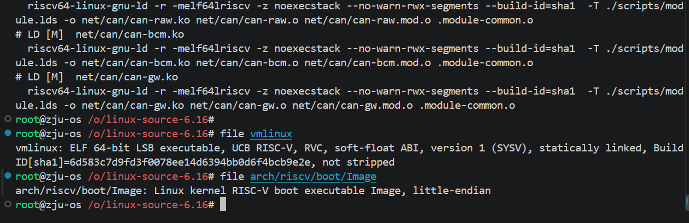</center>
>
>     `ARCH` 的值是通过查看 `arch/`下的文件夹得到的：
>
>     <center>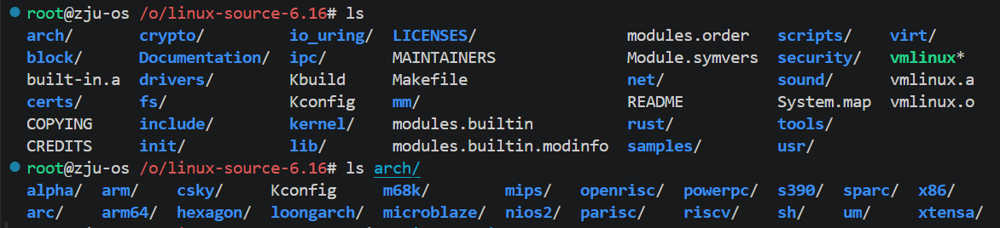</center>
>
>     `CROSS_COMPILE` 这一交叉编译选项直接取题目要求的前缀就行了.
>
> - 如何在命令行中为 `make` 指定变量的值？
>
>     直接用=连接即可.

### 使用 QEMU 运行 RISC-V 内核

返回后根据文档敲点命令：

<center>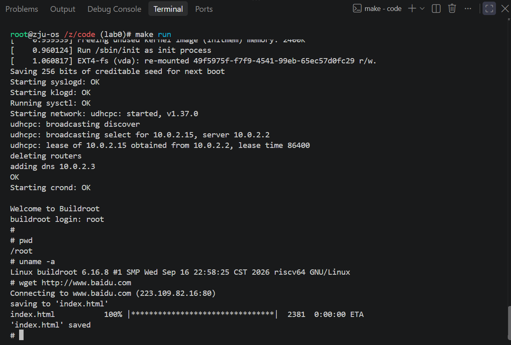</center>

Ctrl + A 按 C 得到 QEMU 模式.

> 像这里的 Ctrl+A 这样的前导组合键在终端复用器（如 tmux）中被称为逃逸键（escape key）。初始状态下，其他所有按键都会被直接传递给当前连接的终端。当你按下逃逸键时，终端复用器会进入「其自身的」命令模式，等待你输入后续的命令键.
>
> 请同学们重点理解**终端复用器**这一概念。在之后的实验中，你可能遇到 QEMU 中虚拟机卡住控制台无输出、虚拟机死循环控制台疯狂输出等情况，但这都是虚拟机控制台的问题，并不影响终端复用器的使用。**只要你启动了 QEMU，就可以通过终端复用器切换到 QEMU Monitor，并与 QEMU Monitor 交互**.

这个模式下可以记忆几个命令：

```bash
(qemu) help
(qemu) info mem
(qemu) info registers
```

参考资料：

* QEMU System 手册：[QEMU User Documentation — QEMU documentation](https://www.qemu.org/docs/master/system/qemu-manpage.html)
* QEMU Monitor 手册：[QEMU Monitor Commands — QEMU documentation](https://www.qemu.org/docs/master/system/monitor.html)
* `rootfs.ext2` 制作方法：[FOSDEM 2019 - Buildroot for RISC-V](https://archive.fosdem.org/2019/schedule/event/riscvbuildroot/attachments/slides/3040/export/events/attachments/riscvbuildroot/slides/3040/FOSDEM_2019_Buildroot_RISCV.pdf)

> [!NOTE]
>
> 使用 QEMU Monitor 进行下列操作：
>
> - 查看寄存器、内存树、设备树、物理内存中的值
>
>     * 查看寄存器：`info registers`
>
>         <center>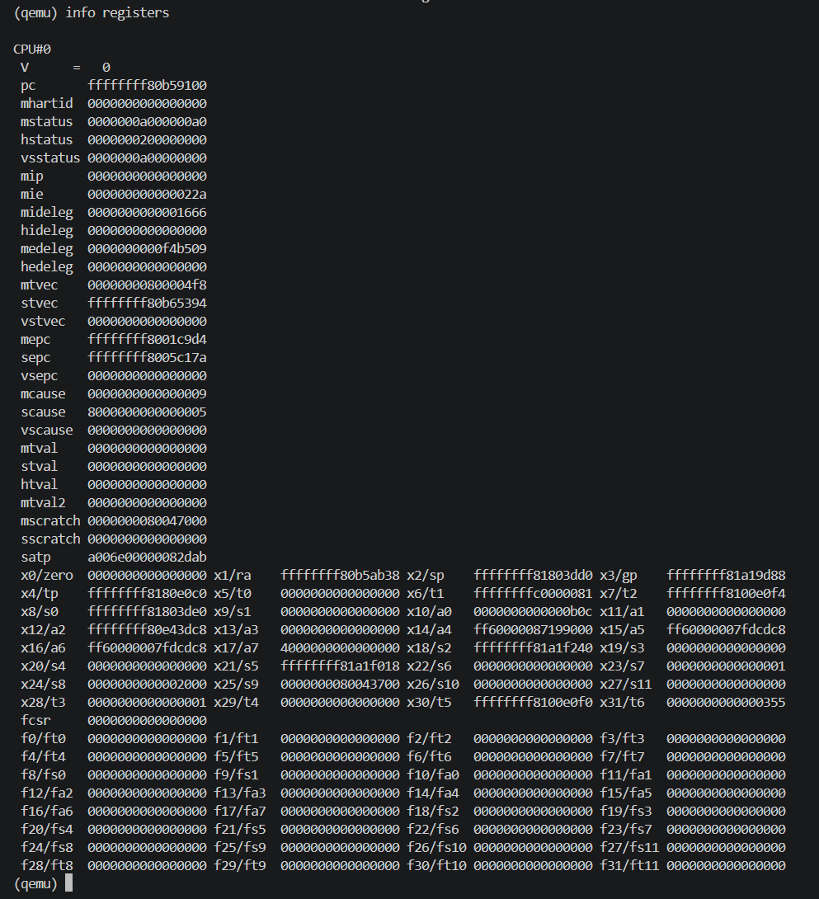</center>
>
>     * 内存树：`info mtree`
>
>         <center>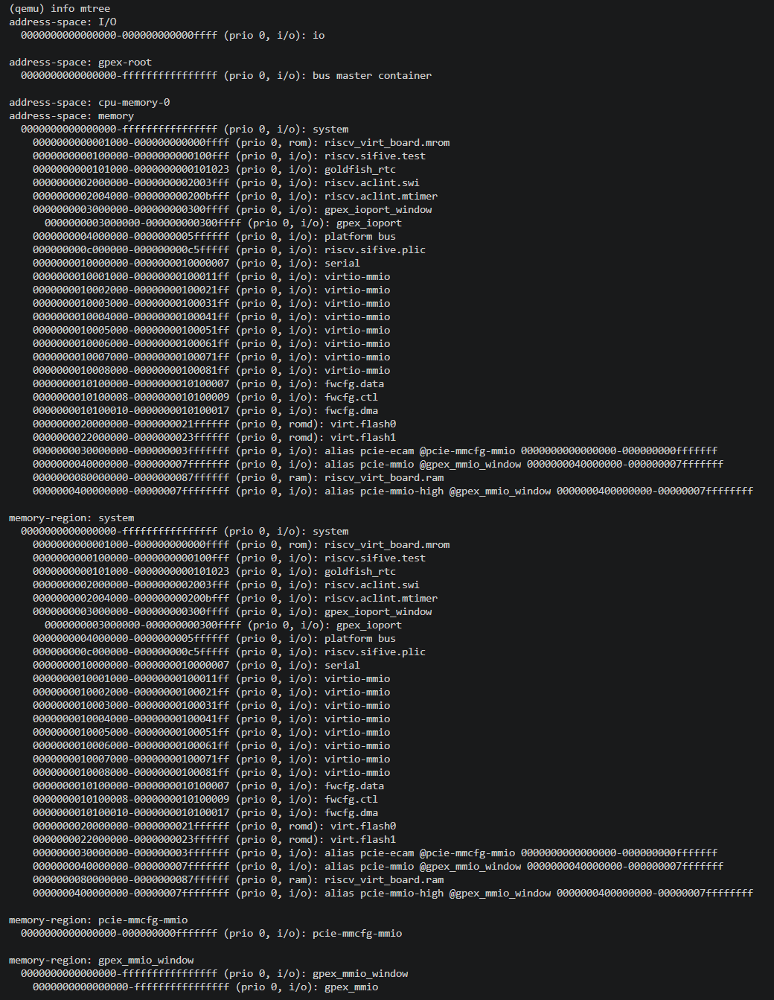</center>
>
>     * 设备树：`info qtree`
>
>         （太长了截不下）
>
>         <center>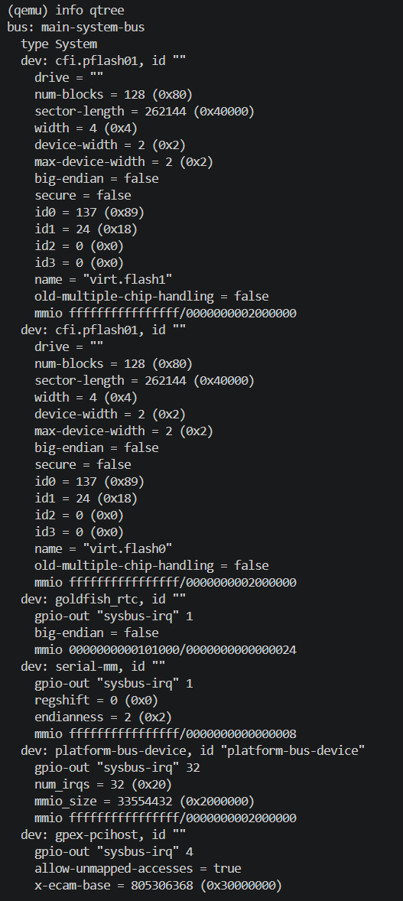</center>
>
>     * 物理内存
>
>         文档里是这么写的：
>
>         <center>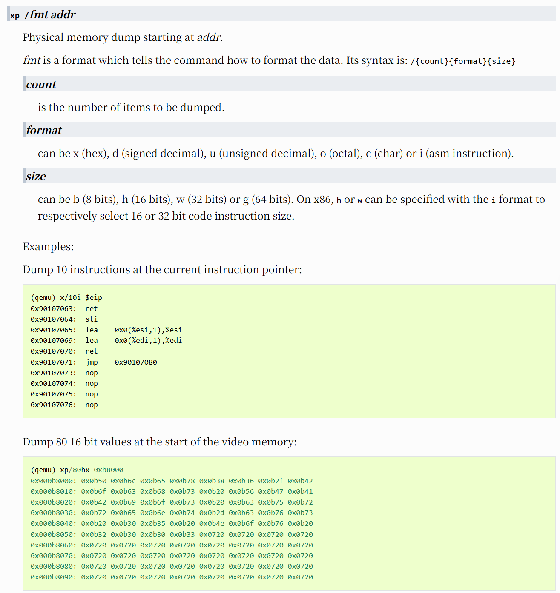</center>
>
>         
>
> - Linux 第一条指令位于物理内存 `0x80200000`，打印这条指令
>
>     使用命令`xp/1i`：
>
>     <center>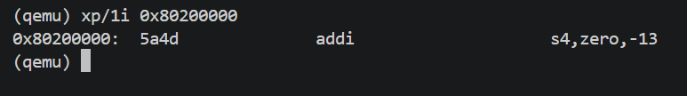</center>

> 仅有一个内核镜像是无法运行系统的，你还需要一个根文件系统（root filesystem），其中包含了 Linux 启动后需要的各种文件，例如执行你输入的指令的 Shell 程序. 容器内预置的 `/opt/rootfs.ext2` 就是一个已经构建好的根文件系统镜像.
>
> 更多资料：
>
> - QEMU System 手册：[QEMU User Documentation — QEMU documentation](https://www.qemu.org/docs/master/system/qemu-manpage.html)
> - QEMU Monitor 手册：[QEMU Monitor Commands — QEMU documentation](https://www.qemu.org/docs/master/system/monitor.html)
> - `rootfs.ext2` 制作方法：[FOSDEM 2019 - Buildroot for RISC-V](https://archive.fosdem.org/2019/schedule/event/riscvbuildroot/attachments/slides/3040/export/events/attachments/riscvbuildroot/slides/3040/FOSDEM_2019_Buildroot_RISCV.pdf)

### QEMU 启动过程

看起来没有什么要做的，只有文档要读：

* [qemu/hw/riscv/boot.c at master · qemu/qemu](https://github.com/qemu/qemu/blob/master/hw/riscv/boot.c)
* [PowerPoint Presentation](https://riscv.org/wp-content/uploads/2024/12/13.30-RISCV_OpenSBI_Deep_Dive_v5.pdf)

### RISC-V 规范导读

> RISC-V **非特权级**规范中的内容想必同学们已经在硬件课程中吃透了：
>
> - Chapter 2. RV32I Base Integer Instruction Set
> - Chapter 3. RV32E and RV64E Base Integer Instruction Sets
> - Chapter 4. RV64I Base Integer Instruction Set
> - Chapter 6. "Zicsr", Extension for Control and Status Register (CSR) Instructions

~~这对吗……？我没多少印象了~~

读了一下这个部分：https://docs.riscv.org/reference/isa/unpriv/intro.html#risc-v-software-execution-environments-and-harts

### GDB调试内核

> 在其中一个终端运行 `make debug`，会看到 QEMU 命令执行后就停住了。在另一个终端运行 `make gdb`，GDB 自动连接到 QEMU 上，但因为什么命令都没执行，GDB 显示的内容全空

的确如此：

<center>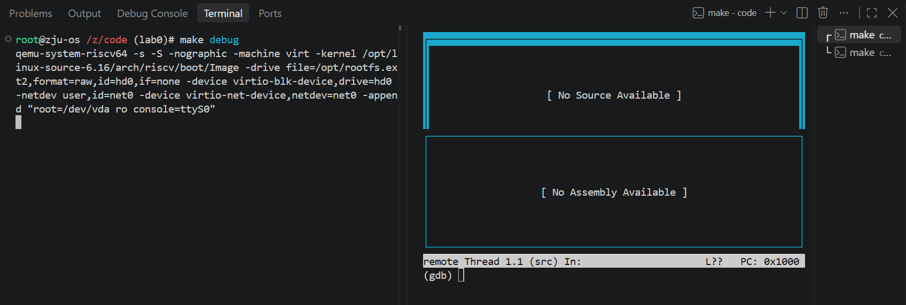</center>

参考资料：

- [GDB Command Reference - Index page](https://visualgdb.com/gdbreference/commands/)
- [Debugging with GDB](https://sourceware.org/gdb/current/onlinedocs/gdb)
- [100个gdb小技巧](https://wizardforcel.gitbooks.io/100-gdb-tips/content/)
- [gdb 相关使用备忘 - 鹤翔万里的笔记本](https://note.tonycrane.cc/cs/tools/gdb/)

> [!NOTE]
>
> 了解下列命令的含义，并进行实操：
>
> * `layout`：
>
>     `layout asm` ，可以查看汇编代码
>
>     `layout regs`，可以查看寄存器值
>
>     <center>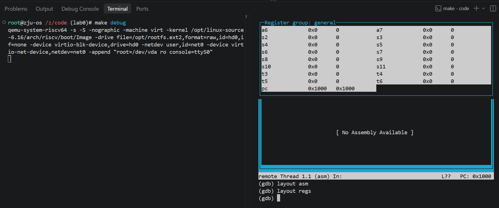</center>
>
>     `layout src`：显示源代码窗格（VSCode里这个就没什么用了）
>
>     `layout split`：同时显示源代码、汇编代码和命令行
>
>     `Ctrl+x o` 在不同窗格之间切换
>
> * `break`：打断点，可以跟着 `*<addr>`，可以添加条件 `if <cond>`，也可以在函数处打断点 `<func_name>`.
>
> * `continue`：从当前暂停位置继续执行程序，直到遇到下一个断点、异常或者 `Ctrl+C`.
>
> * `stepi`：单步执行一条机器指令，可以加数字进行多步调试
>
> * `backtrace`：查看当前函数调用栈，从当前函数逐层显示其调用者（我记得这东西可以简写成`bt`吧）
>
> * `finish`：继续执行程序，直到当前函数执行结束并返回调用者，同时打印函数返回值（也就是说void返回的函数不打印）
>
> * `info register [Reg Name]`：看寄存器值，可以简写成`i r <regs_name> ...`
>
> * `print [Expr]`：计算并打印表达式，可以查看变量、寄存器、指针和算术表达式
>
>     比如：
>
>     ```bash
>     print $a2
>     print/x $a2
>     print $a1 + 8
>     print variable_name
>     ```
>
>     `/x`表示十六进制显示.
>
> * `x /[Length][Format] [Address expression]`：同 qemu，打印指定内存地址的值
>
> * `quit`：输入指令前后：`make debug`卡住 | gdb 无信息 变成 qemu 登陆界面 | 退出gdb
>
>     <center>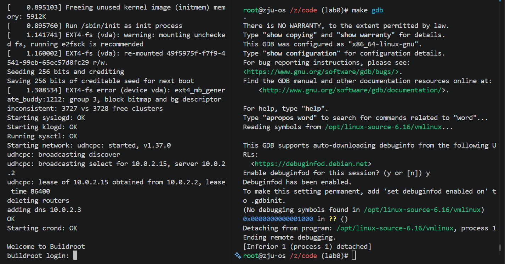</center>

> [!NOTE]
>
> 阅读 `Makefile` 和 `gdbinit`：
>
> - `make run` 和 `make debug` 有什么不同？新增的选项含义是什么？
>
>     * `make debug` 在 Makefile 里面多一个 `$(SIMULATOR_DEBUG_OPTS)`；、
>
>         <center>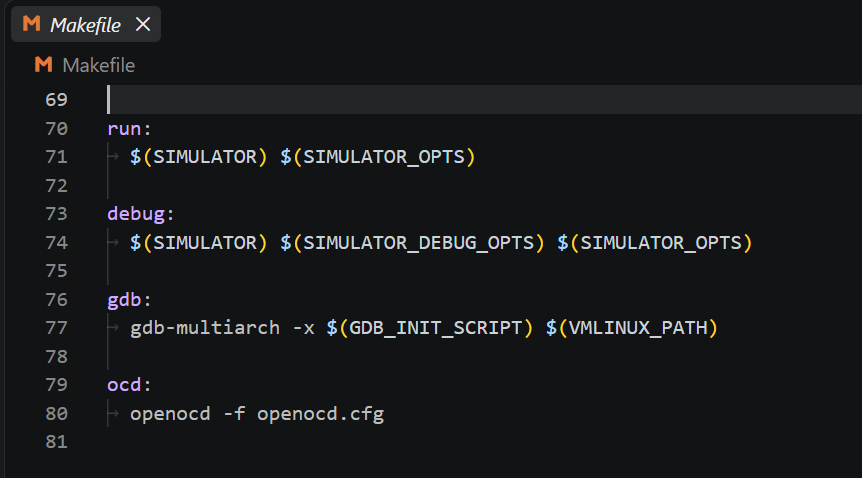</center>
>
>     * 使用以下方法查看编译链区别：
>
>         ```bash
>         make -n run
>         make -n debug
>         ```
>
>         <center>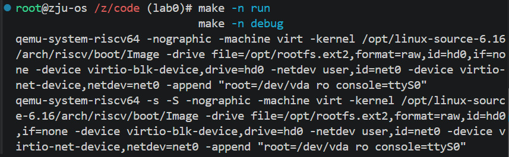</center>
>
>         可以看到差别是：
>
>         * `make run` 直接启动 QEMU，虚拟 CPU 启动后立即执行固件、OpenSBI 和 Linux 内核; 
>         * `make debug` 使用基本相同的 QEMU 启动参数，但额外加入`-s -S`参数，前面的`-s`表示 `-gdb tcp::1234`，`-S`表示QEMU 启动后、GDB 发出 `continue`之前，暂停虚拟 CPU，不执行第一条指令.
>
> - 你运行 `make gdb` 时，脚本对 GDB 做了哪些设置？
>
>     `make gdb` 会启动 RISC-V GDB，并且相当于添加了以下参数：
>
>     ```bash
>     riscv64-linux-gnu-gdb -x gdbinit ...
>     ```
>
> ---
>
> 使用 GDB 进行下列操作：
>
> - **断点：**设置断点、查看断点、删除断点
>
>     <center>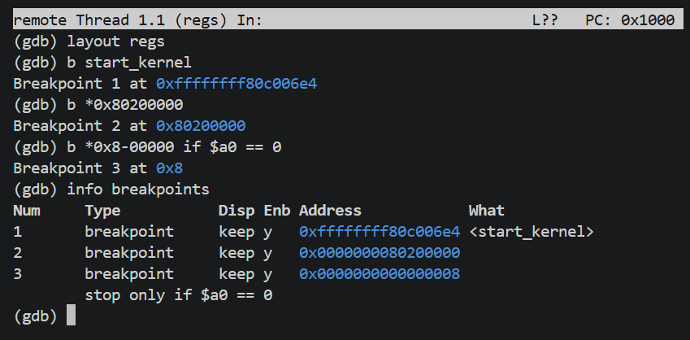</center>
>
>     <center>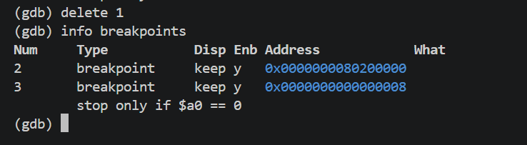</center>
>
> - **调试：**单指令执行、逐过程执行、结束当前函数、继续执行
>
>     按下 `c`：
>
>     <center>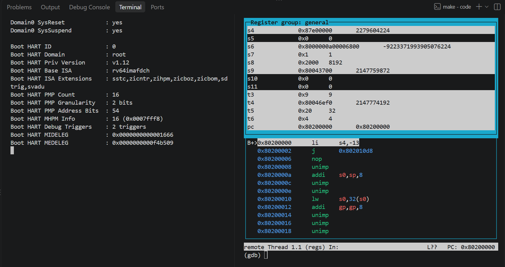</center>
>
>     单步/多步调试：
>
>     <center>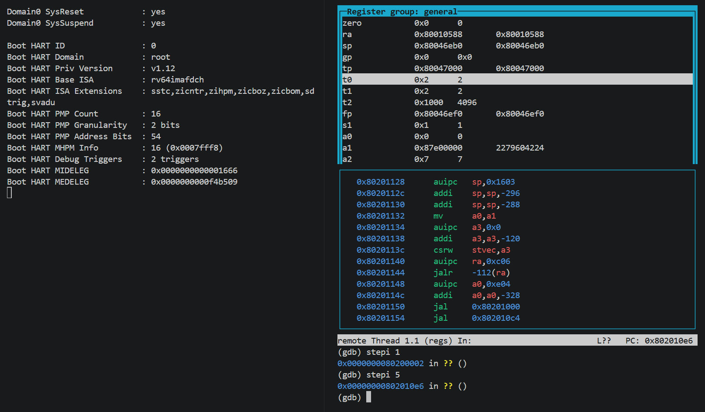</center>
>
>     <center>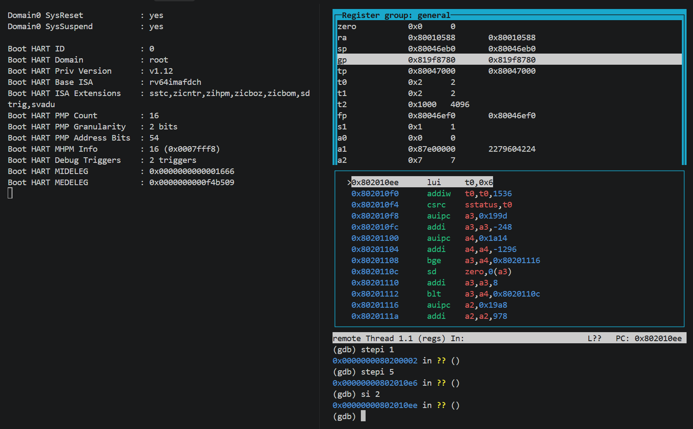</center>
>
> - **查看：**汇编代码、函数调用栈、变量、寄存器值、内存中的内容
>
>     总之就是 `info <...>` 或者 `print <...>` 或者 `x/` 看各种信息
>
>     <center>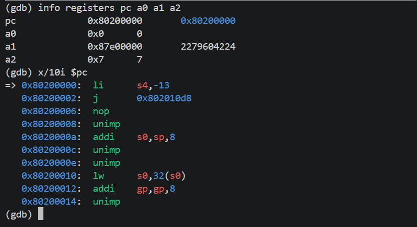</center>
>
>     <center>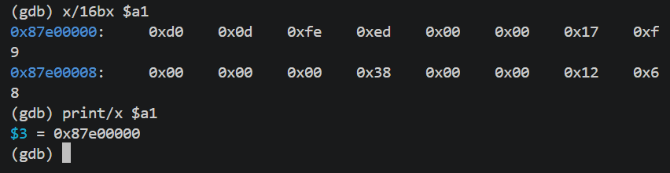</center>
>
> - **分屏：**如何在汇编代码和交互命令行窗格之间切换
>
>     使用 `Ctrl x + o` 即可切换
>
> ---
>
> 上一节我们了解了启动的详细过程，要求你使用 GDB 进一步了解：
>
> - 在 OpenSBI 的起始处打断点，看看这时候 `a2` 寄存器的值是多少；进一步，查看对应内存位置的值
>
>     上面 `0x80200000` 的 `$a1` 指的是 OpenSBI 启动日志中的 `Domain0 Next Arg1`，对应的开头是 `0xd0 0x0d 0xfe 0xed`，所以 `a2` 的值是 `0x7`，对应内存位置的值是 `0x87e00000`.
>
> - 在内核起始处打断点，看看这时候 Next Arg1 处的内存存放了什么内容
>
>     ```bash
>     b start_kernel
>     c
>     ```
>
>     得到Next Arg1 处的内存存放的是 `0x0` ：
>
>     <center>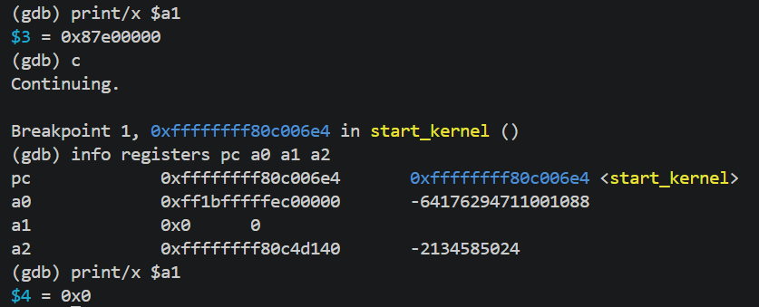</center>

## 实验感想

这个lab怎么全方位地像是南大ICSPA？虽说回去翻文档感觉又不是同一回事，但是风格非常接近.

环境很难配，细节很多很繁琐，gdb 调得还是头疼，之前一直没完全学明白.