# Lab 1: 内核启动与时钟中断

[TOC]

> [实验文档地址](https://os.pages.zjusct.io/fa26/doc-shoulidan/lab1/)

## 环境配置

```bash
git checkout -b lab1
git fetch upstream
git merge upstream/lab1
```

看到 `./Makefile` 显示冲突，选择保留新的 `upstream/lab1` 的情况：

```bash
#KERNEL_PATH := $(wildcard /opt/linux-*)
KERNEL_PATH := kernel
```

这个时候 `autograder` 的确是空白的，所以：

```bash
git submodule update --init --recursive
```

得到了 `autograder/`.

至此多出了一大堆文件，先没急着动.

<center>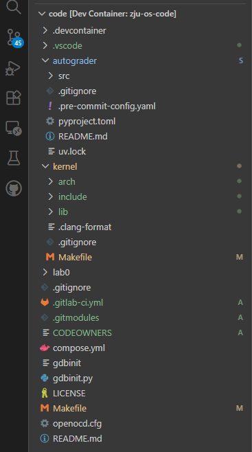</center>

## Part 1: 启动工作

### 学习笔记1

>  [!NOTE]
>
>  ```c
>  int func(int a){return a;}
>  
>  int main() {
>  int r = func(10);
>  return r + 1;
>  }
>  ```
>
>  ```assembly
>  func(int):
>       addi    sp,sp,-32
>       sd      ra,24(sp)
>       sd      s0,16(sp)
>       addi    s0,sp,32
>       mv      a5,a0
>       sw      a5,-20(s0)
>       lw      a5,-20(s0)
>       mv      a0,a5
>       ld      ra,24(sp)
>       ld      s0,16(sp)
>       addi    sp,sp,32
>       jr      ra
>  main:
>       addi    sp,sp,-32
>       sd      ra,24(sp)
>       sd      s0,16(sp)
>       addi    s0,sp,32
>       li      a0,10
>       call    func(int)
>       mv      a5,a0
>       sw      a5,-20(s0)
>       lw      a5,-20(s0)
>       addiw   a5,a5,1
>       sext.w  a5,a5
>       mv      a0,a5
>       ld      ra,24(sp)
>       ld      s0,16(sp)
>       addi    sp,sp,32
>       jr      ra
>  ```
>
>  - 每个函数的开头都操作了 `sp`，这是在干什么？
>
>     这个是栈指针（stack pointer），移动是开辟栈帧（stack frame），移动后指向的寄存器不同，可以对一段内存指向的多个寄存器赋值.
>
>  - 尝试修改 C 语言代码，你会发现 `sp` 的差值总是 16 的倍数，这是为什么？
>
>     * 改 `r` 的类型为 `long int`，在汇编代码的第22-23行会变成：
>
>         ```assembly
>                 sd      a5,-24(s0)
>                 ld      a5,-24(s0)
>         ```
>     
>         其余不变；
>     
>     * 改 `func` 为复合类型的函数：
>     
>         ```c++
>         long long func(int a, double b){return (long long)a+b;}
>                             
>         int main() {
>           long long r = func(10, 20);
>           return r + 1;
>         }
>         ```
>     
>         汇编变成：
>     
>         ```assembly
>         func(int, double):
>                 addi    sp,sp,-32
>                 sd      ra,24(sp)
>                 sd      s0,16(sp)
>                 addi    s0,sp,32
>                 mv      a5,a0
>                 fsd     fa0,-32(s0)
>                 sw      a5,-20(s0)
>                 lw      a5,-20(s0)
>                 fcvt.d.w        fa4,a5
>                 fld     fa5,-32(s0)
>                 fadd.d  fa5,fa4,fa5
>                 fcvt.l.d a5,fa5,rtz
>                 mv      a0,a5
>                 ld      ra,24(sp)
>                 ld      s0,16(sp)
>                 addi    sp,sp,32
>                 jr      ra
>         main:
>                 addi    sp,sp,-32
>                 sd      ra,24(sp)
>                 sd      s0,16(sp)
>                 addi    s0,sp,32
>                 lla     a5,.LC0
>                 fld     fa5,0(a5)
>                 fmv.d   fa0,fa5
>                 li      a0,10
>                 call    func(int, double)
>                 sd      a0,-24(s0)
>                 ld      a5,-24(s0)
>                 sext.w  a5,a5
>                 addiw   a5,a5,1
>                 sext.w  a5,a5
>                 mv      a0,a5
>                 ld      ra,24(sp)
>                 ld      s0,16(sp)
>                 addi    sp,sp,32
>                 jr      ra
>         .LC0:
>                 .word   0
>                 .word   1077149696
>         ```
>     
>         `sp` 差值还是不变.
>     
>     这个好像是 RISC-V 的标准规定，栈指针必须16字节对齐. 可以让内存访问的效率提高.
>
>  - 调用函数前后做了什么？
>
>     将汇编代码分成 caller (`main`) 和 callee (`func`)两个部分：
>     
>     * 调用前，caller会做：
>         * 分配栈帧：用`addi sp,sp,-32`语句给 `ra` 和 `s0` 腾出空间
>         * 传递参数：`li a0,10`第一个参数通过 `a0` 寄存器传递
>         * 执行跳转：`call func(int)`，将下一条指令的地址（`pc+4`）保存到 `ra` 寄存器中并跳转到 `func` 的地址
>     * 调用后，caller会获取值，释放栈帧并返回

伪指令是一种语法糖，能翻译成多种真实指令. 参见[其中](https://zju-os.github.io/doc/spec/riscv-asm.pdf)的Chap 29.

> [!NOTE]
>
> - 下列伪指令分别对应什么真实指令？
>
>     ```assembly
>     la nop li mv j ret call tail
>     ```
>
>     * `la`对应`auipc`，也就是将20位立即数左移12位后与`pc`值相加
>
>     * `nop`对应`addi x0, x0, 0`，功能就是流水线的一个bubble，相当于什么都没做.
>
>     * `li`指的是" load a specific numeric value into a register"，实际指令有很多，我能想到的有：
>
>         ```assembly
>         addi sp, x0, 1 # 情况1, 等同于 li sp, 1
>         mv x1, x0 # 情况2，等同于 li x1, 0
>         ```
>     
>     * `mv`是复制指令，`mv rd, rs` 等同于 `addi rd, rs, 0`.
>     
>     * `j`是直接跳，`j offset` 等同于`jal x0, offset`.
>     
>     * `ret`是` jalr x0, x1, 0`，即跳回到
>     
>     * `call`是远距离函数函数调用，功能等同：
>     
>         ```assembly
>         call offset
>         # ==
>         auipc x1, offset[31:12]
>         jalr x1, x1, offset[11:0]
>         ```
>     
>         计算最终目标地址 `x1 + offset[11:0]`，跳转到该地址执行，并将下一条指令的地址（PC+4）保存回 `x1`.
>     
>     * `tail`是大地址跳转，即
>     
>         ```assembly
>         tail offset
>         # ==
>         auipc x6, offset[31:12]
>         jalr x0, x6, offset[11:0]
>         ```
>         
>         这个的适用情形是该被调用函数是整体的最后一步操作，由于`x0`不接受值，所以不需要返回到`PC+4`继续执行.
>
> - `call` 伪指令做了什么工作？它与 `tail` 指令有什么区别？
>
>     见上最后两点.

考虑脚本 `arch/riscv/kernel/vmlinux.lds`，下面的问题浅作回答：

> [!NOTE]
>
> - 这个链接脚本描述的就是整个内核的内存布局. 它从哪里开始，有多大？
>
>     看这段：
>
>     ````assembly
>     MEMORY {
>         ram  (wxa!ri): ORIGIN = PHY_START + OPENSBI_SIZE, LENGTH = PHY_SIZE - OPENSBI_SIZE
>     }
>     ````
>
>     开始点：`ORIGIN = PHY_START + OPENSBI_SIZE = 0x80200000`
>
>     大小：`LENGTH = PHY_SIZE - OPENSBI_SIZE = 0x8000000 - 0x200000 = 0x7E00000`.
>
>     - 其中的各个段（`.text`、`.rodata`、`.data`、`.bss`）分别存放什么数据？
>
>     * `.text` 存放的是可执行的代码，包含 `init`, `entry`等启动入口代码和其它的普通函数、中断处理、内核代码.
>    * `.rodata` 存放的是只读的数据，即read-only data.
>     * `.data` 存放已初始化的、可读写的全局/静态变量
>     * `.bss` 存放未初始化或零初始化的全局/静态变量
> 
> - `_skernel` 这些符号是什么？你要如何在汇编和 C 代码中使用它们？
>
>     * `_skernel`是链接器脚本定义的符号，表示某个地址
>
>     * 汇编中用 `la` 取地址，
>    * C 中用 `extern char _xxx[];` 后当指针使用

`Image`的生成主要在`kernel/Makefile`里面的这一段体现：

```makefile
all:
	$(MAKE) -C lib all
	$(MAKE) -C arch/riscv all
	$(LD) -T arch/riscv/kernel/vmlinux.lds \
		arch/riscv/kernel/*.o \
		lib/*.o \
		-o vmlinux
	mkdir -p arch/riscv/boot
	$(OBJCOPY) -O binary vmlinux arch/riscv/boot/Image
	$(OBJDUMP) -S vmlinux > vmlinux.asm
	$(NM) vmlinux > System.map
	# Build finished!
```

第9行是核心，大致意思是用 `objcopy` 把 ELF 格式的内核文件 `vmlinux` 转换成纯二进制镜像 `arch/riscv/boot/Image`.

> [!IMPORTANT]
>
> 运行完`make`之后出现了vmlinux的信息界面：
>
> <center>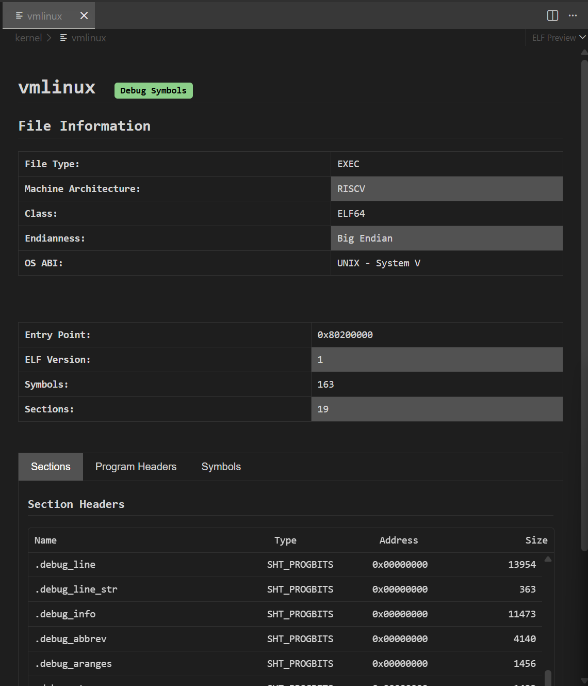</center>
>
> 分别查看文件头、节表、程序头：
>
> * ```bash
>     riscv64-linux-gnu-readelf -h kernel/vmlinux
>     ```
>
>     查看文件头得到：
>
>     <center>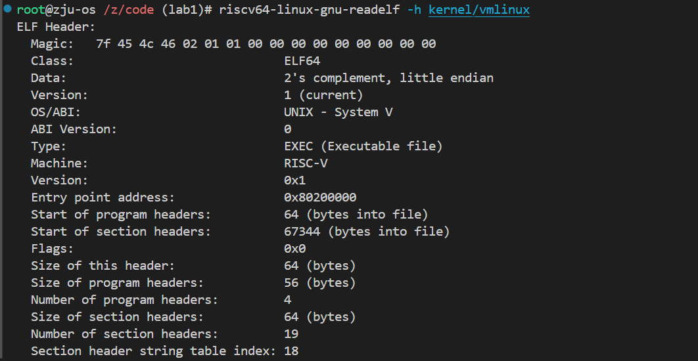</center>
>
> * ```bash
>     riscv64-linux-gnu-readelf -W -S kernel/vmlinux
>     ```
>
>     查看节表得到：
>
>     <center>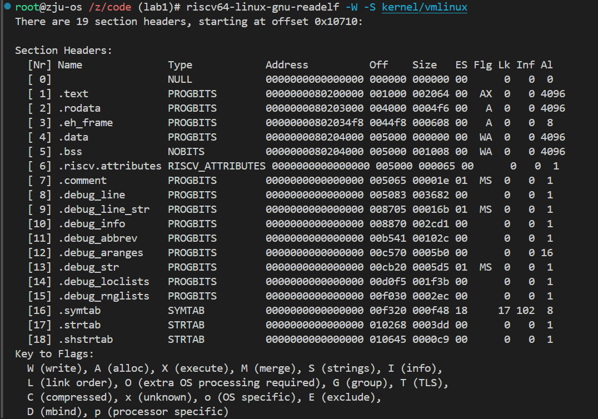</center>
>
> * ```bash
>     riscv64-linux-gnu-readelf -W -l kernel/vmlinux
>     ```
>
>     查看程序头得到：
>
>     <center>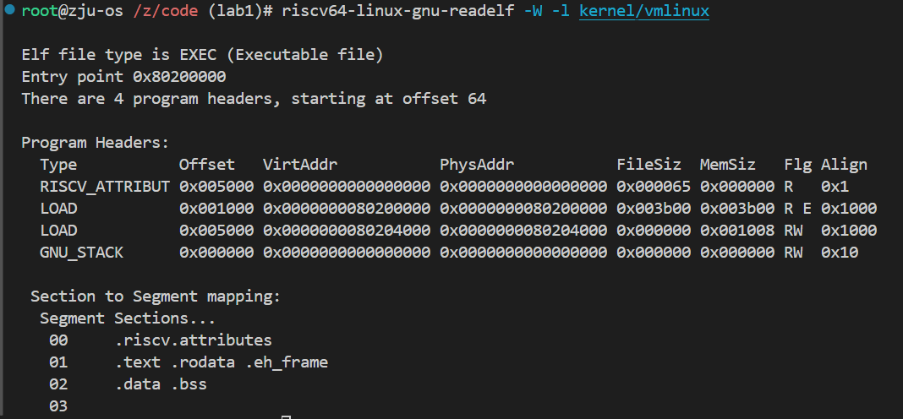</center>

`make run`一下：

<center>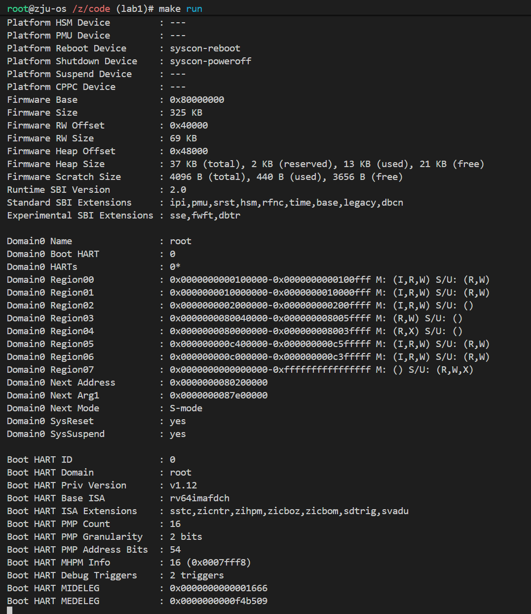</center>

可以知道next address是`0x80200000`.

> [!IMPORTANT]
>
> 按 Lab0 中的步骤启动 QEMU 和 GDB 调试
>
> 1. **GDB 在 OpenSBI 跳转到的地址（Next Addr）处设置断点，查看此时：**
>
>     - **`sp` 寄存器的值是多少？**
>
>         <center>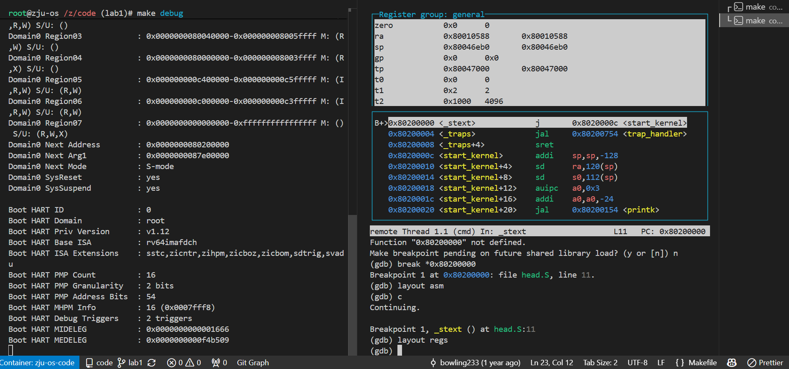</center>
>
>         可以看到`sp`寄存器值是`0x80046eb0`.
>
>     - **这属于哪个区域，该区域各个特权级的权限是什么？**
>
>         这属于 OpenSBI 保留区（`0x80000000` - `0x80200000`），对于以下的权限级别来讲：
>
>         * `M-mode`：能完全访问该区域.
>         * `S-mode`和`U-mode`：不能访问这个区域.
>
>         
>
> 2. **用 VSCode 打开 `kernel/arch/riscv/boot/Image`（已默认绑定到 Hex Editor 插件），然后拉到最底下，观察 Hex Editor 左侧显示的文件偏移地址，它的大小是多少？接下来，请你对照 `vmlinux.lds` 和 `System.map`，查看起始和末尾符号（`_skernel` 和 `_ebss`）对应的地址之差是多少？（在这里，我们暂时不考虑 `_ekernel`，因此存在内存对齐的因素）**
>
>     <center>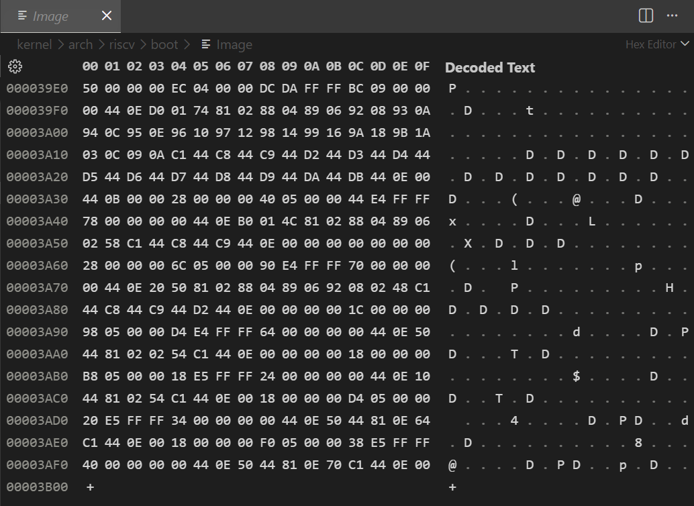</center>
>
>     偏移是`0x3B00`，而`_skernel`和`_ebss`在`kernel/System.map`里对应位置差是：
>
>     * `&_ebss - &_skernel = 0x80205008 - 0x80200000 = 0x5008`
>
>     
>
>     **请你思考：为什么 `Image` 文件的大小会小于链接脚本中定义的内核大小？在上面，我们已经知道 `Image` 文件的内存布局和运行时是一致的，理论上它应当符合链接脚本和符号表中的定义. （提示：你需要理解链接脚本中各个段存放的数据类型）**
>    
>     > `.bss` 段的大小不会反映在 `Image` 文件中.
>    
>     **事实上，由于 `.data` 段存放有初始值的变量，这些初始值本身必须被保存在镜像中，而 `.bss` 段存放未初始化的变量，我们只需要在镜像中记录这个段的大小，而不需要存储其实际内容. 内核启动时，加载器会为它分配空间并直接清零内存. 因此，`.bss` 段的大小不会反映在 `Image` 文件中. **
>
>     
>
>     **接下来，请你寻找 `vmlinux.lds` 中栈空间在哪里被定义，并指出具体的代码. 我们为什么选择在 `.bss` 段开辟栈空间，而不是 `.data` 段呢？**
>    
>     在`kernel/arch/riscv/kernel/vmlinux.lds:52-55`写了栈空间的定义：
>    
>     ```assembly
>         .bss : ALIGN(0x1000) {
>             *(.bss.stack)       /* 这个位置 */
>             . = ALIGN(0x1000); 
>             _sbss = .;
>             ...
>     ```
>    
>     之所以在`.bss`段开辟栈空间，是因为栈是未初始化数据，不需要初始值； `.bss` 段专门存放未初始化/零初始化数据，不占 Image 文件空间.

### Task 1: 为 `start_kernel()` 准备运行环境

我感觉实验文档经常缺细节，比如这个lab直接按文档做会得到：

<center>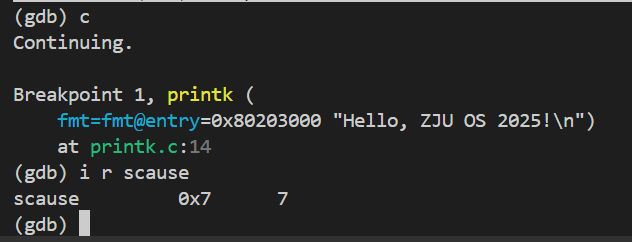</center>

报的错是Store/AMO access fault，然后我试了一下在`start_kernel`入口处加一个断点就避开了问题：

```bash
b *0x80200000
b printk
c
c
i r scause
```

<center>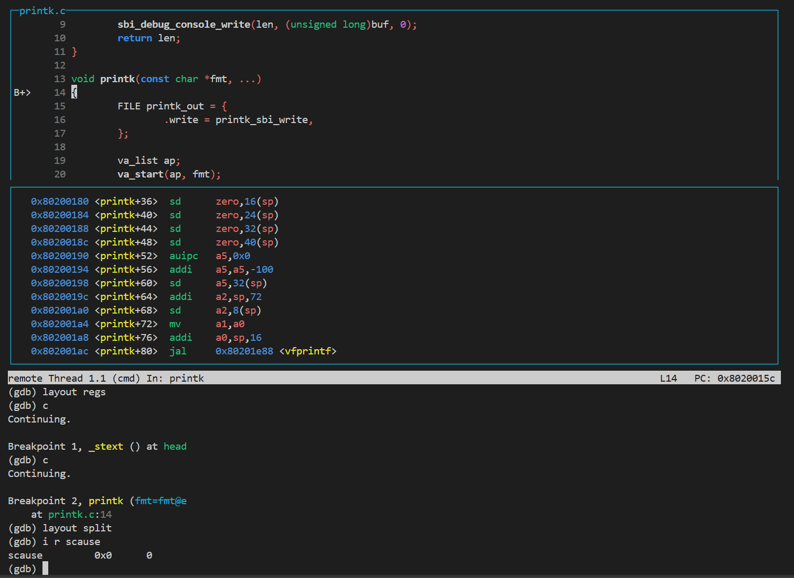</center>

运行测试指令：

```bash
uv --project autograder run autograder -- -k 'test_task1'
```

跑到这里看到最底下的 `Task1 Passed` ，这应该就表明 task1 成功结束了：

<center>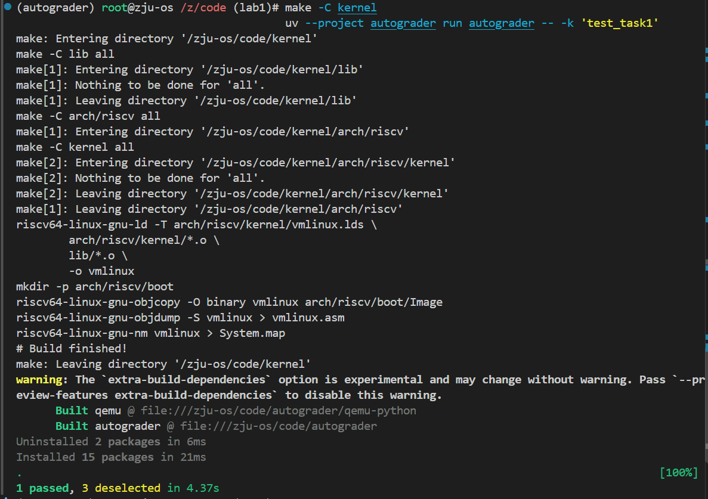</center>

---

### 学习笔记2

C内联汇编的语法太奇怪了，虽然之前我接触过别的语言的内联（Python内联SageMath语言）但还是觉得像在咀嚼什么恶心的东西.

资源：

* [Extended Asm (Using the GNU Compiler Collection (GCC))](https://gcc.gnu.org/onlinedocs/gcc/Extended-Asm.html)
* [Local Register Variables (Using the GNU Compiler Collection (GCC))](https://gcc.gnu.org/onlinedocs/gcc/Local-Register-Variables.html)

> [!IMPORTANT]
>
> 代码分析：
>
> * 左侧第3行对应右侧 1-9 行，内联汇编部分对应 10-23 行：
>
>     <center>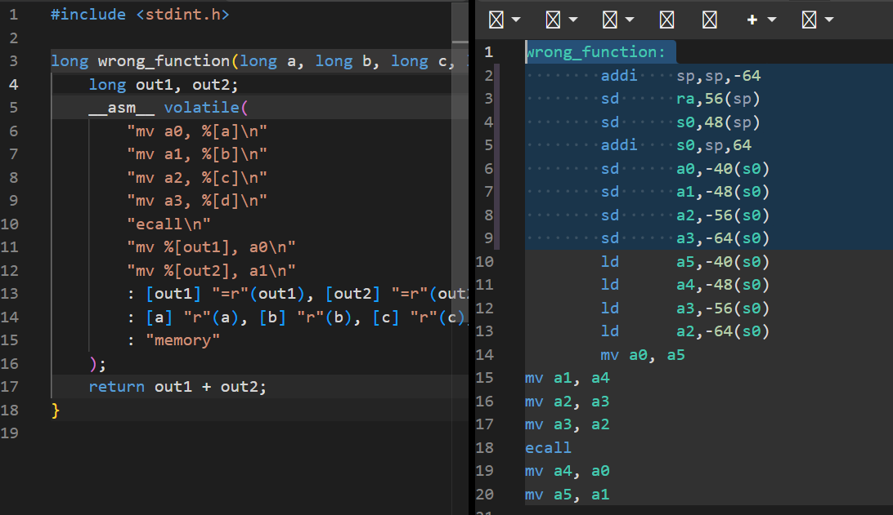</center>
>
>     此时寄存器值：
>
>     <center>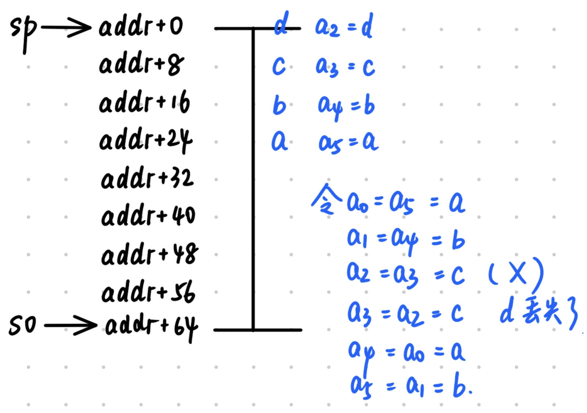</center>
>
>     出的问题主要在以下两行：
>
>     ```assembly
>     mv a2, a3
>     mv a3, a2
>     ```
>
>     这里直接丢失了 `d` 的值.
>
> * 修改：
>
>     首先是使用 `register` 来声明，根据 [Local Register Variables (Using the GNU Compiler Collection (GCC))](https://gcc.gnu.org/onlinedocs/gcc/Local-Register-Variables.html) 里的：
>
>     > As with global register variables, it is recommended that you choose a register that is normally saved and restored by function calls on your machine, so that calls to library routines will not clobber it.
>     >
>     > The only supported use for this feature is to specify registers for input and output operands when calling Extended `asm`.
>
>     其次是根据函数代码逻辑指定某些变量是memory不重排：
>
>     <center>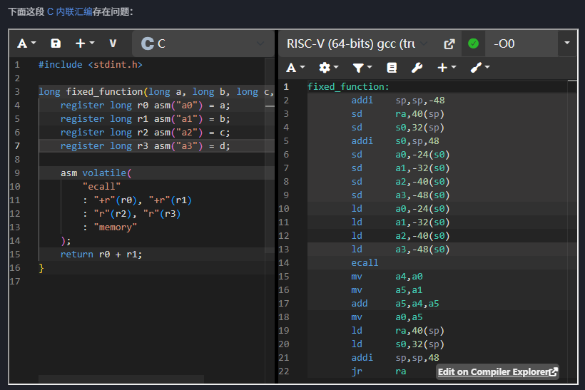</center>
>
>     `+r`表示的是读写操作数，是 `sd ... ld `的合体操作，执行前 `a0=a、a1=b`，执行后从 `a0、a1` 读取两个结果.
>
>     `r`表示的是只读输入，表示执行前 `a2=c、a3=d`.

> [!NOTE]
>
> 1. [Environment Call](https://zju-os.github.io/doc/spec/riscv-unprivileged.html#ecall-ebreak)
>
>     * `ECALL`指令的作用是 `make a service request to the execution environment`
>     * `EEI` 负责规定服务请求的参数应如何传递.
>
> 2. [SBI](https://zju-os.github.io/doc/spec/riscv-sbi.pdf)
>
>     1. Chapter 1. Introduction
>
>         SBI是supervisor binary interface，是运行在 Supervisor 模式的软件与更高特权级执行环境之间的接口；它为 S 模式运行的软件提供服务.
>
>     2. Chapter 3. Binary Encoding 的章节导言
>
>         **在本课程中，谁是 Supervisor？谁是 SEE？**
>
>          Supervisor 是运行在 S 模式的内核；SEE 是为内核提供 SBI 服务的 OpenSBI 固件.
>
>         **如何标识一个特定的 SBI 调用？**
>
>         把扩展 ID（EID）放入 `a7`，把该扩展的函数 ID（FID）放入 `a6`，然后执行 `ecall`
>
>         **SBI 调用的参数和返回值是如何传递的？**
>
>         函数参数依次放在 `a0`～`a5`. 调用返回时，`a0` 是错误码 `sbiret.error`，`a1` 是结果 `sbiret.value` 或 `sbiret.uvalue`.
>
>         **SBI 调用时，哪些寄存器的值不会被保存？**
>
>         `a0` 和 `a1`.
>
>         **如何判断 SBI 调用是否成功？**
>
>         检查 `a0`，即 `sbiret.error`：`0`（`SBI_SUCCESS`）表示成功；非零表示错误.
>
>     3. Chapter 12. Debug Console Extension (EID #0x4442434E "DBCN")
>
>         **Debug Console Extension 提供了什么功能？**
>
>         用于内核调试和启动早期的控制台输入输出
>
>         **`sbi_debug_console_write` 函数的参数和返回值分别是什么？**
>
>         | 寄存器         | 含义                                              |
>         | -------------- | ------------------------------------------------- |
>         | `a0`（调用前） | 要写出的字节数 `num_bytes`                        |
>         | `a1`（调用前） | 输入缓冲区**物理地址**的低 XLEN 位 `base_addr_lo` |
>         | `a2`（调用前） | 输入缓冲区物理地址的高 XLEN 位 `base_addr_hi`     |
>         | `a6` / `a7`    | FID `0` / EID `0x4442434E`                        |
>         | `a0`（返回后） | 错误码 `sbiret.error`                             |
>         | `a1`（返回后） | 实际写出的字节数 `sbiret.uvalue`                  |
>
>         (这个是 ChatGPT 给我总结的，看得我快吐了)

### Task 2: 使用 SBI 实现 `printk()`

我们已经知道 `struct sbiret` 是这样的定义：

```c
struct sbiret {
    long error;
    union {
        long value;
        unsigned long uvalue;
    };
};
```

`sbi_ecall`逻辑是：

<center>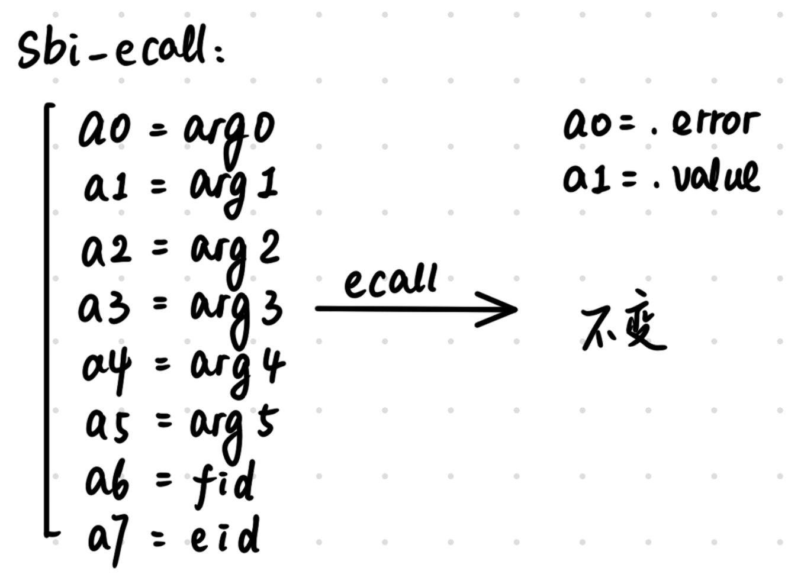</center>

所以写了这个部分：

```assembly
struct sbiret sbi_ecall(uint64_t eid, uint64_t fid, uint64_t arg0,
			uint64_t arg1, uint64_t arg2, uint64_t arg3,
			uint64_t arg4, uint64_t arg5)
{
	/* Lab1 Task2 */
	// Finished
	register uint64_t e asm("a7") = eid;
	register uint64_t f asm("a6") = fid;
	register uint64_t a_5 asm("a5") = arg5;
	register uint64_t a_4 asm("a4") = arg4;
	register uint64_t a_3 asm("a3") = arg3;
	register uint64_t a_2 asm("a2") = arg2;
	register uint64_t a_1 asm("a1") = arg1;
	register uint64_t a_0 asm("a0") = arg0;

	asm volatile(
		"ecall"
		: "+r"(a_0), "+r"(a_1)
		: "r"(a_5), "r"(a_4), "r"(a_3), "r"(a_2), "r"(e), "r"(f)
		: "memory"
	);

	return (struct sbiret){
		.error = (long)a_0,
		.value = a_1, // 有点疑惑这里uint64_t和long不转换是不是也行？
	};
}
```

宏定义部分实在是太抽象了，让ChatGPT总结了一下：

| 扩展宏（传给 `eid`）                 | 含义                                  | 函数宏（传给 `fid`）及含义                                   |
| ------------------------------------ | ------------------------------------- | ------------------------------------------------------------ |
| `SBI_EXT_BASE = 0x10`                | 基础扩展：查询 SBI 自身和实现的信息   | `0` 规范版本；`1` 实现 ID；`2` 实现版本；`3` 探测某扩展是否可用；`4` 厂商 ID；`5` 架构 ID；`6` 实现 ID（`mimpid`） |
| `SBI_EXT_TIME = 0x54494d45`          | 定时器扩展；十六进制字节可读作 `TIME` | `SBI_TIME_SET_TIMER = 0`：设置定时器                         |
| `SBI_EXT_DEBUG_CONSOLE = 0x4442434e` | 调试控制台扩展 `DBCN`                 | `0` 写一段缓冲区；`1` 读入缓冲区；`2` 写单个字节             |
| `SBI_EXT_SYSTEM_RESET = 0x53525354`  | 系统复位扩展 `SRST`                   | `0`：系统复位／关机请求                                      |
| `SBI_EXT_HSM = 0x48534d`             | Hart 状态管理扩展 `HSM`               | `0` 启动 hart；`1` 停止当前 hart；`2` 查询状态；`3` 挂起 hart |

```c
#define SBI_EXT_BASE 0x10
#define SBI_BASE_GET_SPEC_VERSION 0
#define SBI_BASE_GET_IMPL_ID 1
#define SBI_BASE_GET_IMPL_VERSION 2
#define SBI_BASE_PROBE_EXT 3
#define SBI_BASE_GET_MVENDORID 4
#define SBI_BASE_GET_MARCHID 5
#define SBI_BASE_GET_MIMPID 6

#define SBI_EXT_TIME 0x54494d45 // "TIME"
#define SBI_TIME_SET_TIMER 0

#define SBI_EXT_DEBUG_CONSOLE 0x4442434e // "DBCN"
#define SBI_DBCN_WRITE 0
#define SBI_DBCN_READ 1
#define SBI_DBCN_WRITE_BYTE 2

#define SBI_EXT_SYSTEM_RESET 0x53525354 // "SRST"
#define SBI_SRST_SYSTEM_RESET 0

#define SBI_EXT_HSM 0x48534d // "HSM"
#define SBI_HSM_HART_START 0
#define SBI_HSM_HART_STOP 1
#define SBI_HSM_HART_GET_STATUS 2
#define SBI_HSM_HART_SUSPEND 3
```

所以需要填写的三个函数：

```c
struct sbiret sbi_debug_console_write(unsigned long num_bytes,
				      unsigned long base_addr_lo,
				      unsigned long base_addr_hi)
{
	return sbi_ecall(/* Lab1 Task2 */ SBI_EXT_DEBUG_CONSOLE, SBI_DBCN_WRITE, num_bytes, base_addr_lo, base_addr_hi, 0, 0, 0);
}

struct sbiret sbi_debug_console_read(unsigned long num_bytes,
				     unsigned long base_addr_lo,
				     unsigned long base_addr_hi)
{
	return sbi_ecall(/* Lab1 Task2 */ SBI_EXT_DEBUG_CONSOLE, SBI_DBCN_READ, num_bytes, base_addr_lo, base_addr_hi, 0, 0, 0);
}

struct sbiret sbi_debug_console_write_byte(uint8_t byte)
{
	return sbi_ecall(/* Lab1 Task2 */ SBI_EXT_DEBUG_CONSOLE, SBI_DBCN_WRITE_BYTE, byte, 0, 0, 0, 0, 0);
}
```

最后结果：

<center>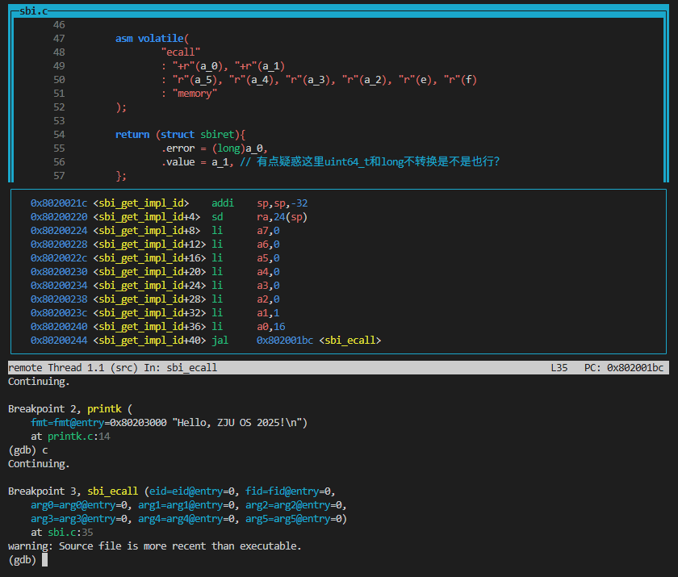</center>

<center>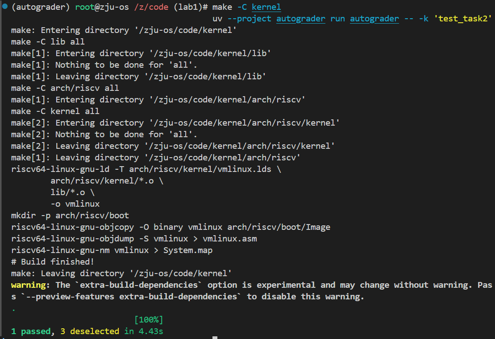</center>

## Part 2: 时钟中断及其处理

### 学习笔记1

学习材料：

* [The RISC-V Instruction Set Manual, Volume II: Privileged Architecture](https://zju-os.github.io/doc/spec/riscv-privileged.html#_privilege_levels)

* https://zju-os.github.io/doc/spec/riscv-unprivileged.html#trap-defn

> [!NOTE]
>
> - **特权级是用来干什么的？**
>
>     > Privilege levels are used to provide protection between different components of the software stack, and attempts to perform operations not permitted by the current privilege mode will cause an exception to be raised.
>
>     也就是用在不同的组件之间，提供权限保护，拒绝不允许的行为发生.
>
> - **执行当前特权级不允许的操作会发生什么？**
>
>     抛出 exception.
>
> - **M、U、S 模式分别是为了什么设计的？**
>
>     Machine: 管理机器级资源
>
>     Supervisor: 运行操作系统内核，管理进程、虚拟内存和系统调用
>
>     User: 运行单个应用程序
>
> > We use the term exception to refer to an unusual condition occurring at run time associated with an instruction in the current RISC-V hart. We use the term interrupt to refer to an external asynchronous event that may cause a RISC-V hart to experience an unexpected transfer of control. We use the term trap to refer to the transfer of control to a trap handler caused by either an exception or an interrupt.
>
> - **RISC-V 中 exception、interrupt 有何异同？**（ChatGPT总结的）
>
>     |      | Exception                            | Interrupt                  |
>     | ---- | ------------------------------------ | -------------------------- |
>     | 来源 | 当前 hart 执行指令时遇到的情况       | 与当前指令执行不同步的事件 |
>     | 时机 | 与某条指令相关，属于同步事件         | 异步到达                   |
>     | 例子 | 执行 `ecall`、访问内存时发生缺页异常 | 定时器中断、外部设备中断   |
>
> - **Trap 是什么意思？举两个 Trap 的例子**
>
>     发生 exception 或 interrupt 后，处理器把控制权转移到 trap handler（陷入处理程序） 的过程.
>
>     例子：
>
>     1. 内核在 S 模式执行 `ecall`：产生 exception，随后 trap 到处理 SBI 调用的程序. 
>
>     2. 定时器中断到达：产生 interrupt，随后 trap 到相应的中断处理程序

> CSR寄存器是 RISC-V CPU 中的特殊寄存器，能够反映和控制 CPU 当前的状态和执行机制.

> [!NOTE]
>
> * Chap 2
>
>     - **读取、修改、写入 CSR 的指令定义在哪个扩展？**
>
>         Zicsr 扩展.
>
>     - **S 模式的 CSR 能被 M 模式访问吗？反之呢？**
>
>         可以，反之不行.
>
> * [The RISC-V Instruction Set Manual, Volume II: Privileged Architecture](https://zju-os.github.io/doc/spec/riscv-privileged.html#privstack)
>
>     * **mstatus 寄存器的作用是什么？**
>
>         机器状态寄存器，保存和控制处理器的运行状态，包括`xIE`、`xPIE`、`xPP`等.
>
>         <center>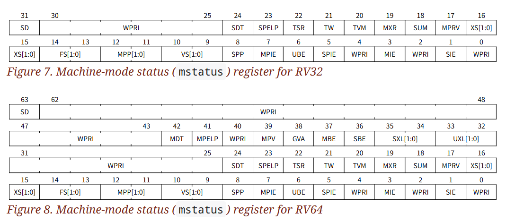</center>
>
>     * **xIE bit 的作用是什么？**
>
>         用 x 指代某个特权级别， xIE bit 是 x 级中断的全局使能位，作用条件：（也是ChatGPT总结的）
>
>         | 当前特权级与 x 的关系 | x 级中断的全局使能条件        |
>         | --------------------- | ----------------------------- |
>         | 当前级 = x            | 由 `xIE` 控制：1 开启，0 关闭 |
>         | 当前级 < x            | 全局开启，不受 `xIE` 影响     |
>         | 当前级 > x            | 全局关闭，不受 `xIE` 影响     |
>
>     * **运行在 S 模式且 mstatus.SIE=0，mstatus.MIE=0 时，发生中断会进入哪个模式？**
>
>         M级中断可以使 processor 进入M模式，S级中断会被关闭 (`SIE = 0`导致的).
>
>     * **从特权级 y 陷入到更高的特权级 x 时，xPIE、xIE 和 xPP 会如何变化？**
>
>         * xPIE 会变成 xIE
>         * xIE 会变成 0
>         * xPP 会变成 y
>
>     * **xRET 指令返回时，特权级和中断使能位会如何恢复？xPP 会设置为什么？**
>
>         * 当前特权级会变成 xPP
>         * xIE 会变成 xPIE
>         * xPIE 会变成 1
>         * xPP 会变成 U 级
>
> * [The RISC-V Instruction Set Manual, Volume II: Privileged Architecture](https://zju-os.github.io/doc/spec/riscv-privileged.html#_machine_interrupt_mip_and_mie_registers)
>
>     * **mip 和 mie 寄存器的作用分别是什么？**
>
>         `mip`: Machine Interruption Pending, 保存挂起中断的信息
>
>         `mie`: Machine Interruption-Enable Register, 控制各类终端是否被enable
>
>     * **在什么条件下，中断会陷入 M 模式？**
>
>         条件：
>
>         * 当前特权级是 M 级且 `mstatus.MIE = 1` 或者 当前特权级 < M
>         * `mip[i] = mie[i] = 1`.
>         * 如果存在 `mideleg`，则 `mideleg[i] = 0`
>
>     * **为什么软件中断的优先级高于定时器中断？**
>
>         便于多核信息传递
>
> * [The RISC-V Instruction Set Manual, Volume II: Privileged Architecture](https://zju-os.github.io/doc/spec/riscv-privileged.html#_machine_trap_delegation_medeleg_and_mideleg_registers)
>
>     * **为什么需要委派机制？**
>
>         
>
>     * **`medeleg` 和 `mideleg` 寄存器的作用分别是什么？**
>    
>     * **当一个 trap 被委派到 S 模式后，下面这些地方的值会如何变化？**
>    
>         - **`scause`**: 
>         - **`stval`**
>         - **`sepc`**
>         - **`mstatus.SPP`**
>         - **`mstatus.SPIE`**
>         - **`mstatus.SIE`**
>    
>     * **如果一个 trap 是在 M 模式下发生的，但它在 medeleg 中已被设置委派给 S 模式，会在哪里处理？**
>    
>     * **mideleg 中的某一位被设置后，这个中断在 M 模式下会被触发吗？**

> [!IMPORTANT]
>
> 在 `start_kernel` 处打断点，得到：
>
> <center>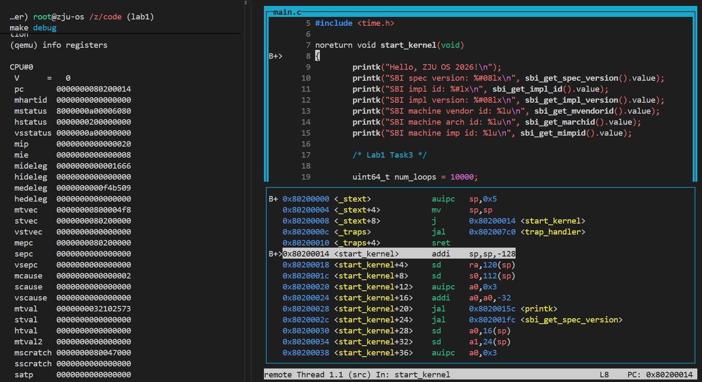</center>
>
> 含义：
>
> * `mstatus = 0x8000000a00006080`: 机器模式状态寄存器，主要字段：
>     - `MIE=0`、`SIE=0`：M/S 模式的全局中断使能位均关闭
>     - `MPIE=1`：保存的上一层 M 模式中断使能状态为开启
>     - `MPP=0`：保存的返回特权级为 U 模式
>     - `SXL=2`、`UXL=2`：S/U 模式均使用 64 位寄存器宽度
>     - `FS=3`：浮点状态为 Dirty，表示上下文保存时需要保存浮点状态
>     - `SD=1`：存在 Dirty 的扩展状态，此处由 `FS=3` 引起
> * `mip = 0x20`: 中断待处理寄存器，第 5 位 `STIP=1`，表示 S 模式定时器中断处于待处理状态
> * `mie = 0x8`:中断使能寄存器，`MSIE = 1`，相当于允许 M 模式软件中断.
> * `mtvec = 0x4f8`: 
> * `medeleg = `: 
> * `mideleg = `: 
> * `mepc = `: 
> * `mcause = `: 
> * `mtval = `: 
> * `sstatus = `: 
> * `sip = `: 
> * `sie = `: 
> * `stvec = `: 
> * `scause = `: 
> * `sepc = `: 
> * `stval = `: 

> [!IMPORTANT]
>
> 移除 Task 1 的代码之后重新编译`make -C kernel`，得到没法正常跳转调用 `printk`，会跳回`tail`语句，陷入了死循环：
>
> <center>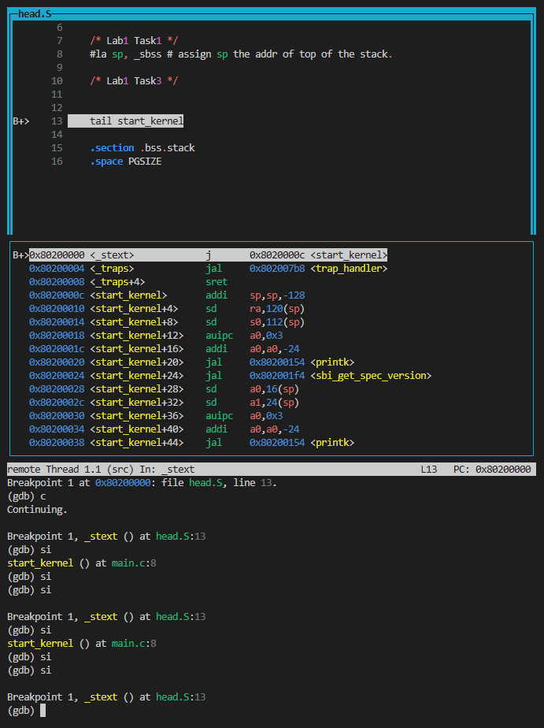</center>
>
> <center>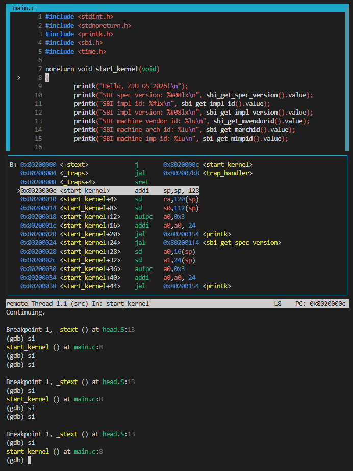</center>
>
> 查看寄存器值，得到问题出在：（问了ChatGPT得到的结果）
>
> | 寄存器   | 值           | 含义                                     |
> | -------- | ------------ | ---------------------------------------- |
> | `scause` | `0x7`        | **Store/AMO access fault**，存储访问异常 |
> | `sepc`   | `0x80200010` | 触发异常的指令地址                       |
> | `stval`  | `0x80046e28` | 这次存储访问的出错地址                   |
> | `stvec`  | `0x80200000` | S 模式异常处理入口，恰好指向内核起始地址 |
>
> 删除 `_start` 断电之后进去了：
>
> <center>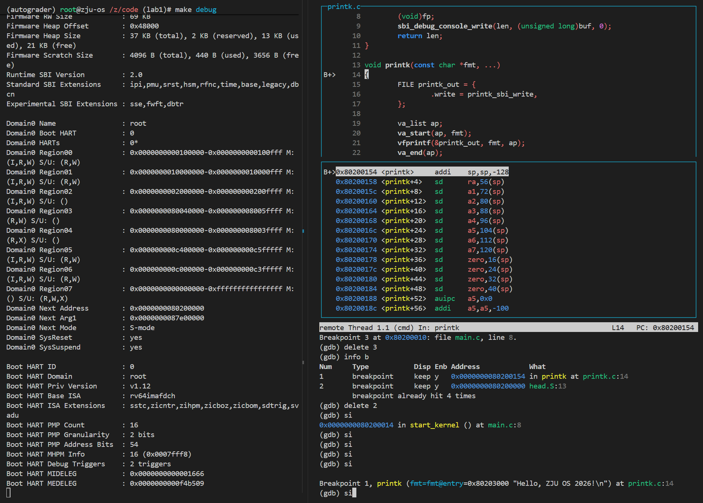</center>

特权指令目前暂时只需要 [trap-return](https://zju-os.github.io/doc/spec/riscv-privileged.html#otherpriv) 指令的 `xRET` 指令掌握.

> [!NOTE]
>
> - xRET 指令的作用是什么？
>
>     用于从陷入处理程序返回，恢复之前的特权级、中断使能状态和执行位置
>
> - xRET 指令执行后，CSR 寄存器会如何变化？PC 的值会如何变化？
>
>     假设执行前 `xPP` 保存的特权级是 `y`，基本变化如下：（ChatGPT总结的）
>
>     | 项目       | 执行 `xRET` 后                               |
>     | ---------- | -------------------------------------------- |
>     | 当前特权级 | 恢复为 `y`                                   |
>     | `xIE`      | 设置为原来的 `xPIE`，恢复中断使能            |
>     | `xPIE`     | 设置为 `1`                                   |
>     | `xPP`      | 重置为最低的受支持特权级；实验中为 U，即 `0` |
>     | `MPRV`     | 若返回到非 M 模式，则清零                    |
>     | PC         | 设置为 `xepc` 中保存的地址                   |

[Zicsr 扩展](https://zju-os.github.io/doc/spec/riscv-unprivileged.html#csrinsts) 先读一下，感觉又多一堆莫名其妙的东西.

### Task3: Trap Handler

S模式的CSR:[The RISC-V Instruction Set Manual, Volume II: Privileged Architecture](https://zju-os.github.io/doc/spec/riscv-privileged.html#_supervisor_csrs)

<center>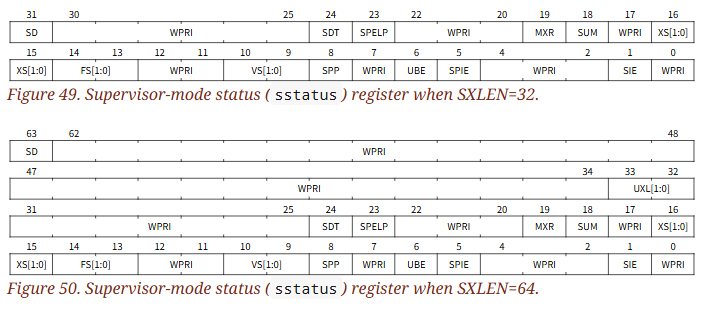</center>

`csr_read` 这个宏定义是传入 `csr`，整个 `csr_read(...)` 的值就是 `__v`，也就是说：

```c
uint64_t x = csr_read(sstatus);
```

想表达的是“读取 `sstatus`，将结果赋给 `x`”.

下面的两个宏定义不需要返回值，所以调用格式类似：

```c
csr_write(sie, SIE_SSIE);
```

因此实现.

---

接下来是在 `start_kernel` 中：

- 打印 `sstatus`、`sie` 和 `sip` 的值
- 将 `sie` 设置为合适的值，使得只有软件中断被使能
- 将 `sstatus` 设置为合适的值，使能 S 模式中断
- 将 `sip` 设置为合适的值，立刻触发一个软件中断

```c
	printk("sstatus : %#lx\n", (unsigned long)csr_read(sstatus));
	printk("sie     : %#lx\n", (unsigned long)csr_read(sie));
	printk("sip     : %#lx\n", (unsigned long)csr_read(sip));
	// 好邪门的语法，估计两周之后就会忘记

	csr_write(sie, SIE_SSIE);			 // sie 只有软件中断被使能
	csr_set(sstatus, SSTATUS_SIE); // sstatus 使能 S 模式中断
	csr_set(sip, SIP_SSIP);        // sip 立刻触发一个软件中断
```

---

在 `head.S` 里面添加这个：

```assembly
    la t0, _traps # put the addr of _traps into reg t0
    csrw stvec, t0 # write the addr to CSR stvec
```

---

在`entry.S`中添加这个：

```assembly
_traps:

    /* Lab1 Task3 */
    csrr t0, sepc
    sd t0, 0(sp)
    mv a0, t0
    csrr a1, scause
    csrr a2, stval

    call trap_handler # 跳回trap.c执行函数
```

这里主要是将 `sepc` 放入 `a0`，`scause` 放入 `a1`，`stval` 放入 `a2`，同时把`sepc` 额外保存在栈中，供返回时恢复.

---

在`trap.c`里面的修改：

```c
void clear_ssip(void)
{
	/* Lab1 Task3 */
	asm volatile("csrc sip, %0"
							: 
							: "r"(SIP_SSIP)
							: "memory");
}
```

这个没什么好说的，直接清除值就行了.

下面这段要求太猎奇了：

> - Trap 随时可能发生. 因此，Trap Handler 的首要工作是**保存现场，并在完成 Trap 处理后恢复现场**，保证被中断的程序的执行不受影响. 
>
>     为什么需要保存现场呢？因为接下来 Trap 处理程序也会使用一些寄存器，如果这些寄存器正在被被中断的程序使用，数据就丢失了，导致被中断的程序无法正确恢复执行. 
>
>     为此，有哪些内容需要保存？保存到哪里？
>
>     - 回顾 RISC-V 调用约定，它为了保存 caller 的上下文，是怎么做的？
>     - `mtvec` 指向了 OpenSBI 的中断处理程序，你可以使用 Lab0 中学习的调试知识，将它的汇编打印出来，分析它是如何工作的. 
>
> - `_traps()` 的第二个作用是跳转到 `trap.c` 中的 `trap_handler()` 函数，因为 C 语言编程更方便，我们当然想用 C 语言完成具体的 Trap 处理工作. 你需要向 `trap_handler()` 传递哪些参数？
>
> - `_traps()` 非得用汇编写吗？直接指向 `trap_handler()` 可以吗？

回答：

* 感觉是把gdb界面能看到的寄存器值全保留一遍，感觉会搓一长段sd ld；

* 需要向 `trap_handler()` 传递的参数显然就是`sepc`, `scause`, `stval`；

* 我不知道（即答），下面是chatgpt的分析：

    不能把 `stvec` 直接指向普通的 `trap_handler()`，`_traps` 这层入口需要先完成普通 C 函数调用所要求、但硬件不会替你完成的准备工作，参数没办法写入CSR寄存器中再跳回 `stvec` 指定的地址.

修改前后都通过结算：

<center>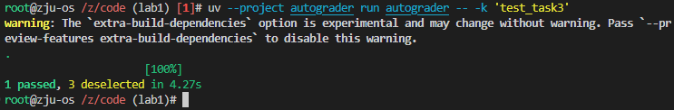</center>

### 学习笔记2

> Platforms provide a real-time counter, exposed as a memory-mapped machine-mode read-write register, `mtime`

`mtime`记录的不是时钟周期，而是由平台决定的某个固定周期频率. 所有 RV32 和 RV64 系统中，`mtime` 都是 64 位精度.

`mtimecmp` 是 64 位内存映射机器模式定时器比较寄存器，当 `mtime ≥ mtimecmp` 时，机器定时器中断挂起. 中断会一直挂起，直到 `mtimecmp > mtime`（通常通过写入新的 mtimecmp 值实现）

二者均仅供M模式使用.

> [!IMPORTANT]
>
> **阅读 OpenSBI 源码 [`lib/sbi/sbi_ecall_time.c`](https://github.com/riscv-software-src/opensbi/blob/master/lib/sbi/sbi_ecall_time.c)，了解 OpenSBI 是如何实现 `sbi_set_timer()` 函数的. 请你指出：**
>
> （这个 task 很奇怪，设置定时器的代码应该在[sbi_timer.c](https://github.com/riscv-software-src/opensbi/blob/master/lib/sbi/sbi_timer.c)，函数名字也应该是被调用的`sbi_timer_smode_event_start()`）
>
> ```c
> void sbi_timer_smode_event_start(u64 next_event)
> {
> 	struct timer_state *tstate = sbi_scratch_offset_ptr(sbi_scratch_thishart_ptr(),
> 							    timer_state_off);
> 
> 	sbi_pmu_ctr_incr_fw(SBI_PMU_FW_SET_TIMER);
> 
> 	/**
> 	 * Update the stimecmp directly if available. This allows
> 	 * the older software to leverage sstc extension on newer hardware.
> 	 */
> 	if (sbi_hart_has_extension(sbi_scratch_thishart_ptr(), SBI_HART_EXT_SSTC)) {
> 		csr_write64(CSR_STIMECMP, next_event);
> 	} else {
> 		csr_clear(CSR_MIP, MIP_STIP);
> 		sbi_timer_event_start(&tstate->smode_ev, next_event);
> 	}
> }
> ```
>
> - **当平台支持 SSTC 扩展时，OpenSBI 会如何设置定时器？**
>
>     直接把到期时间写入 `stimecmp` CSR.
>
> - **当平台不支持 SSTC 扩展时，OpenSBI 如何进行定时器多路复用？**
>
>     清除 STIP，再调用 `sbi_timer_event_start(...)`

做得很疑惑，不知道多路复用在什么位置.

### Task4: 开启并处理 S 模式时钟中断

> [POSIX 标准](https://pubs.opengroup.org/onlinepubs/009695099/functions/clock.html) 定义了：
>
> - `CLOCKS_PER_SEC` 常量：表示每秒的时钟滴答数（Clocks），在 POSIX 标准中要求为 1000000（1M）
> - `clock()` 函数：返回自进程启动以来，过去的时钟滴答数
> - 也就是说，要将 `clock()` 返回的值转换为秒，需要用返回值除以 `CLOCKS_PER_SEC` 宏的值

所以经过大概：
$$
2^{64} / (10^6 \times 24 \times 60 \times 60 \times 365) \approx 584942 \text{年}
$$
会回绕.

---

`main.c`里面修改不是很难，加两行就能打开使能：

```c
	csr_set(sie, SIE_STIE);
	sbi_set_timer(0);
```

---

添加时钟中断要先加一个case:

```c
	case SCAUSE_SSI:
		clear_ssip();
		break;
	default:
		...
```

然后加一个函数：

```c
static void handle_timer_interrupt(void)
{
	clock_set_next_event();
	printk("timer interrupt\n");
}
```

最后再加上这个case就行了.

---

这里我搞错了，一开始填了：

```c
void clock_set_next_event(void) {
	/* Lab1 Task4 */
	sbi_set_timer(1000000);
};
```

后来发现情况不对，（经 ChatGPT 提醒）改成了：

```c
void clock_set_next_event(void) {
	/* Lab1 Task4 */
	uint64_t now = csr_read(time);
	sbi_set_timer(now+TIMECLOCK);
};
```

---

`clock.c`里的宏定义很奇怪：

```c
#include <time.h>
#include <stdint.h>
#include "../arch/riscv/include/sbi.h"
#include "../arch/riscv/include/private_kdefs.h"

clock_t clock(void)
{
	uint64_t ticks = csr_read(time);
	return (clock_t)(ticks / (TIMECLOCK / CLOCKS_PER_SEC));
}
```

折腾了一下是，硬件层面的ticks是$10^7/s$，所以还得折算一下.

---

运行测试成功结算：

<center>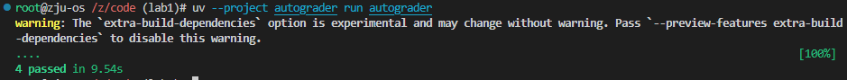</center>

至此实验完成.

## 思考题

1. **概括 RISC-V 调用约定：参数、返回值如何传递？Caller-saved 与 Callee-saved 寄存器有何区别？**

    * 对于普通整数和指针参数，使用 `a0～a7` 传递. 其中普通整数返回值放在 `a0`，需要两个寄存器的返回值使用 `a0`, `a1`；

    * 参数寄存器不足时使用栈，标准 ABI 要求栈保持 16 字节对齐.

    | 寄存器    | 用途                        | 调用后是否保证原值 |
    | --------- | --------------------------- | ------------------ |
    | `a0～a7`  | 参数、返回值                | 否，Caller-saved   |
    | `t0～t6`  | 临时变量                    | 否，Caller-saved   |
    | `ra`      | 返回地址                    | 否，Caller-saved   |
    | `s0～s11` | 保存变量，`s0` 也可作帧指针 | 是，Callee-saved   |
    | `sp`      | 栈指针                      | 返回时须恢复       |
    | `gp、tp`  | 全局指针、线程指针          | 普通函数通常不修改 |

    区别：

    * Caller-saved：调用者若还要使用某个寄存器中的旧值，必须在调用前保存;
    * Callee-saved：被调用者若使用这些寄存器，必须保存旧值，并在返回前恢复. 例如，函数修改 `s0` 后，要保证调用者看到的 `s0` 没有变化

    

2. **编译内核后，在 `System.map` 中找到 `vmlinux.lds` 定义的符号，解释其地址. **

    定义的符号有：

    | 符号                   |                       地址 | 含义                          |
    | ---------------------- | -------------------------: | ----------------------------- |
    | `_skernel`、`_stext`   |               `0x80200000` | 内核及代码起点                |
    | `_etext`               |               `0x802022e8` | 代码终点                      |
    | `_srodata`、`_erodata` | `0x80203000`、`0x8020353e` | 只读数据范围                  |
    | `_sdata`、`_edata`     |          均为 `0x80204000` | 本次没有占空间的 `.data` 内容 |
    | `_sbss`、`_ebss`       | `0x80205000`、`0x80205008` | 普通未初始化数据范围          |
    | `_ekernel`             |               `0x80206000` | 页对齐后的内核终点            |

3. **用 `csr_read` 读取 `sstatus`，对照规范解释关键位. **

    读取：

    ```c
    unsigned long status = csr_read(sstatus);
    printk("sstatus = 0x%lx\n", status);
    ```

    关键位置解释：（ChatGPT总结的，前面也有一张图能说明）

    |     位 | 名称         | 含义                                 |
    | -----: | ------------ | ------------------------------------ |
    |      1 | `SIE`        | S 模式全局中断使能                   |
    |      5 | `SPIE`       | 进入 Trap 前的 `SIE` 值              |
    |      8 | `SPP`        | 进入 Trap 前的特权级：0 为 U，1 为 S |
    | 13～14 | `FS`         | 浮点状态                             |
    | 18、19 | `SUM`、`MXR` | 用户页访问、可执行页读取控制         |
    | 32～33 | `UXL`        | U 模式寄存器宽度编码（RV64）         |
    |     63 | `SD`         | 扩展状态中存在 Dirty 状态的摘要位    |

4. **用 `csr_write` 写入 `sscratch`，再读回验证. **

    测试代码：

    ```c
    uint64_t old = csr_read(sscratch);
    uint64_t expected = 0x12345678UL;
    csr_write(sscratch, expected);
    uint64_t actual = csr_read(sscratch);
    printk("sscratch: wrote %#lx, read %#lx\n",
           (unsigned long)expected, (unsigned long)actual);
    csr_write(sscratch, old);
    ```

    得到验证结果：

    <center>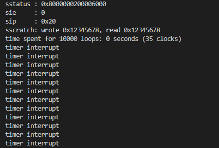</center>

5. **用 `readelf` 和 `objdump` 查看内核 ELF 的结构与反汇编；另运行一个容器内的 Linux ELF 程序，结合 `/proc/<PID>/maps` 解释其内存布局. **

    * 查看内核结构与反汇编：

        ```bash
        riscv64-linux-gnu-readelf -h -l -S kernel/vmlinux
        riscv64-linux-gnu-objdump -d -S kernel/vmlinux | less
        ```
        
        <center>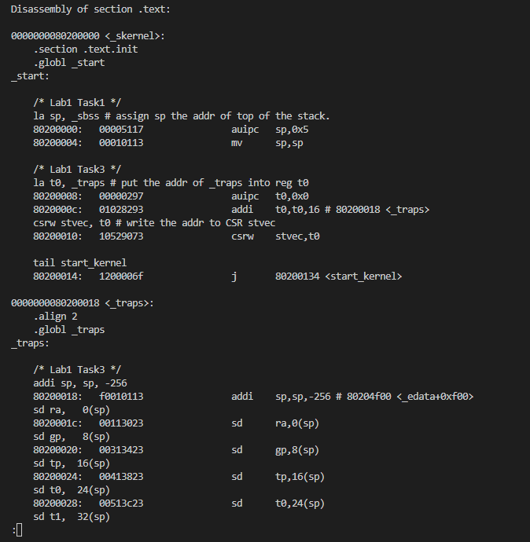</center>
        
    * 内存布局：

        <center>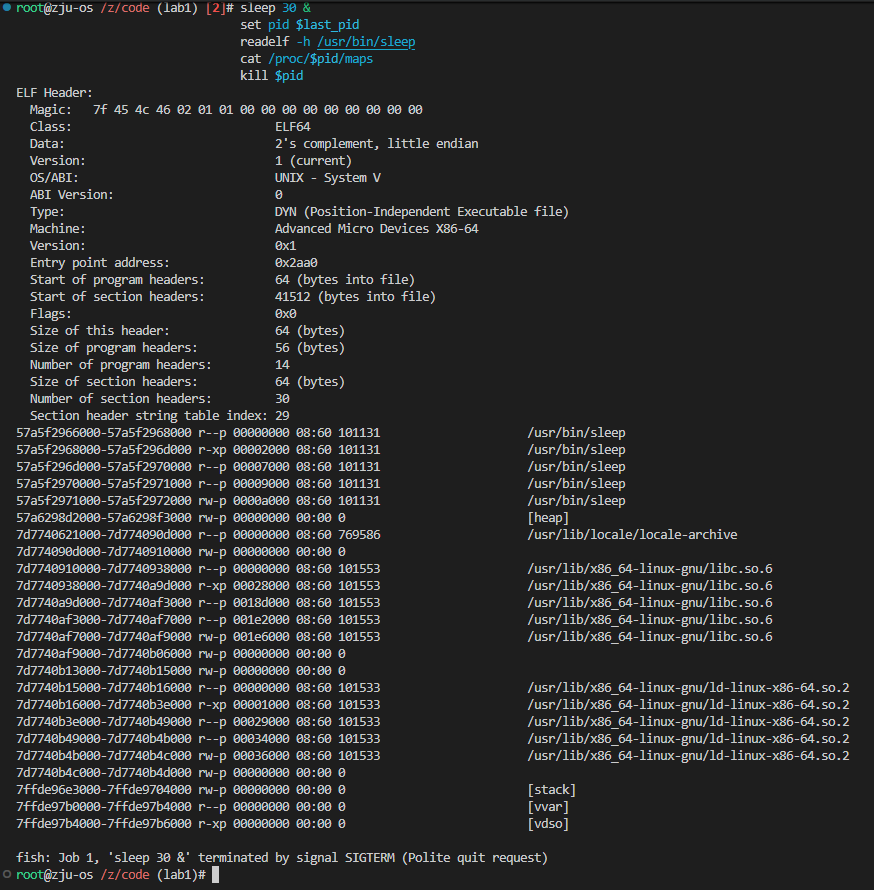</center>

    

6. **在我们使用 make run 时，OpenSBI 会产生如下输出：**

    ```
        OpenSBI v1.5.1
         ____                    _____ ____ _____
        / __ \                  / ____|  _ \_   _|
       | |  | |_ __   ___ _ __ | (___ | |_) || |
       | |  | | '_ \ / _ \ '_ \ \___ \|  _ < | |
       | |__| | |_) |  __/ | | |____) | |_) || |_
        \____/| .__/ \___|_| |_|_____/|____/_____|
              | |
              |_|
    
        ......
    
        Boot HART MIDELEG         : 0x0000000000000222
        Boot HART MEDELEG         : 0x000000000000b109
    
        ......
    ```

    **通过查看 RISC-V Privileged Spec CH2 中的 medeleg 和 mideleg 部分，解释上面 MIDELEG 和 MEDELEG 值的含义. **

    我这边看到的正常运行的如此：

    <center>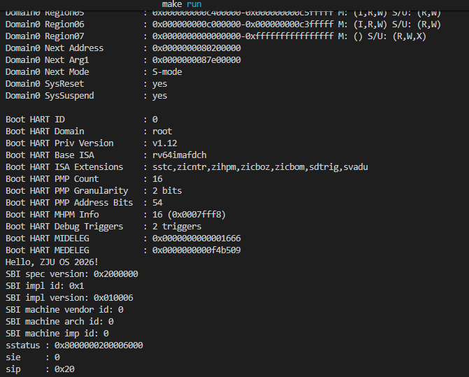</center>

    Boot HART MIDELEG           : 0x0000000000001666
    Boot HART MEDELEG           : 0x0000000000f4b509

    题目的报错信息拆解：

    * `MIDELEG = 0x222`：置位的是 1、5、9，依次为 S 模式软件中断、定时器中断、外部中断. 
    - `MEDELEG = 0xb109`：置位的是 0、3、8、12、13、15，依次为指令地址未对齐、断点、U 模式 `ecall`、取指页错误、读页错误、写／原子操作页错误

    

7. **为什么 `.bss` 占用内存，却不占用同等大小的内核镜像文件？**

     `.bss` 存放未显式初始化或零初始化的数据. ELF 将它标成 `NOBITS`，记录所需的内存大小，装载时提供零填充空间，无须在文件中存放同样多的零字节. 内核 ELF 文件另外还含符号和调试信息，文件总大小不能直接拿来当作内存占用.

    

8. **异常与中断有何区别？为什么 Trap 返回需要 `sret`？**

    * 异常通常由当前指令同步引起，例如非法指令、页错误、`ecall`；

    * 中断来自定时器、设备等事件，相对当前指令异步发生. 进入 S 模式 Trap 时，硬件记录 `sepc`、`scause`，并把原来的中断使能状态保存到 `SPIE`、清除 `SIE`. 

    * 处理完要用 `sret`：因为它按 `sepc` 恢复执行位置，按 `SPP` 恢复特权级，并把 `SPIE` 恢复到 `SIE`. 
    * 相比之下，普通函数返回指令 `ret` 只按 `ra` 跳转，无法完成这些特权状态恢复. [RISC-V 特权规范：S 模式 Trap 返回](<https://docs.riscv.org/reference/isa/priv/supervisor.html>)对 `ecall` 等同步异常，处理程序还须按原因决定是否调整 `sepc`；若应跳过该指令却原样 `sret`，会再次执行它

