# Lab1 WireShark & Web Basics

## 实验目的和要求

- 初步了解WireShark软件的界面和功能
- 熟悉各类常用网络命令的使用

## 实验内容和原理

- Wireshark是PC上使用最广泛的免费抓包工具，可以分析大多数常见的协议数据包。有Windows版本、Linux版本和Mac版本，可以免费从网上下载  
- 初步掌握网络协议分析软件Wireshark的使用，学会配置过滤器
- 根据要求配置Wireshark，捕获某一类协议的数据包
- 在PC机上熟悉常用网络命令的功能和用法: Ping.exe，Netstat.exe, Telnet.exe, Tracert.exe, Arp.exe, Ipconfig.exe, Net.exe, Route.exe, Nslookup.exe
- 利用WireShark软件捕捉上述部分命令产生的数据包

## 主要仪器设备

- 联网的PC机
- WireShark协议分析软件

## 操作方法与实验步骤

1. 安装网络包捕获软件Wireshark
2. 配置网络包捕获软件，捕获所有类型的数据包
3. 配置网络包捕获软件，只捕获特定类型的包
4. 在Windows命令行方式下，执行适当的命令，完成以下功能(请以管理员身份打开命令行)：
    - 测试到特定地址的联通性、数据包延迟时间
    - 显示本机的网卡物理地址、IP地址 	 	
    - 显示本机的默认网关地址、DNS服务器地址 	 	
    - 显示本机记录的局域网内其它机器IP地址与其物理地址的对照表
    - 显示从本机到达一个特定地址的路由 	 	
    - 显示某一个域名的IP地址
    - 显示已经与本机建立TCP连接的端口、IP地址、连接状态等信息
    - 显示本机的路由表信息，并手工添加一个路由
    - 显示本机的NetBIOS名称	 	
    - 显示局域网内某台机器的共享资源 	 	
    - 使用telnet连接WEB服务器的端口，输入（\<cr\>表示回车）获得该网站的主页内容：
        - GET / HTTP/1.1
        - Host:www.baidu.com

​	5. 利用WireShark实时观察在执行上述命令时，哪些命令会额外产生数据包，并记录这些数据包的种类。

## <span id='result'> 实验结果与分析 </span>

- 运行Wireshark软件，主界面是由哪几个部分构成？各有什么作用？

    主界面构成：上面的工具栏 + 过滤器 + 文件历史记录 + 当前流量捕获

    <center>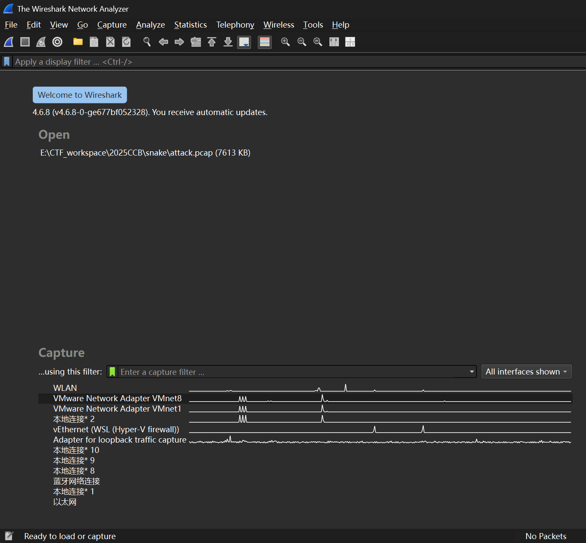</center>

    工具栏：可以做很多自由的配置

    <center>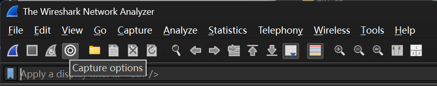</center>

    过滤器：可以根据字段、协议等对流量包进行过滤

    <center>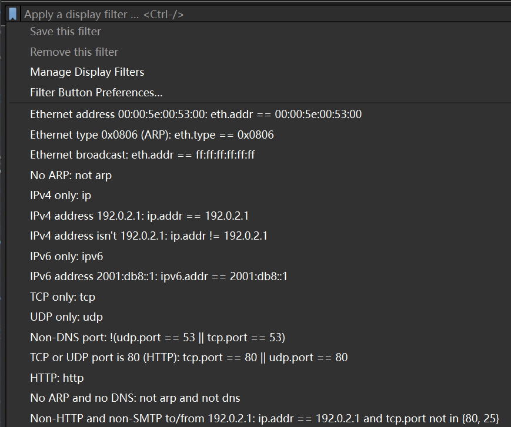</center>

    文件历史记录：会存放一些曾经打开过的流量包(`.pcap`等格式)，这里也显示了这个 wireshark 的版本号4.6.8

    <center>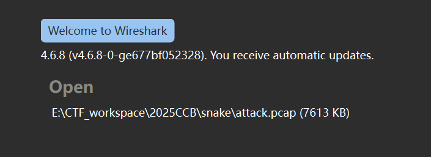</center>

    当前流量捕获：展示本机当前的网络流量情况

    <center>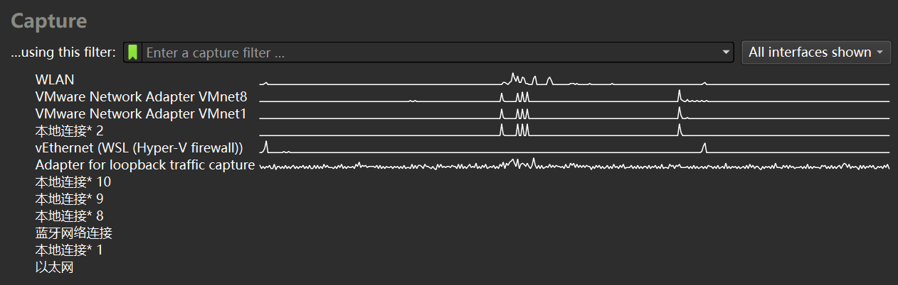</center>

- 开始捕获网络数据包，你看到了什么？有哪些协议？

    上图中有流量的网络接口包括： 

    * WLAN，即当前使用的无线网络接口；
    * VMware Network Adapter VMnet8，即 VMware 的 NAT 虚拟网卡；
    * Adapter for loopback traffic capture，即本机环回流量捕获接口。 

    选择捕获其中的WLAN，打开：

    <center>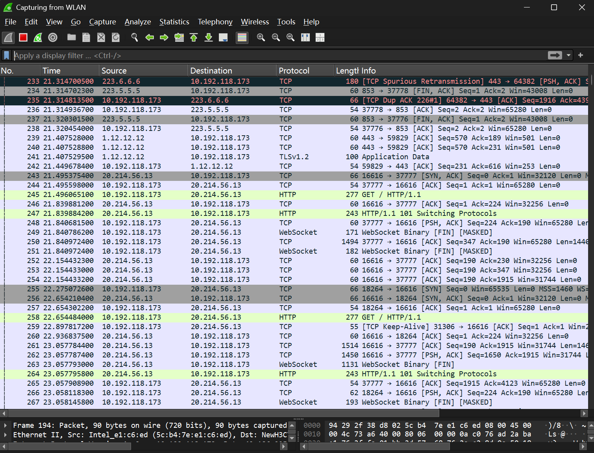</center>

    如上，可以看到需要流量包动态滚动，显示了时间，source和destination，协议，包长度和具体细节.

    其中能看到的协议有：TCP, HTTP, WebSocket, TLS

    实际上全部协议包括： ARP、DNS、TCP、UDP、TLS、HTTP/2、QUIC、ICMPv6 等，不同协议分别承担地址解析、域名解析、可靠传输、加密通信和网络诊断等功能

- 配置显示过滤器，让界面只显示某一协议类型的数据包

    在 Apply a display filter 中设置`tcp.port == 80 || udp.port == 80`，可以看到隐藏了很多包，右下角的 Displayed = 1615 (4.4%) 展示了具体情况.

    <center>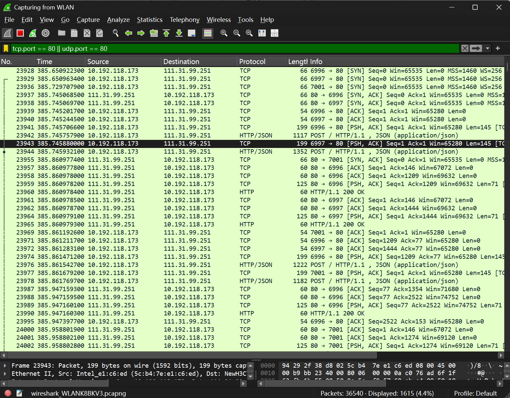</center>

- 配置捕获过滤器，只捕获某类协议的数据包

    上面的已经是选择了 WLAN 来捕获，可见左上角的 Capturing from WLAN.

- 利用ping, ipconfig, arp, tracert, nslookup, nbtstat, route, netstat, NET SHARE, telnet命令完成在实验步骤4中列举的11个功能

    * `ping`：用于测试到特定地址的连通性、数据包的延迟时间

        <center>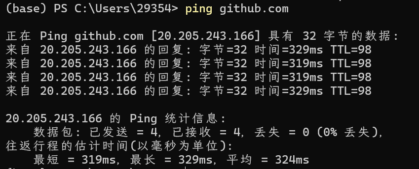</center>

    * `ipconfig`：查看本机的网卡物理地址、IP地址；查看本机默认网关、DNS服务器地址

        <center>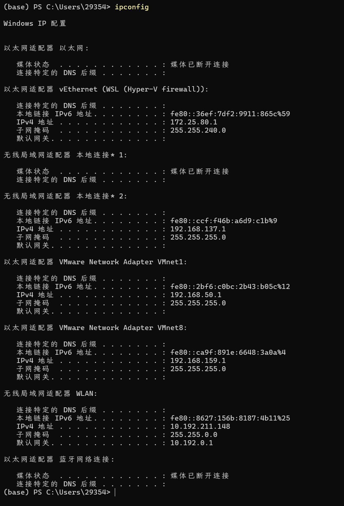</center>

    * `arp -a`：显示本机记录的局域网内其它机器IP地址与其物理地址的对照表

        <center>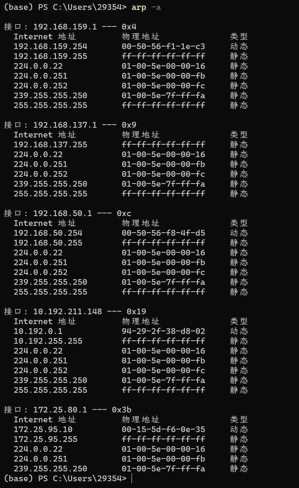</center>

    * `tracert`：traceroute，显示从本机到达一个特定地址的路由过程

        <center>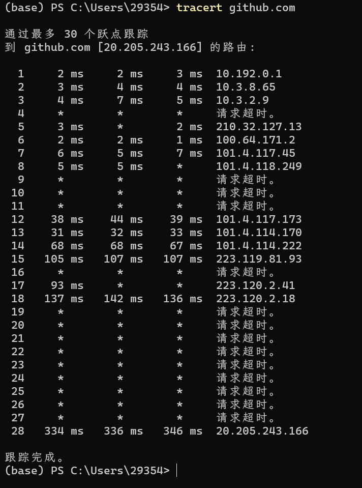</center>

    * `nslookup`：显示某一个域名的 IP 地址

        <center>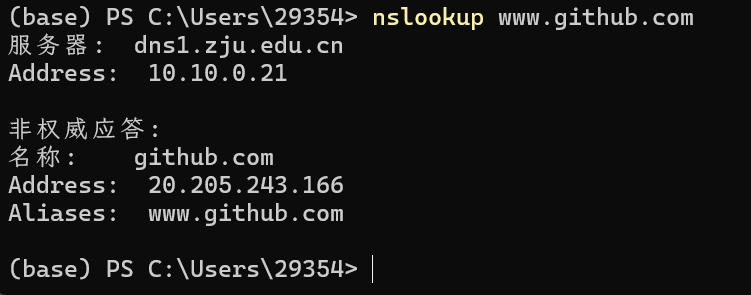</center>

    * `nbtstat`：显示本机 NetBIOS 名称表 

        <center>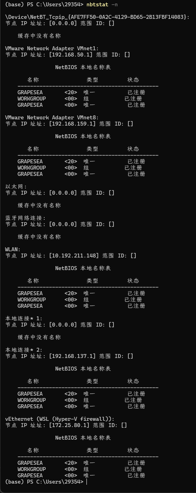</center>

    * `route`：

        `route print`：

        <center>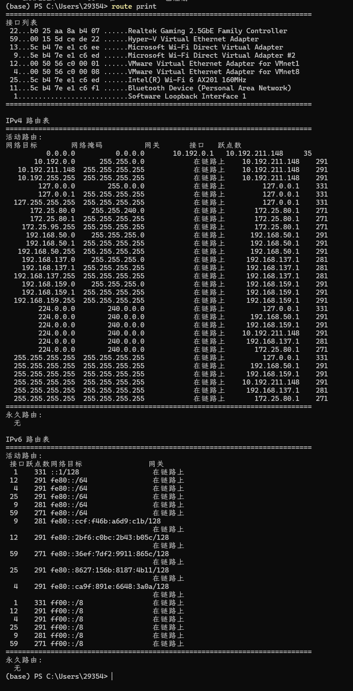</center>

        `route add`：从`ipconfig`可知网关是`10.192.0.1`，所以使用 `route add` 命令添加目标地址为 `11.22.45.5/32` 的主机路由，指定下一跳网关为 `10.192.0.1`

        <center>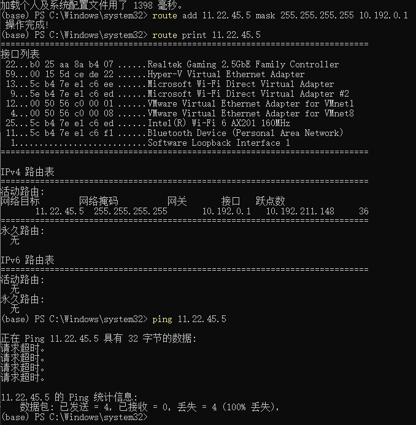</center>

        通过 `route print` 可以确认该路由已成功加入 IPv4 活动路由表，出接口为 WLAN 的 `10.192.211.148`. 随后执行 ping，Wireshark 捕获到了发往目标地址的 ICMP Echo Request，但由于该目标地址不存在、不可达或禁止响应 ICMP，没有收到 Echo Reply，因此 ping 显示请求超时.

        最后清理掉环境：

        ```bash
        route delete 11.22.45.5
        ```

    * `netstat`：显示已经与本机建立TCP连接的端口、IP地址、连接状态等信息

        <center>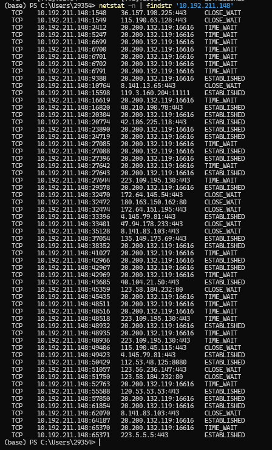</center>

    * `NET SHARE`：显示局域网范围内某台机器的共享资源

        <center>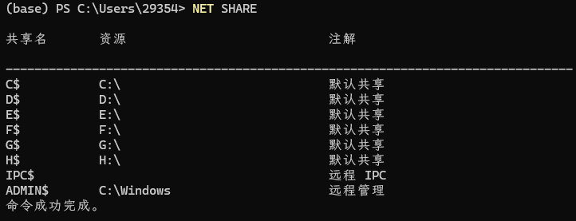</center>

    * `telnet`：连接WEB服务器的端口获得该网站的主页内容

        要达成实验文档的要求得开本地回显：

        ```bash
        telnet
        set localecho
        open www.github.com 80
        ```

        <center>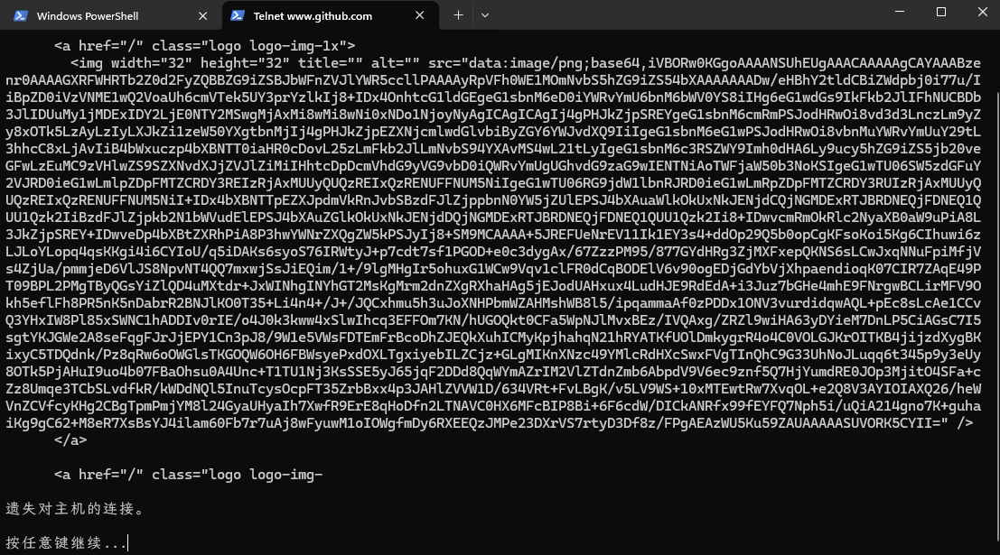</center>

        

- 观察使用ping命令时在WireShark中出现的数据包并捕获。这是什么协议？

    这是 ICMP 协议，Wireshark捕获结果如下：

    <center>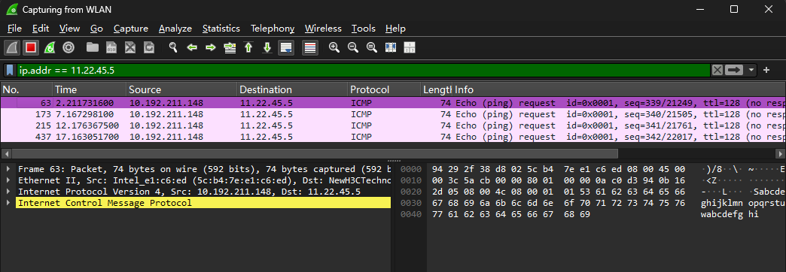</center>

- 观察使用tracert命令时在WireShark中出现的数据包并捕获。这是什么协议？

    考虑：

    ```bash
    tracert github.com
    ```

    得到是 ICMP 协议：

    <center>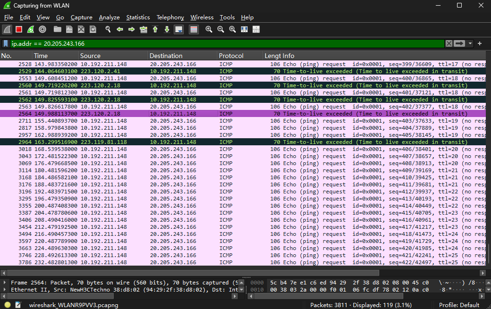</center>

- 观察使用nslookup命令时在WireShark中出现的数据包并捕获。这是什么协议？

    是DNS协议：

    <center>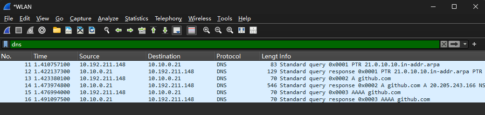</center>

- 观察使用telnet命令时在WireShark中出现的数据包并捕获。这是什么协议？

    流程：

    1. 在 Wireshark 双击 WLAN 开始捕获。

    2. 再执行 Telnet 连接

        ```bash
        telnet
        set localecho
        open www.baidu.com 80
        ```

    3. 逐行输入：

        ```bash
        GET / HTTP/1.0
        Host: www.baidu.com
        Connection: close
        ```

        最后再按一次 Enter 发送空行.

    TCP 与 HTTP 混合协议，Wireshark捕获结果如下：

    <center>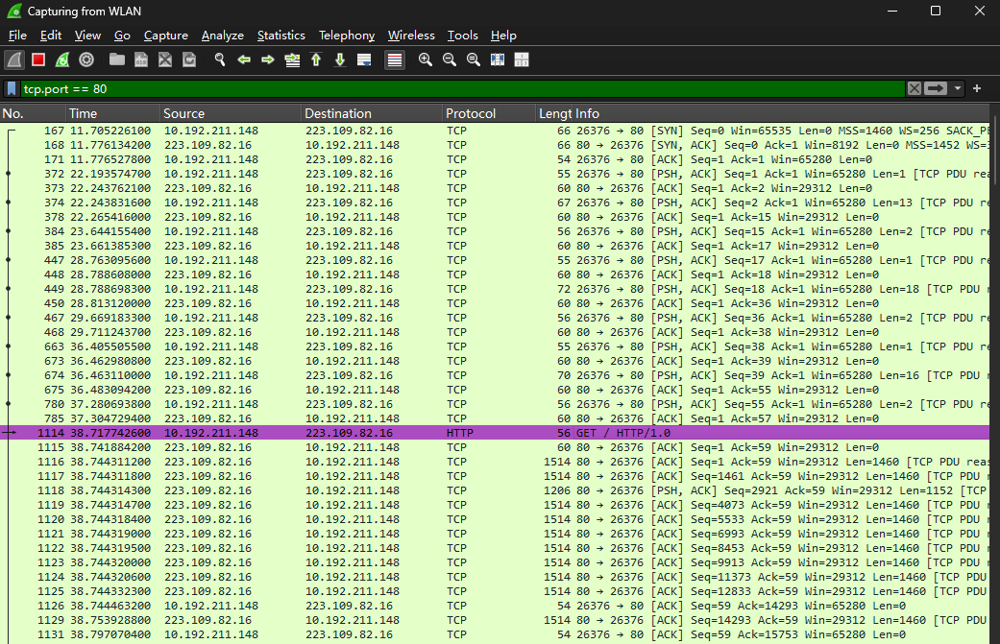</center>

    PC 通过 TCP 80 端口发送 HTTP 请求，即传输层协议是 TCP，应用层协议是 HTTP.

### 思考题

- WireShark的两种过滤器有什么不同？

    * **显示过滤器**只是隐藏了一部分满足条件的流量包，不展示在屏幕界面上，实际上捕获到了；

    * **捕获过滤器**会优先判断捕获条件，不满足的不捕获.

- 哪些网络命令会在WireShark中产生数据包，为什么？

    `ping`, `tracert`, `nslookup`, `telnet`，因为都涉及了与其他主机的交互，有数据的传输.

- ping发送的是什么类型的协议数据包？什么时候会出现ARP消息？ping一个域名和ping一个IP地址出现的数据包有什么不同？

    * ICMP，发送 `ICMP Echo Request`（回显请求），接收 `ICMP Echo Reply`（回显应答）；

    * ARP协议的出现：当主机不知道目标设备或下一跳网关的 MAC 地址时，会通过 ARP协议查询对应的 MAC 地址；
    * 差别是DNS解析域名和响应数据包的发送.

## 讨论、心得

实验本身比较繁琐，telnet 指令的现象跟我的复现情况也不是很匹配，花了一段时间.