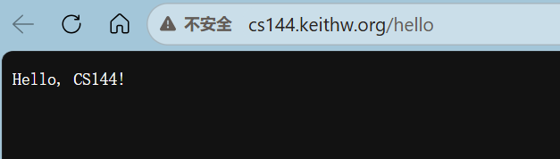
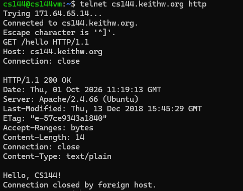
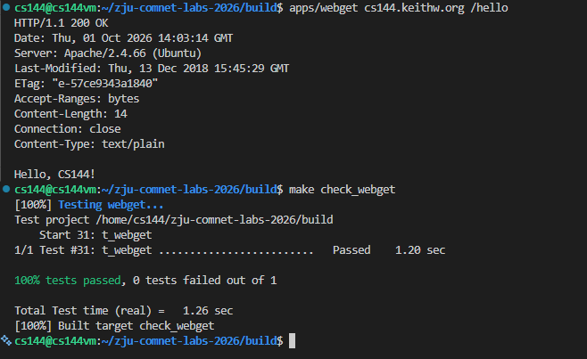
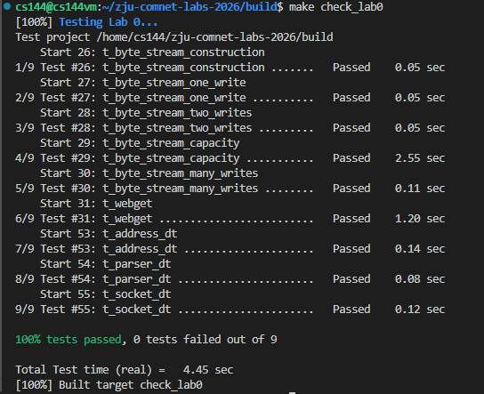

# Lab2 Webget 与字节流（ByteStream）

> [实验文档](https://zju-zhiyi.github.io/2026netlab/lab2/)

## 实验目的

- 学习掌握Linux虚拟机的用法
- 学习掌握网页的抓取方法
- 学习掌握ByteStream的相关知识

## 实验内容

- 安装配置Linux虚拟机并在其上完成本次实验. 

- 使用应用层程序访问网页. 

- 编写小程序webget，通过网络获取web页面. 

- 实现字节流ByteStream：

  - 字节流可以从写入端写入，并以相同的顺序，从读取端读取；

  - 字节流是有限的，写者可以终止写入. 而读者可以在读取到字节流末尾时，产生EOF标志，不再读取；

  - 写入的字节流可能会很长，必须考虑到字节流大于缓冲区大小的情况. 

## 主要仪器设备

- 联网的PC机
- Linux虚拟机

## 操作方法与实验步骤

### 环境配置

在 `C:\Users\<name>\.ssh\config`里面添加：

```text
Host cs144
    HostName localhost
    Port 2222
    User cs144
```

然后配置公钥上传到服务器：

```bash
type $env:USERPROFILE\.ssh\id_ed25519.pub | ssh cs144@localhost -p 2222 "cat >> ~/.ssh/authorized_keys"
```

之后就可以直接简单地连接了：

```bash
ssh cs144
```

### 使用网络

使用浏览器访问网页：

<center></center>

使用 Telnet 获取网页：

<center></center>

### Webget

一次性脚本：

```bash
git clone git@github.com:ZJU-Zhiyi/zju-comnet-labs-2026.git
cd zju-comnet-labs-2026
mkdir build
cd build
cmake .. -DCMAKE_POLICY_VERSION_MINIMUM=3.5
make
```

其中第5行跟实验文档有出入，这是因为这个项目编译配置太古早了，需要改一些CMake配置，否则会直接报错：

空框架直接 `make` 编译还会报这个错：

```bash
In file included from /home/cs144/zju-comnet-labs-2026/libsponge/tcp_helpers/ethernet_frame.hh:4,
                 from /home/cs144/zju-comnet-labs-2026/libsponge/network_interface.hh:4,
                 from /home/cs144/zju-comnet-labs-2026/libsponge/network_interface.cc:1:
/home/cs144/zju-comnet-labs-2026/libsponge/util/buffer.hh:39:5: error: ‘uint8_t’ does not name a type
   39 |     uint8_t at(const size_t n) const { return str().at(n); }
      |     ^~~~~~~
/home/cs144/zju-comnet-labs-2026/libsponge/util/buffer.hh:13:1: note: ‘uint8_t’ is defined in header ‘<cstdint>’; this is probably fixable by adding ‘#include <cstdint>’
   12 | #include <vector>
  +++ |+#include <cstdint>
   13 | 
make[2]: *** [libsponge/CMakeFiles/sponge.dir/build.make:93: libsponge/CMakeFiles/sponge.dir/network_interface.cc.o] Error 1
make[1]: *** [CMakeFiles/Makefile2:7922: libsponge/CMakeFiles/sponge.dir/all] Error 2
make: *** [Makefile:101: all] Error 2
```

需要在`zju-comnet-labs-2026/libsponge/util/buffer.hh`里面添加一行：

```c
#include <cstdint>
```

才能正常编译.

编译测试：

```bash
make -j2
apps/webget cs144.keithw.org /hello
make check_webget
```

得到：

<center></center>

### 字节流

稍有点麻烦，思路是实现一个简化的 socket 读写缓冲区（ByteStream）. 如下图所示，建立连接后，TCP 会维护发送（send）和接收（recv）两个缓冲区.

<center></center>

所以考虑使用`std::deque`作为buffer，然后在private里面添加这些信息：

```c++
std::deque<char> _buffer{};
size_t _capacity;
size_t _bytes_written{0};
size_t _bytes_read{0};
bool _input_ended{false};
```

这里面有一个函数写的时候有点问题，导致27-29样例点没过：

```c++
//! \param[in] len bytes will be copied from the output side of the buffer
string ByteStream::peek_output(const size_t len) const { // 返回接下来至多 len 个字节，但不移除它们
    const size_t cnt = std::min(len, str_buf.size());
    std::string res;
    res.resize(cnt);
    for (size_t i = 0; i < cnt; i++) {
        res[i] = str_buf[i];
    }
    return res;
}
```

`resize(len)`用法是将字符串调整成指定长度，如果第9行写成了：

```c++
res.push_back(str_buf[i]);
```

就不正确了，该函数已经把字符串长度变成了 `cnt`，并填入 `cnt` 个 `'\0'`，追加的话长度又被改变，因此还能写：

```c++
string ByteStream::peek_output(const size_t len) const {
    const size_t cnt = std::min(len, str_buf.size());
    string res;
    res.reserve(cnt);

    for (size_t i = 0; i < cnt; ++i) {
        res.push_back(str_buf[i]);
    }
    return res;
}
```

`reserve(len)`是预留空间，目前还是空子串，之后最大会变成`len`长度.

运行结果：

<center></center>

结束了.

## <span id='result'> 实验结果与分析 </span>

- 抓取网页（通过浏览器和telnet）的运行结果
- 使用webget抓取网页运行结果
- 运行make check_webget的测试结果展示
- 运行make check_lab0测试结果

直接看上面的截图就行了.

### 思考题

- 完成webget程序编写后的测试结果和Fetch a Web page步骤的运行结果一致吗？如果不一致的话你认为问题出在哪里？请描述一下所写的webget程序抓取网页的流程

    * 结果基本上一致，但还是有点小区别.

    * webget 首先根据主机名和路径构造 HTTP GET 请求，包含 `Host` 和 `Connection: close` 请求头，并以空行结束请求头. 随后创建 TCP socket，解析目标主机地址并连接其 HTTP 服务，发送请求. 程序循环读取服务器返回的数据，将完整响应输出到标准输出，直到服务器关闭连接、读到 EOF 后结束

- 请描述ByteStream是如何实现流控制的？

    使用固定容量的缓冲区来存放字符串，并使用参数来辅助处理，写入时根据剩余容量决定实际接收的字节数：

    ```c++
    remaining_capacity() = capacity - str_buf.size();
    cnt = std::min(data.size(), remaining_capacity());
    ```

- 当遇到超出capacity范围的数据流的时候，该如何进行处理？如果不限制流的长度会怎么样？

    * 如果一次写入的数据超过剩余容量，ByteStream 只接收能够容纳的前缀，剩余部分由调用者保存，等待空间释放后再次写入. 例如`remaining_capacity`为 3 时：

        ```c++
        write("abcde");  // 返回 3，只保存 "abc"
        ```

        调用者需要稍后重试写入 `"de"`，否则这部分数据就无法进入字节流.

    * **capacity 限制的是缓冲区中积压的数据量. **即使容量只有 5 字节，也可以通过不断读写传输很长的数据流. 如果不限制缓冲区容量，当写入速度持续超过读取速度时，未读取的数据会不断积累，导致内存占用持续增长，最终可能耗尽内存，使程序被系统终止.

## 讨论、心得

这个lab应该是对标CS144的 checkpoint 0+1，之前我没找到稳定可访问的CS144网络服务，所以就作罢了. 整体来说不是很难.

